# 备品备件库房管理平台 - 数据库ER图

## 实体关系总览

```mermaid
erDiagram
    %% ========== 系统基础 ==========
    sys_department ||--o{ sys_user : "拥有"
    sys_role ||--o{ sys_user_role : "关联"
    sys_user ||--o{ sys_user_role : "关联"
    sys_role ||--o{ sys_role_menu : "分配菜单"
    sys_menu ||--o{ sys_role_menu : "角色分配"
    sys_menu ||--o{ sys_permission : "拥有权限"
    sys_role ||--o{ sys_role_permission : "拥有"
    sys_permission ||--o{ sys_role_permission : "授予"

    %% ========== 库房结构 ==========
    wms_warehouse ||--o{ wms_area : "包含"
    wms_area ||--o{ wms_cabinet : "包含"
    wms_cabinet ||--o{ wms_bin : "包含"

    %% ========== 类目与标签 ==========
    wms_category ||--o{ wms_sub_category : "包含"
    wms_category ||--o{ wms_item : "归属"
    wms_sub_category ||--o{ wms_item : "归属"
    wms_tag ||--o{ wms_item_tag : "关联"
    wms_item ||--o{ wms_item_tag : "打标"
    wms_item ||--o{ wms_item_image : "拥有"

    %% ========== 物品与库存 ==========
    wms_item ||--o{ wms_electronic_label : "绑定"
    wms_item ||--o{ wms_stock : "拥有"
    wms_bin ||--o{ wms_stock : "存放"
    wms_item ||--o{ wms_machine_spare : "备件"
    wms_item ||--o{ wms_machine_spare : "机器"

    %% ========== 业务单据 ==========
    wms_inbound_order ||--o{ wms_inbound_detail : "包含"
    wms_outbound_order ||--o{ wms_outbound_detail : "包含"
    wms_return_order ||--o{ wms_return_detail : "包含"
    wms_scrap_order ||--o{ wms_scrap_detail : "包含"
    wms_transfer_order ||--o{ wms_transfer_detail : "包含"
    wms_item ||--o{ wms_inbound_detail : "入库"
    wms_item ||--o{ wms_outbound_detail : "出库"
    wms_item ||--o{ wms_return_detail : "归还"
    wms_item ||--o{ wms_scrap_detail : "报废"
    wms_item ||--o{ wms_transfer_detail : "调拨"

    %% ========== 审批 ==========
    wms_approval_config ||--o{ wms_approval_record : "配置"
    sys_user ||--o{ wms_approval_record : "审批"

    %% ========== 供应商 ==========
    sys_supplier ||--o{ wms_inbound_order : "供应"

    %% ========== 用户关联业务 ==========
    sys_user ||--o{ wms_outbound_order : "领用"
    sys_user ||--o{ wms_return_order : "归还"
    sys_user ||--o{ wms_scrap_order : "申请报废"
    sys_user ||--o{ wms_transfer_order : "申请调拨"
```

## 实体明细

| 分组 | 表名 | 说明 |
|------|------|------|
| 系统基础 | sys_user | 用户账号 |
| 系统基础 | sys_role | 角色 |
| 系统基础 | sys_user_role | 用户-角色关联 |
| 系统基础 | sys_menu | 菜单 |
| 系统基础 | sys_role_menu | 角色-菜单关联 |
| 系统基础 | sys_permission | 权限(功能权限+数据权限) |
| 系统基础 | sys_role_permission | 角色-权限关联 |
| 系统基础 | sys_department | 部门 |
| 系统基础 | sys_config | 系统配置项 |
| 系统基础 | sys_supplier | 供应商 |
| 库房结构 | wms_warehouse | 库房 |
| 库房结构 | wms_area | 存放区域 |
| 库房结构 | wms_cabinet | 存放柜 |
| 库房结构 | wms_bin | 库位 |
| 类目标签 | wms_category | 主类目 |
| 类目标签 | wms_sub_category | 细分类目 |
| 类目标签 | wms_tag | 自定义标签 |
| 类目标签 | wms_item_tag | 物品-标签关联 |
| 物品库存 | wms_item | 物品档案 |
| 物品库存 | wms_item_image | 物品图片 |
| 物品库存 | wms_electronic_label | 电子标签 |
| 物品库存 | wms_stock | 库存 |
| 物品库存 | wms_machine_spare | 机器-备件关联 |
| 业务单据 | wms_inbound_order | 入库单 |
| 业务单据 | wms_inbound_detail | 入库明细 |
| 业务单据 | wms_outbound_order | 出库/领用单 |
| 业务单据 | wms_outbound_detail | 出库明细 |
| 业务单据 | wms_return_order | 归还单 |
| 业务单据 | wms_return_detail | 归还明细 |
| 业务单据 | wms_scrap_order | 报废单 |
| 业务单据 | wms_scrap_detail | 报废明细 |
| 业务单据 | wms_transfer_order | 调拨单 |
| 业务单据 | wms_transfer_detail | 调拨明细 |
| 审批日志 | wms_approval_config | 审批流程配置 |
| 审批日志 | wms_approval_record | 审批记录 |
| 审批日志 | wms_operation_log | 操作日志 |
| 审批日志 | wms_login_log | 登录日志 |
