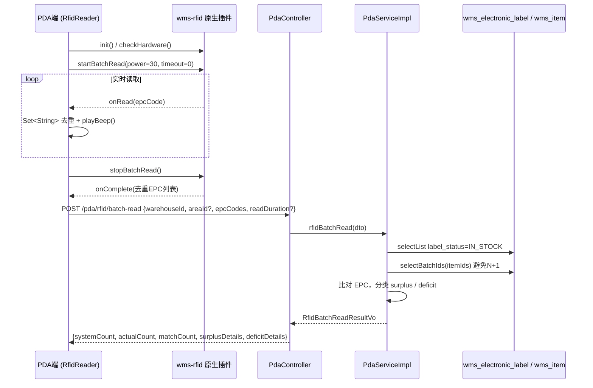
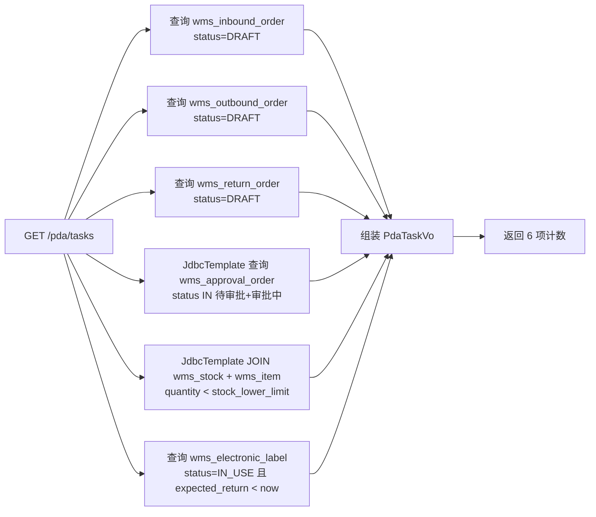

# PDA 移动端

> **状态**: ✅ 已完成（2026-06-02）
> **负责人**: <TBD>
> **关联模块**: `wms-pda`（前端 uni-app 子项目）+ `wms-business.controller.pda`（后端 PDA 专用接口）+ `wms-item.ElectronicLabelService`（RFID 标签读取）+ `wms-warehouse`（库房/区域校验）
> **优先级**: 🔴 P0 — 核心业务

## 一、业务概述

PDA（Personal Digital Assistant）移动端是备品备件库房的**现场作业终端**，与 wms-web 主前端互补，专注解决以下三大场景：

1. **扫码识别作业**：库管员在货架前通过 PDA 扫头/摄像头识别二维码/条形码/RFID 标签，直接在手持设备上完成入库、出库、归还、调拨、报废等业务单据的创建与提交。
2. **RFID 批量读取**：通过手持机内置的超高频 RFID 读写模块，批量读取库房内所有电子标签的 EPC 编码，与系统台账做差异对比。
3. **库存盘点上报**：库管员到现场盘点实际库存后，通过 PDA 录入系统数量与实际数量的差异，提交至后端生成盘点单。

PDA 端与 wms-web 主前端的差异主要体现在：

| 维度 | wms-web（PC 主前端） | wms-pda（移动端） |
|------|---------------------|------------------|
| 技术栈 | Vue 3 + Vite + Element Plus | uni-app + Vue 3 + Pinia（条件编译 H5/APP） |
| 打包目标 | H5 / 桌面浏览器 | iOS / Android APP + H5 |
| 设备能力 | 鼠标键盘、摄像头（弱） | 物理扫码头、RFID 读写器、振动马达、扬声器、NFC |
| 网络环境 | 稳定内网 | 弱网/离线常见，需本地暂存 |
| 业务入口 | 全功能管理端 | 仅现场作业（扫码、盘点、查询、待办） |
| 通用接口前缀 | `/api/...` | `/api/...`（同一网关，相同后端） |
| 专用接口前缀 | - | `/pda/...`（PdaController 独有） |

文档目标：

- 描述 PDA 端整体架构（前后端分离 + 离线容错 + RFID 集成）
- 厘清 `PdaController` 三个核心 API 与 `wms-business` 主业务接口的边界
- 落地弱网策略、RFID 批量读取、盘点差异上报的实现细节
- 与 [入库流程.md](入库流程.md)、[出库流程.md](出库流程.md)、[库存盘点.md](库存盘点.md)、[电子标签.md](电子标签.md) 的接口对接关系

## 二、整体架构

### 2.1 子包结构

PDA 模块遵循 [工程结构.md §1.2](../.harness/rules/%E5%B7%A5%E7%A8%8B%E7%BB%93%E6%9E%84.md) 规范，独立子包划分如下：

```
wms-server/wms-business/src/main/java/com/wms/business/
├── controller/
│   └── pda/
│       └── PdaController.java          # 三个 PDA 专用接口
├── service/
│   └── pda/
│       ├── PdaService.java             # PDA 服务接口
│       └── impl/
│           └── PdaServiceImpl.java     # RFID 上报 / 盘点 / 待办 实现
├── converter/
│   └── StockCheckConverter.java        # 盘点单实体→VO 转换
├── domain/
│   ├── dto/pda/                        # RfidBatchReadDto / StockCheckDto / StockCheckDetailDto
│   ├── vo/pda/                         # PdaTaskVo / RfidBatchReadResultVo / StockCheckResultVo / StockCheckDiffDetailVo
│   └── constant/
│       └── PdaConstants.java           # PDA 业务常量
└── domain/entity/
    ├── WmsStockCheckOrder.java         # 盘点单主表
    └── WmsStockCheckDetail.java        # 盘点差异明细
```

```
wms-pda/                                # 前端独立子项目（uni-app）
├── src/
│   ├── api/                            # 接口封装：pda.ts / scan.ts / order.ts / stock.ts / request.ts
│   ├── components/                     # 通用组件：ScanInput / RfidReader / OfflineBar / StatusTag ...
│   ├── composables/                    # 组合式函数：useScan / useRfid / useOffline / useVibrate / useSound
│   ├── pages/                          # 页面：home / scan/* / stock/* / order/* / rfid/check / mine/*
│   ├── store/                          # Pinia：app / auth / scan / offline
│   ├── utils/                          # constants.ts / db.ts（本地 SQLite）/ format.ts / validate.ts
│   ├── manifest.json                   # uni-app 原生配置（Android 权限、wms-rfid 原生插件）
│   └── pages.json                      # uni-app 路由与 tabBar
└── package.json                        # uni-app + Vue 3 + Pinia
```

### 2.2 前后端交互

- **PdaController** 仅暴露 PDA 端特有能力（RFID 批量上报、盘点差异、待办统计），挂载在 `/pda` 前缀下。
- 业务单据（入库/出库/归还/调拨/报废）的 CRUD **不通过 PdaController**，PDA 端通过 `/api/inbound`、`/api/outbound`、`/api/return`、`/api/transfer`、`/api/scrap` 等通用业务接口完成（与 wms-web 共用同一套 Controller），从而避免在 PDA 端维护重复的单据管理代码。
- 扫码识别统一走 `OutboundScanServiceImpl.scan` / `InboundScanServiceImpl.scan` 复用逻辑（详见 [入库流程.md §4.1.5](入库流程.md) 与 [出库流程.md §4.1.5](出库流程.md)）。

### 2.3 端到端流程

```
PDA App ── uni.request ── 网关 ── Spring Boot
  │                                  │
  │ useScan/useRfid                  ├─► PdaController (/pda)
  │ useOffline                       │     ├─ PdaServiceImpl.rfidBatchRead
  │ Pinia store                      │     ├─ PdaServiceImpl.stockCheck
  │                                  │     └─ PdaServiceImpl.getTasks
  │                                  │
  │ 扫码头/RFID 读写器                 ├─► OutboundController (/outbound/scan)
  │ 振动/声音反馈                     │     └─ OutboundScanServiceImpl.scan
  │                                  │
  │ 离线队列（SQLite）                ├─► InboundController (/inbound)
  │ LocalStorage Token              │     └─ InboundServiceImpl.createOrder
  └──────────────────────────────────┴──────► ...
```

## 三、业务流程图

### 3.1 RFID 批量读取上报



### 3.2 盘点结果提交

```mermaid
flowchart TD
    A[库管员选择库房] --> B[开始 RFID 读取<br/>或人工录入]
    B --> C{PDA 端对比系统数量}
    C -->|有差异| D[录入差异明细<br/>items: {itemId, systemQty, actualQty, binId?}]
    C -->|无差异| E[提交空明细]
    D --> F[POST /pda/stock/check]
    E --> F
    F --> G[PdaController 校验 @PreAuthorize]
    G --> H[PdaServiceImpl.stockCheck]
    H --> I[SequenceGenerator 生成盘点单号<br/>PD + yyyyMMdd + 4位流水]
    I --> J[保存 wms_stock_check_order<br/>status=CHECK_STATUS_SUBMITTED]
    J --> K[批量入库 wms_stock_check_detail<br/>仅 actualQty ≠ systemQty]
    K --> L[返回 StockCheckResultVo]
```

### 3.3 PDA 待办任务统计



## 四、核心 API 清单

`PdaController` 仅暴露三个接口，路径前缀 `/pda`，所有方法均带 `@PreAuthorize("isAuthenticated()")`。

| # | HTTP | 路径 | 方法名 | 权限标识 | 注解 | 说明 |
|---|------|------|--------|----------|------|------|
| 1 | POST | `/pda/rfid/batch-read` | `rfidBatchRead` | `pda:rfid:report` | `@OperLog(上报)` | RFID 批量读取上报，差异对比（仅写操作，添加 `@OperLog`，不写库） |
| 2 | POST | `/pda/stock/check` | `stockCheck` | `pda:stock:check` | `@OperLog(提交)` | 盘点结果提交，生成盘点单并保存差异明细 |
| 3 | GET | `/pda/tasks` | `getTasks` | `pda:task:view` | `@DataScope` | 当前用户待办任务统计（含数据权限过滤） |

> PDA 端其余业务（入库/出库/归还/调拨/报废的创建、提交、详情）**复用通用业务 Controller**，不在 `PdaController` 范围内。例如 PDA 创建出库单 → `POST /api/outbound`，PDA 扫码识别 → `POST /api/outbound/scan`（详见 [出库流程.md §4](出库流程.md)）。

### 4.1 RFID 批量读取上报 `POST /pda/rfid/batch-read`

请求体：

```json
{
  "warehouseId": 1,
  "areaId": 10,
  "epcCodes": ["EPC280...ABC", "EPC280...DEF"],
  "readDuration": 25
}
```

响应（`R<RfidBatchReadResultVo>`）：

```json
{
  "code": 200,
  "data": {
    "systemCount": 12,
    "actualCount": 11,
    "matchCount": 9,
    "surplusDetails": [
      { "labelNo": "EPC280...ZZZ", "itemId": null, "diffType": "surplus", "systemQty": 0, "actualQty": 1 }
    ],
    "deficitDetails": [
      { "labelNo": "BQ202605180012", "itemId": 101, "itemName": "M10 螺栓", "itemCode": "WP202605180001", "diffType": "deficit", "systemQty": 1, "actualQty": 0 }
    ]
  }
}
```

> `surplusDetails.itemId/itemName/itemCode` 三个字段仅在能从系统标签表反查到物品时填充；纯盘盈（实际有但系统无）时 `itemId` 为 `null`。

### 4.2 盘点结果提交 `POST /pda/stock/check`

请求体：

```json
{
  "warehouseId": 1,
  "areaId": 10,
  "checkType": 1,
  "items": [
    { "itemId": 101, "systemQty": 10, "actualQty": 9, "binId": 5021 },
    { "itemId": 102, "systemQty": 5,  "actualQty": 6, "binId": 5022 }
  ],
  "remark": "2026-06-02 例行盘点"
}
```

响应：

```json
{
  "code": 200,
  "data": { "checkId": 99001, "status": 1 }
}
```

> 服务端仅保存 `actualQty ≠ systemQty` 的差异明细（`PdaServiceImpl.stockCheck` §232-247），匹配项不落库以减少噪声数据。

### 4.3 PDA 待办任务统计 `GET /pda/tasks`

响应：

```json
{
  "code": 200,
  "data": {
    "inboundPendingCount": 3,
    "outboundPendingCount": 5,
    "returnPendingCount": 1,
    "approvalPendingCount": 4,
    "stockAlertCount": 7,
    "overdueReturnCount": 2
  }
}
```

> 该接口是 PDA 端**唯一带 `@DataScope`** 的方法，统计结果受当前用户数据权限范围（DEPT_AND_SUB / DEPT / SELF / CUSTOM）影响。详见 [AGENTS.md §1.2](../AGENTS.md) 与 [权限体系.md](../系统管理/权限体系.md)。

## 五、PDA 端关键服务

### 5.1 PdaService / PdaServiceImpl

`PdaService` 暴露三个 `public` 方法，全部由 `PdaServiceImpl` 实现：

| 方法 | 职责 | 关键校验/操作 | 事务 |
|------|------|---------------|------|
| `rfidBatchRead` | RFID 批量读取上报与差异对比 | 校验库房存在且未删除 → 查询 `label_status=IN_STOCK` → 构建 `systemRfidMap` → 与 `actualEpcSet` 做 Set 差集 → 批量查 `itemMap` 避免 N+1（[AGENTS.md §5.1](../AGENTS.md)） | 否（只读） |
| `stockCheck` | 盘点结果入库 | 校验库房 → 校验 `checkType` ∈ {全盘, 抽盘} → `SequenceGenerator` 生成盘点单号 → 保存主表 → 循环校验 `WmsItem` 存在/未删除 → 仅保存有差异的明细 → `Db.saveBatch` 批量插入 | `@Transactional(rollbackFor=Exception.class)` |
| `getTasks` | 待办任务统计 | 5 次统计：`status=DRAFT` 的入库/出库/归还 + `wms_approval_order.status IN (待审批, 审批中)` + `wms_stock.quantity < wms_item.stock_lower_limit` + `label_status=IN_USE AND expected_return < now` | 否（只读） |

#### 5.1.1 私有方法

- `sequenceGenerator.next(PdaConstants.STOCK_CHECK_NO_PREFIX)` —— Redis INCR 生成 `PD + yyyyMMdd + 4位流水`（见 [AGENTS.md §5.4](../AGENTS.md)）。
- 库存预警统计使用 `JdbcTemplate.queryForObject` 直连 SQL（`wms_stock s INNER JOIN wms_item i ON s.item_id = i.id`），**在 SQL 层面完成** `s.quantity < i.stock_lower_limit` 过滤，避免全表查询 + 内存过滤（[AGENTS.md §5.2](../AGENTS.md)）。
- 审批单统计同样使用 `JdbcTemplate.queryForObject` 跨模块查询 `wms_approval_order`，避免 `wms-approval` 与 `wms-business` 模块间循环依赖。

#### 5.1.2 StockCheckConverter 字段映射

| 实体字段 | VO 字段 | 来源/补齐方式 |
|----------|---------|---------------|
| `id` | `checkId` | `StockCheckResultVo.checkId` |
| `status` | `status` | `PdaConstants.CHECK_STATUS_*`（详见 §10.2） |
| `WmsStockCheckDetail.labelNo` | `StockCheckDiffDetailVo.labelNo` | 直接复制 |
| `WmsStockCheckDetail.itemId` | `StockCheckDiffDetailVo.itemId` + `itemName` + `itemCode` | `WmsItemMapper.selectById` 单点查询；批量场景下 `toDiffDetailVoList` 接受预查询 `itemMap` 避免 N+1 |
| `WmsStockCheckDetail.diffType` | `StockCheckDiffDetailVo.diffType` | `PdaConstants.DIFF_TYPE_SURPLUS` / `DIFF_TYPE_DEFICIT` |
| `WmsStockCheckDetail.systemQty` / `actualQty` | `StockCheckDiffDetailVo.systemQty` / `actualQty` | 直接复制 |

### 5.2 前端 PdaTaskVo 字段差异

> ⚠️ **前后端字段命名一致性提醒**：后端 `PdaTaskVo` 字段为 `inboundPendingCount/outboundPendingCount/returnPendingCount/approvalPendingCount/stockAlertCount/overdueReturnCount`；前端 `src/utils/constants.ts` 中对应类型声明为 `pendingInbound/pendingOutbound/pendingReturn/pendingApproval/stockAlert/overdueReturn`（无 `Count` 后缀）。
>
> 现有 `api/pda.ts` 调用 `getPdaTasksApi()` 时未做字段重命名，**PdaTaskVo 的 TS 类型与 Java 实体字段不一致**，需前端同学在串接时调整类型定义或重命名映射（建议按 [AGENTS.md §8.1](../AGENTS.md) 调整为与后端完全一致的小驼峰命名）。

## 六、RFID 集成

### 6.1 原生插件（前端）

PDA 端通过 `manifest.json` 中声明的 `wms-rfid` 原生插件（[wms-pda/src/manifest.json §67-70](../wms-pda/src/manifest.json)）访问超高频 RFID 读写模块：

```json
"nativePlugins": {
  "wms-rfid": {
    "type": "module",
    "name": "wms-rfid"
  }
}
```

`useRfid` 组合式函数（[wms-pda/src/composables/useRfid.ts](../wms-pda/src/composables/useRfid.ts)）封装以下能力：

| 方法 | 作用 | 备注 |
|------|------|------|
| `init()` | 加载原生插件并调用 `init()` | 返回 `Promise<boolean>`，硬件不可用时 `hardwareAvailable=false` |
| `checkHardware()` | 检测 RFID 硬件 | 单独方法，初始化成功后自动调用 |
| `startRead(callbacks)` | 批量读取 EPC 码 | 使用 `Set<string>` 内置去重；每读到新 EPC 触发 `playBeep()` |
| `stopRead()` | 停止读取 | 保留已读取数据并触发 `onComplete` 回调 |
| `release()` | 释放资源 | 组件卸载时自动调用 |
| `setPower(power)` | 设置功率 | 范围 `RFID_POWER_MIN` ~ `RFID_POWER_MAX`（即 `5` ~ `30`） |

### 6.2 关键常量

| 常量名 | 位置 | 值 | 说明 |
|--------|------|----|------|
| `RFID_DEFAULT_POWER` | `wms-pda/src/utils/constants.ts` | `30` | 默认读取功率 |
| `RFID_POWER_MIN` | `wms-pda/src/utils/constants.ts` | `5` | 最低功率 |
| `RFID_POWER_MAX` | `wms-pda/src/utils/constants.ts` | `30` | 最高功率 |
| `LabelConstants.LABEL_TYPE_RFID` | `wms-item.domain.constant` | `3` | 标签类型：RFID |
| `LabelConstants.RFID_RANDOM_MIN` | `wms-item.domain.constant` | `1000` | RFID 编码随机段最小值 |
| `LabelConstants.RFID_RANDOM_MAX` | `wms-item.domain.constant` | `9000` | RFID 编码随机段最大值 |

> ⚠️ **后端 PDA 模块当前未在 `PdaConstants` 中定义 `RFID_BATCH_LIMIT` 阈值常量**（搜索全部 `PdaConstants` 字段确认无此定义）。单次上报 EPC 数量上限当前仅由前端 `EPC码列表` `@NotEmpty` 校验保证非空，**没有数量上限**。若需要限制单次上报条数，应在 `PdaConstants` 中新增 `RFID_BATCH_LIMIT` 常量并在 `RfidBatchReadDto` 上添加 `@Size(max=...)` 校验（建议值 500-1000）。

### 6.3 批量读取流程

1. PDA 端调用 `useRfid().init()`，原生插件回调 `success: true` 后 `hardwareAvailable=true`。
2. 用户点击开始读取 → `startRead({onRead, onComplete})`，原生插件进入循环扫描。
3. 每读到一条 EPC → 插件回调 `onRead(epcCode)` → `Set` 去重 → `playBeep()`。
4. 用户点击停止 → `stopRead()` → 触发 `onComplete(去重后EPC列表)`。
5. PDA 端将 `epcCodes` 数组作为请求体发送至 `POST /pda/rfid/batch-read`。
6. 后端从 `wms_electronic_label` 查 `label_status=IN_STOCK`（详见 `LabelStatusEnum.IN_STOCK`）的 `rfidCode` 集合，与 `epcCodes` 差集对比，返回盘盈/盘亏明细。

### 6.4 降级方案

原生插件不可用（如 H5 平台、未正确打包）时，`hardwareAvailable=false`，`pages/rfid/check.vue` 自动渲染**手动输入 EPC 码**的输入框（[wms-pda/src/pages/rfid/check.vue §40-50](../wms-pda/src/pages/rfid/check.vue)），库管员可逐条手动录入后上报。

## 七、弱网/离线策略

### 7.1 总体设计

PDA 端基于 **uni-app 离线存储 + SQLite + 离线队列** 三件套实现弱网容错：

| 能力 | 实现位置 | 说明 |
|------|----------|------|
| 网络监听 | `composables/useOffline.ts` | `uni.getNetworkType` + `uni.onNetworkStatusChange` 实时更新 `appStore.isOnline` |
| 离线队列 | `store/offline.ts` | Pinia + `utils/db.ts`（基于 `uni.getStorage` + SQLite） |
| 自动同步 | `useOffline.autoSync()` | 网络恢复后 1 秒延迟触发，避免抖动 |
| 请求拦截 | `api/request.ts` | `uni.request` 失败时根据 HTTP 方法判断入队或失败 |

### 7.2 离线队列容量

- 上限：`OFFLINE_QUEUE_MAX_SIZE` = `100`（常量见 `wms-pda/src/utils/constants.ts`）。
- 队列满时 `enqueue()` 返回 `false` 并提示用户。

### 7.3 入队规则

`request.ts` 中 `handleOfflineRequest` 决定请求是否可入队：

| HTTP 方法 | 路径 | 行为 |
|-----------|------|------|
| POST / PUT / PATCH | 业务接口（如 `/api/inbound`） | ✅ 自动入队 |
| GET / DELETE | 任意 | ❌ 提示"网络不可用"，不入队 |
| 任意 | `/api/auth/*`（登录、登出、Token 刷新） | ❌ 不入队（认证路径强制要求在线） |

### 7.4 同步策略

1. 用户从离线恢复为在线时，监听器延迟 `1000ms` 调用 `autoSync()`。
2. `syncQueue` 先检查 `authStore.isTokenExpiring()`，必要时主动调用 `refreshTokenAction()`；刷新失败则**中止同步**并提示重新登录。
3. FIFO 顺序逐条调用 `sendOfflineRequest`（用 `uni.request` 重发）。
4. HTTP 200 + `code=200` → 标记 `OfflineQueueStatus.SUCCESS`；否则 → `FAILED` 并 `incrementRetryCount`。
5. 同步完成后 `dbClearSuccessRecords()` 清理已成功记录，避免本地存储无限增长。

### 7.5 Token 自动刷新

`api/request.ts` 实现**单例刷新模式**：

- `isRefreshing` 标志位 + `pendingRequests` 回调队列，确保并发请求只触发一次刷新。
- 主动刷新：`isTokenExpiringCheck()` 检查 Token 是否在 `TOKEN_EXPIRE_THRESHOLD`（`5 * 60 * 1000` ms = 5 分钟）内过期。
- 被动刷新：HTTP 401 或业务层 `code=401` 时重试，刷新失败 → `clearAuthAndRedirect` 跳转登录页。

### 7.6 用户提示

`OfflineBar` 组件（[wms-pda/src/components/OfflineBar.vue](../wms-pda/src/components/OfflineBar.vue)）在首页顶部渲染状态条：

- 离线时显示 `离线模式 | 队列: N条 | 同步按钮`
- 同步中显示 `同步中...` 动画
- 在线时隐藏

## 八、权限与限流

### 8.1 权限注解

| 接口 | 权限注解 | 权限标识 | 规则出处 |
|------|----------|----------|----------|
| `rfidBatchRead` | `@PreAuthorize("isAuthenticated()")` | `pda:rfid:report` | [AGENTS.md §1.3](../AGENTS.md) |
| `stockCheck` | `@PreAuthorize("isAuthenticated()")` | `pda:stock:check` | [AGENTS.md §1.3](../AGENTS.md) |
| `getTasks` | `@PreAuthorize("isAuthenticated()")` + `@DataScope` | `pda:task:view` | [AGENTS.md §1.2/§1.3](../AGENTS.md) |

> `@PreAuthorize("isAuthenticated()")` 为最小粒度要求；具体业务权限标识（`pda:rfid:report` 等）建议接入 `wms-system` 模块的 RBAC 权限点。**PDA 端在生产环境应至少配置细粒度权限**，避免仅依赖登录态。

### 8.2 数据权限

- `getTasks` 接口带 `@DataScope`，受 `DataScopeConstants` 控制（ALL / DEPT_AND_SUB / DEPT / SELF / CUSTOM）。
- 库存预警与超期归还统计 SQL 中**未叠加** `dept_id` / `create_by` 过滤，原因是 PDA 待办为**全员可见**指标，但具体作用范围由调用方的数据权限注解决定。
- `rfidBatchRead` / `stockCheck` 不带 `@DataScope`，因 PDA 端按 `warehouseId` 明确指定库房，无需再叠加部门/用户过滤。

### 8.3 限流

`wms-auth` 模块提供 `RateLimiterService`（[wms-auth/src/main/java/com/wwms/auth/service/RateLimiterService.java](../wms-server/wms-auth/src/main/java/com/wms/auth/service/RateLimiterService.java)），目前**仅在 `AuthServiceImpl` 登录流程中调用 `rateLimiterService.tryAcquire(clientIp)`**，未对 PDA 接口做限流。

> ⚠️ **建议**：PDA 端 RFID 批量读取与盘点提交均为**重操作**（单次请求可能携带数百个 EPC 码），未来应在 `PdaController` 入口或网关层叠加 `RateLimiterService.tryAcquire` 做 IP/用户级限流，避免异常请求拖垮后端。

### 8.4 越权校验

- 库房存在性：`warehouse == null` → `BizException("库房不存在")`
- 库房未删除：`warehouse.delFlag == DELETED` → `BizException("库房已删除")`
- 盘点类型：`checkType ∉ {PdaConstants.CHECK_TYPE_FULL, PdaConstants.CHECK_TYPE_PARTIAL}` → `BizException("盘点类型无效，仅支持1(全盘)或2(抽盘)")`
- 物品存在性：`item == null` → `BizException("物品不存在: {itemId}")`
- 物品未删除：`item.delFlag == DELETED` → `BizException("物品已删除: {itemId}")`

## 九、异常处理清单

`PdaController` / `PdaServiceImpl` 中所有 `throw new BizException(...)` 场景（区分场景抛精准信息，符合 [AGENTS.md §4.4](../AGENTS.md)）：

| Service | 触发点 | 异常信息 | 业务含义 |
|---------|--------|----------|----------|
| `PdaServiceImpl` | `rfidBatchRead` 库房校验 | `库房不存在` | `wmsWarehouseMapper.selectById` 未查到 |
| `PdaServiceImpl` | `rfidBatchRead` 库房校验 | `库房已删除` | `warehouse.delFlag == DELETED` |
| `PdaServiceImpl` | `stockCheck` 库房校验 | `库房不存在` | 同上 |
| `PdaServiceImpl` | `stockCheck` 库房校验 | `库房已删除` | 同上 |
| `PdaServiceImpl` | `stockCheck` 盘点类型校验 | `盘点类型无效，仅支持1(全盘)或2(抽盘)` | `checkType` 为 `null` 或非 `CHECK_TYPE_FULL/CHECK_TYPE_PARTIAL` |
| `PdaServiceImpl` | `stockCheck` 物品校验 | `物品不存在: {itemId}` | 物品主表查不到 |
| `PdaServiceImpl` | `stockCheck` 物品校验 | `物品已删除: {itemId}` | `item.delFlag == DELETED` |
| `RfidBatchReadDto` | `@NotNull` 校验 | `库房ID不能为空` | `warehouseId` 为空（`@Validated` + `@Valid` 触发） |
| `RfidBatchReadDto` | `@NotEmpty` 校验 | `EPC码列表不能为空` | `epcCodes` 为空列表或 `null` |
| `StockCheckDto` | `@NotNull` 校验 | `库房ID不能为空` | `warehouseId` 为空 |
| `StockCheckDto` | `@NotNull` 校验 | `盘点类型不能为空` | `checkType` 为 `null` |
| `StockCheckDto` | `@NotEmpty` 校验 | `盘点明细不能为空` | `items` 为空 |
| `StockCheckDetailDto` | `@NotNull` 校验 | `物品ID不能为空` / `系统数量不能为空` / `实际数量不能为空` | 明细字段缺失 |

> 上述异常通过全局异常处理器统一转为 `{code, msg, data}` 错误响应；前端 `api/request.ts` 通过 `showErrorToast` 弹 Toast 提示用户。

## 十、关键字段说明

### 10.1 DTO

`RfidBatchReadDto`（RFID 批量读取上报请求）：

| 字段 | 类型 | 必填 | 校验 | 说明 |
|------|------|------|------|------|
| `warehouseId` | `Long` | ✅ | `@NotNull` | 库房 ID |
| `areaId` | `Long` | ❌ | - | 区域 ID（可选，用于局部盘点） |
| `epcCodes` | `List<String>` | ✅ | `@NotEmpty` | 实际读取 EPC 码列表（PDA 端已去重） |
| `readDuration` | `Integer` | ❌ | - | 读取持续时长（秒），用于统计 |

`StockCheckDto`（盘点结果提交请求）：

| 字段 | 类型 | 必填 | 校验 | 说明 |
|------|------|------|------|------|
| `warehouseId` | `Long` | ✅ | `@NotNull` | 库房 ID |
| `areaId` | `Long` | ❌ | - | 区域 ID（可选） |
| `checkType` | `Integer` | ✅ | `@NotNull` | 盘点类型（`PdaConstants.CHECK_TYPE_FULL`=全盘 / `CHECK_TYPE_PARTIAL`=抽盘） |
| `items` | `List<StockCheckDetailDto>` | ✅ | `@NotEmpty` | 盘点明细列表 |
| `remark` | `String` | ❌ | - | 备注 |

`StockCheckDetailDto`（盘点明细项）：

| 字段 | 类型 | 必填 | 校验 | 说明 |
|------|------|------|------|------|
| `itemId` | `Long` | ✅ | `@NotNull` | 物品 ID |
| `systemQty` | `Integer` | ✅ | `@NotNull` | 系统数量 |
| `actualQty` | `Integer` | ✅ | `@NotNull` | 实际数量 |
| `binId` | `Long` | ❌ | - | 库位 ID（可选） |

### 10.2 VO

`PdaTaskVo`（待办任务统计）：

| 字段 | 类型 | 说明 |
|------|------|------|
| `inboundPendingCount` | `Integer` | 待提交入库单数（`status=DRAFT`） |
| `outboundPendingCount` | `Integer` | 待提交出库单数（`status=DRAFT`） |
| `returnPendingCount` | `Integer` | 待提交归还单数（`status=DRAFT`） |
| `approvalPendingCount` | `Integer` | 待审批单据数（`wms_approval_order.status IN (0, 1)`） |
| `stockAlertCount` | `Integer` | 库存预警数（`quantity < stock_lower_limit`） |
| `overdueReturnCount` | `Integer` | 超期归还数（`label_status=IN_USE AND expected_return < now`） |

`RfidBatchReadResultVo`（RFID 批量读取上报结果）：

| 字段 | 类型 | 说明 |
|------|------|------|
| `systemCount` | `Integer` | 系统在库标签数（`label_status=IN_STOCK` 的 `rfidCode` 非空集合大小） |
| `actualCount` | `Integer` | 实际读取标签数（PDA 上报 `epcCodes` 去重大小） |
| `matchCount` | `Integer` | 匹配标签数（`systemRfidMap.keySet() ∩ actualEpcSet`） |
| `surplusDetails` | `List<StockCheckDiffDetailVo>` | 盘盈明细：实际有但系统无 |
| `deficitDetails` | `List<StockCheckDiffDetailVo>` | 盘亏明细：系统有但实际无 |

`StockCheckDiffDetailVo`（盘点差异明细）：

| 字段 | 类型 | 说明 |
|------|------|------|
| `labelNo` | `String` | 标签编号 / EPC 码（盘盈时直接使用 EPC） |
| `itemId` | `Long` | 物品 ID（盘盈时为 `null`） |
| `itemName` | `String` | 物品名称（盘盈时为 `null`） |
| `itemCode` | `String` | 物品编码（盘盈时为 `null`） |
| `diffType` | `String` | `PdaConstants.DIFF_TYPE_SURPLUS`=盘盈 / `DIFF_TYPE_DEFICIT`=盘亏 |
| `systemQty` | `Integer` | 系统数量 |
| `actualQty` | `Integer` | 实际数量 |

`StockCheckResultVo`（盘点提交响应）：

| 字段 | 类型 | 说明 |
|------|------|------|
| `checkId` | `Long` | 盘点单 ID（雪花 ID） |
| `status` | `Integer` | 盘点状态（创建后固定为 `PdaConstants.CHECK_STATUS_SUBMITTED`） |

### 10.3 实体

`WmsStockCheckOrder`（表 `wms_stock_check_order`）：

| 字段 | DB 列 | 说明 |
|------|-------|------|
| `id` | `id` | 主键，雪花 ID（`IdType.ASSIGN_ID`） |
| `checkNo` | `check_no` | 盘点单号（`PD + yyyyMMdd + 4位流水`） |
| `warehouseId` | `warehouse_id` | 库房 ID |
| `areaId` | `area_id` | 区域 ID |
| `checkType` | `check_type` | 盘点类型（`CHECK_TYPE_FULL`=全盘 / `CHECK_TYPE_PARTIAL`=抽盘） |
| `status` | `status` | 盘点状态（`CHECK_STATUS_DRAFT` / `CHECK_STATUS_SUBMITTED` / `CHECK_STATUS_CONFIRMED`） |
| `systemCount` | `system_count` | 差异总条数（surplus + deficit） |
| `actualCount` | `actual_count` | 实际盘点物品数（`items.size`） |
| `matchCount` | `match_count` | 匹配数（`items.size - surplus - deficit`） |
| `remark` | `remark` | 备注 |
| 公共字段 | `del_flag/create_time/create_by/update_time/update_by` | 见 [AGENTS.md §7.3](../AGENTS.md) |

`WmsStockCheckDetail`（表 `wms_stock_check_detail`）：

| 字段 | DB 列 | 说明 |
|------|-------|------|
| `id` | `id` | 主键，雪花 ID |
| `checkOrderId` | `check_order_id` | 盘点单 ID |
| `labelNo` | `label_no` | 标签编号（盘亏时为 `WmsElectronicLabel.labelNo`，盘盈时为 EPC） |
| `itemId` | `item_id` | 物品 ID（盘盈为 `null`） |
| `diffType` | `diff_type` | 差异类型（`DIFF_TYPE_SURPLUS` / `DIFF_TYPE_DEFICIT`） |
| `systemQty` | `system_qty` | 系统数量 |
| `actualQty` | `actual_qty` | 实际数量 |
| `binId` | `bin_id` | 库位 ID（可选） |
| 公共字段 | `del_flag/...` | 同上 |

## 十一、关联数据库表

| 表 | 用途 | PDA 模块是否修改 |
|----|------|------------------|
| `wms_electronic_label` | 电子标签主数据（`label_status` 决定 RFID 比对范围） | 只读（`selectList` / `selectCount`） |
| `wms_item` | 物品主数据（关联 `stock_lower_limit`） | 只读（`selectBatchIds` 用于填充 `itemName/itemCode`） |
| `wms_warehouse` | 库房主数据 | 只读（`selectById` 校验存在性） |
| `wms_inbound_order` | 入库单主表（待办统计） | 只读（`selectCount`） |
| `wms_outbound_order` | 出库单主表（待办统计） | 只读（`selectCount`） |
| `wms_return_order` | 归还单主表（待办统计） | 只读（`selectCount`） |
| `wms_approval_order` | 审批单（待办统计） | 只读（`JdbcTemplate.queryForObject`） |
| `wms_stock` | 库存表（库存预警） | 只读（`JdbcTemplate.queryForObject`） |
| `wms_stock_check_order` | 盘点单主表 | **写**（`wmsStockCheckOrderMapper.insert`） |
| `wms_stock_check_detail` | 盘点差异明细表 | **写**（`Db.saveBatch`） |

> ⚠️ `wms_stock_check_order` / `wms_stock_check_detail` 表 DDL **当前未在 `database/wms_complete_init.sql` 中找到**（按 [AGENTS.md §7.3](../AGENTS.md) 公共字段规范需要在 SQL 中补充 `del_flag/create_time/...`）。表结构应在补齐 DDL 后再正式启用，详见 `wiki/TODO.md`（如存在）。

## 十二、关联规则引用

| 规则条目 | 内容 |
|----------|------|
| [AGENTS.md §1.2](../AGENTS.md) | 查询接口必加 `@DataScope`（本模块 `getTasks` 已落实） |
| [AGENTS.md §1.3](../AGENTS.md) | 所有 Controller 方法必加 `@PreAuthorize(...)`（三个接口均已落实） |
| [AGENTS.md §1.4](../AGENTS.md) | 写操作必加 `@OperLog`（`rfidBatchRead` / `stockCheck` 已落实） |
| [AGENTS.md §3.1-§3.3](../AGENTS.md) | 禁止物理删除、逻辑删除必须显式 set `del_flag`、禁止 `eq(::getDelFlag, 0)` 冗余条件（PDA 服务均遵守） |
| [AGENTS.md §4.3](../AGENTS.md) | 状态/类型值必须引用枚举或常量类（`PdaConstants` / `LabelStatusEnum`） |
| [AGENTS.md §4.4](../AGENTS.md) | 异常信息必须区分场景（参考第九节异常处理清单） |
| [AGENTS.md §5.1](../AGENTS.md) | 列表查询禁止 N+1（`rfidBatchRead` 批量查 `itemMap`、`Converter` 批量转换） |
| [AGENTS.md §5.2](../AGENTS.md) | 禁止全表查询+内存过滤（库存预警 SQL 层面完成 JOIN 过滤） |
| [AGENTS.md §5.3](../AGENTS.md) | 批量插入用 `saveBatch`（`stockCheck` 使用 `Db.saveBatch(detailList)`） |
| [AGENTS.md §5.4](../AGENTS.md) | 编号生成并发安全（`SequenceGenerator.next(PdaConstants.STOCK_CHECK_NO_PREFIX)`） |
| [AGENTS.md §7.3](../AGENTS.md) | 表必须包含公共字段（`wms_stock_check_order/detail` 待补 DDL） |
| [AGENTS.md §8.1](../AGENTS.md) | 前后端参数命名一致（**PdaTaskVo 字段命名待对齐**，详见 §5.2） |
| [工程结构.md §1.2](../.harness/rules/%E5%B7%A5%E7%A8%8B%E7%BB%93%E6%9E%84.md) | PDA 子包结构规范（`controller/pda` + `service/pda/impl` + `domain/dto/pda` + `domain/vo/pda`） |
| [LabelConstants](../AGENTS.md) | `LABEL_TYPE_RFID=3`、`IDLE_THRESHOLD_DAYS=90`、`RFID_RANDOM_MIN/MAX` |
| [PdaConstants](../AGENTS.md) | `STOCK_CHECK_NO_PREFIX=PD`、`CHECK_TYPE_*`、`DIFF_TYPE_*`、`TASK_TYPE_*` |

## 十三、前端规范

### 13.1 项目概况

PDA 前端为**独立子项目** `wms-pda/`（路径：`d:\Codes\WMS_code\wms-pda\`），基于 **uni-app + Vue 3 + Pinia** 构建，可同时打包为：

- H5（`yarn dev:h5`，端口 8080）
- iOS / Android APP（`yarn dev:app`、`yarn build:app`，需原生 SDK 编译）

### 13.2 关键目录

| 目录 | 内容 | 关键文件 |
|------|------|----------|
| `src/api/` | 接口封装 | `pda.ts`（`/api/pda/*`）、`scan.ts`（`/api/inbound/scan` 等）、`order.ts`（5 种单据 CRUD）、`request.ts`（`uni.request` + Token + 离线容错） |
| `src/composables/` | 组合式函数 | `useScan` / `useRfid` / `useOffline` / `useVibrate` / `useSound` / `useAuth` |
| `src/store/` | Pinia 状态 | `app.ts`（网络/RFID 功率）、`auth.ts`（Token）、`scan.ts`（扫码作业状态）、`offline.ts`（离线队列） |
| `src/pages/` | 页面 | `home/`、`scan/{inbound,outbound,return,transfer,scrap,query}.vue`、`stock/{list,alert}.vue`、`order/{list,detail}.vue`、`rfid/check.vue`、`mine/{index,settings}.vue`、`login/index.vue` |
| `src/components/` | 通用组件 | `ScanInput` / `RfidReader` / `OfflineBar` / `StatusTag` / `OrderCard` / `EmptyState` / `DetailItem` |
| `src/utils/` | 工具 | `constants.ts`（DTO/VO 类型 + 枚举常量）、`db.ts`（SQLite 离线队列）、`format.ts` / `validate.ts` |
| `manifest.json` | 原生配置 | `wms-rfid` 原生插件、Android 权限（INTERNET/CAMERA/VIBRATE/NFC...）、`minSdkVersion=26` |

### 13.3 关键业务页面

- `pages/scan/inbound.vue` / `outbound.vue` / `return.vue` / `transfer.vue` / `scrap.vue` —— 5 种单据的扫码创建与提交（复用 `useScan`）。
- `pages/scan/query.vue` —— 通用扫码查询（调用 `labelScanApi` 即 `GET /api/labels/scan/{code}`）。
- `pages/rfid/check.vue` —— RFID 批量盘点页（`useRfid` + `rfidBatchReadApi` + `stockCheckApi`）。
- `pages/home/index.vue` —— 首页（作业入口网格 + 待办任务统计 + `OfflineBar`）。
- `pages/stock/{list,alert}.vue` —— 库存查询与预警列表。

### 13.4 命名与常量规范

- 前后端 DTO/VO 字段名一致（小驼峰，无下划线混用），但 `PdaTaskVo` 字段后端带 `Count` 后缀、前端不带（详见 §5.2 ⚠️）。
- 禁止使用魔法数字；所有枚举值集中在 `src/utils/constants.ts`，如 `LabelStatus.IN_STOCK=1`、`OrderStatus.DRAFT=0`、`CheckType.RFID=1`。
- 设备扫码键 KeyCode 集中在 `PdaScanKeyCodes`（ZEBRA=120、UROVO=293、NEWLAND=280）。

### 13.5 权限与登录

PDA 端登录复用 `wms-auth` 通用 `POST /api/auth/login` 接口，登录后 `accessToken` / `refreshToken` 存储到 `uni.storage`。具体鉴权与多端互踢策略见 [认证鉴权.md](../系统管理/认证鉴权.md)。

## 十四、关联文档链接

- [入库流程.md](入库流程.md) —— PDA 扫码入库对接的通用业务接口
- [出库流程.md](出库流程.md) —— PDA 扫码出库对接的通用业务接口（第九节有 PDA 拣货交互说明）
- [库存盘点.md](库存盘点.md) —— 盘点单的后续审批与库存调整
- [电子标签.md](电子标签.md) —— `WmsElectronicLabel` 模型与 `LabelStatusEnum` 状态机
- [归还报废调拨.md](归还报废调拨.md) —— 归还/调拨/报废的 PDA 扫码创建
- [库房管理.md](库房管理.md) —— `WmsWarehouse` 库房主表
- [审批流程.md](审批流程.md) —— `wms_approval_order` 审批单模型
- [物品库存.md](物品库存.md) —— `wms_stock` 库存模型与 `stock_lower_limit` 预警规则
- [监控预警.md](监控预警.md) —— 库存预警、超期归还的告警策略
- [认证鉴权.md](../系统管理/认证鉴权.md) —— PDA 登录、Token 刷新、单点登录
- [权限体系.md](../系统管理/权限体系.md) —— `@DataScope` 数据权限范围
- [Vue3规范.md](../技术层/Vue3规范.md) —— 前端编码风格
- [常量和工具.md](../技术层/常量与工具.md) —— `PdaConstants` / `LabelConstants` / `SequenceGenerator` 用法
- [AGENTS.md](../AGENTS.md) —— 全局开发规则（必读）

## 附录 A：PdaConstants 全量字段

`com.wms.business.domain.constant.PdaConstants` 当前定义的全部常量：

| 常量 | 类型 | 值（按 [AGENTS.md §4.3](../AGENTS.md) 引用） | 含义 |
|------|------|-------------------------------------|------|
| `STOCK_CHECK_NO_PREFIX` | `String` | `"PD"` | 盘点单号前缀 |
| `CHECK_TYPE_FULL` | `int` | `PdaConstants.CHECK_TYPE_FULL` | 盘点类型：全盘 |
| `CHECK_TYPE_PARTIAL` | `int` | `PdaConstants.CHECK_TYPE_PARTIAL` | 盘点类型：抽盘 |
| `CHECK_STATUS_DRAFT` | `int` | `PdaConstants.CHECK_STATUS_DRAFT` | 盘点状态：草稿 |
| `CHECK_STATUS_SUBMITTED` | `int` | `PdaConstants.CHECK_STATUS_SUBMITTED` | 盘点状态：已提交 |
| `CHECK_STATUS_CONFIRMED` | `int` | `PdaConstants.CHECK_STATUS_CONFIRMED` | 盘点状态：已确认 |
| `DIFF_TYPE_SURPLUS` | `String` | `PdaConstants.DIFF_TYPE_SURPLUS`（`"surplus"`） | 差异类型：盘盈 |
| `DIFF_TYPE_DEFICIT` | `String` | `PdaConstants.DIFF_TYPE_DEFICIT`（`"deficit"`） | 差异类型：盘亏 |
| `TASK_TYPE_INBOUND_PENDING` | `String` | `PdaConstants.TASK_TYPE_INBOUND_PENDING` | 待办类型：待提交入库单 |
| `TASK_TYPE_OUTBOUND_PENDING` | `String` | `PdaConstants.TASK_TYPE_OUTBOUND_PENDING` | 待办类型：待提交出库单 |
| `TASK_TYPE_RETURN_PENDING` | `String` | `PdaConstants.TASK_TYPE_RETURN_PENDING` | 待办类型：待提交归还单 |
| `TASK_TYPE_APPROVAL_PENDING` | `String` | `PdaConstants.TASK_TYPE_APPROVAL_PENDING` | 待办类型：待审批单据 |
| `TASK_TYPE_STOCK_ALERT` | `String` | `PdaConstants.TASK_TYPE_STOCK_ALERT` | 待办类型：库存预警 |
| `TASK_TYPE_OVERDUE_RETURN` | `String` | `PdaConstants.TASK_TYPE_OVERDUE_RETURN` | 待办类型：超期归还 |

> 当前 `PdaTaskVo` 仅返回**计数**（`Integer`），不返回**按类型分组**的任务列表；`TASK_TYPE_*` 常量暂未在响应体中使用，建议后续扩展 `PdaTaskVo` 时增加 `Map<String, Integer> taskCounts` 字段并填充。

## 附录 B：关键代码定位

- [PdaController.java](../wms-server/wms-business/src/main/java/com/wms/business/controller/pda/PdaController.java) —— 3 个 PDA 专用接口
- [PdaServiceImpl.java:83-164](../wms-server/wms-business/src/main/java/com/wms/business/service/pda/impl/PdaServiceImpl.java) —— `rfidBatchRead` 差异对比核心
- [PdaServiceImpl.java:174-253](../wms-server/wms-business/src/main/java/com/wms/business/service/pda/impl/PdaServiceImpl.java) —— `stockCheck` 盘点保存
- [PdaServiceImpl.java:262-308](../wms-server/wms-business/src/main/java/com/wms/business/service/pda/impl/PdaServiceImpl.java) —— `getTasks` 待办统计
- [StockCheckConverter.java:35-94](../wms-server/wms-business/src/main/java/com/wms/business/converter/StockCheckConverter.java) —— 实体 → VO 转换（含 N+1 防护）
- [wms-pda/src/api/pda.ts](../wms-pda/src/api/pda.ts) —— 三个 PDA 接口前端封装
- [wms-pda/src/composables/useRfid.ts](../wms-pda/src/composables/useRfid.ts) —— RFID 读写组合式函数
- [wms-pda/src/composables/useOffline.ts](../wms-pda/src/composables/useOffline.ts) —— 弱网监听 + 自动同步
- [wms-pda/src/store/offline.ts:108-152](../wms-pda/src/store/offline.ts) —— 离线入队与容量控制
- [wms-pda/src/api/request.ts:125-149](../wms-pda/src/api/request.ts) —— Token 单例刷新模式
- [wms-pda/src/api/request.ts:405-449](../wms-pda/src/api/request.ts) —— 离线入队判定（`OFFLINE_METHODS` 过滤 `/api/auth/*`）
- [ElectronicLabelServiceImpl.java](../wms-server/wms-item/src/main/java/com/wms/item/service/impl/ElectronicLabelServiceImpl.java) —— RFID 标签生成与扫码查询（被 PDA 端的 `labelScanApi` 调用）
