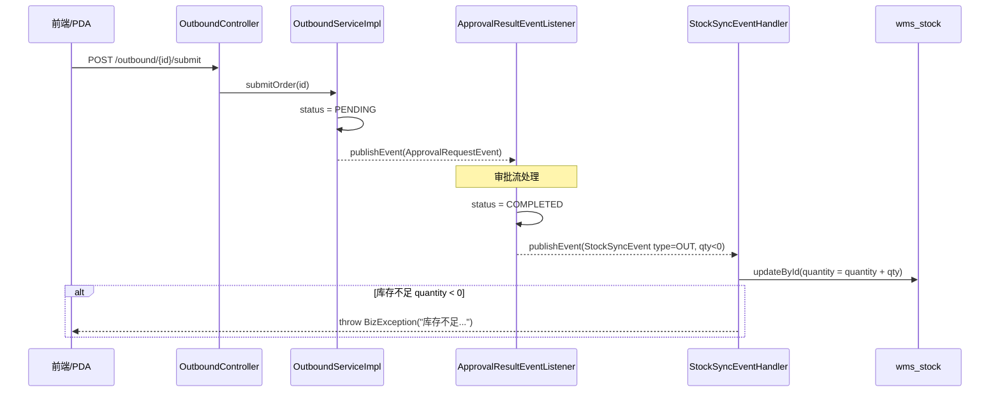

# 出库流程

> **状态**: ✅ 已完成（2026-06-02）
> **负责人**: <TBD>
> **关联模块**: `wms-business` (Outbound) + `wms-item` (库存) + `wms-approval` (审批) + `wms-warehouse` (库房库位)
> **优先级**: 🔴 P0 — 核心业务

## 一、业务概述

出库（领用）是备品备件库房最核心的下行业务，覆盖 **领用出库 / 调拨出库 / 报废出库** 三类业务场景，状态从 `DRAFT(草稿)` 走到 `COMPLETED(已完成)`，中间需经 `PENDING(待审批)` → `APPROVING(审批中)` → `APPROVED(已通过)` 的审批流转。库存的实际扣减不会在创建或提交时发生，而是统一由 `ApprovalResultEventListener` 监听 `ApprovalResultEvent` 后，在审批通过时才为每条明细发布一次 `StockSyncEvent(type=OUT)`，由 `StockSyncEventHandler` 真正改写 `wms_stock` 表的库存数量。

业务流程涉及以下模块协同：

- **wms-business**: 出库单主表/明细维护、扫码识别、提交与逻辑删除
- **wms-warehouse**: 库房/库位校验、库位归属单据库房校验（`BinWarehouseValidator`）
- **wms-item**: 物品存在性校验、库存扣减、库存预警
- **wms-approval**: 出库单提交后进入审批流；审批通过/驳回均通过 `ApprovalResultEvent` 回调
- **wms-pda (前端) / wms-business.controller.pda (后端)**: PDA 端通过 `/pda/tasks` 拉取出库待办，扫码出入库单均复用 `/outbound/scan` 接口

文档目标：

- 业务出库全链路（创建 → 提交 → 审批 → 完成 → 库存扣减 → 事件发布）
- 状态机与异常分支
- 与审批模块、库存模块、PDA 模块的交互边界
- 与 [入库流程.md](入库流程.md) 的 IN vs OUT 对照

## 二、业务流程图

### 2.1 主链路

```mermaid
flowchart TD
    A[创建出库单<br/>POST /outbound] -->|状态=DRAFT| B[草稿]
    B -->|扫码追加明细<br/>POST /outbound/scan| B
    B -->|更新<br/>PUT /outbound/{id}| B
    B -->|提交<br/>POST /outbound/{id}/submit| C[待审批<br/>PENDING]
    C -->|发布 ApprovalRequestEvent| D[审批模块]
    D -->|审批中| E[APPROVING]
    E -->|通过<br/>ApprovalResultEvent.approved=true| F[ApprovalResultEventListener<br/>handleOutboundApproved]
    F -->|标记COMPLETED| G[已完成]
    F -->|逐条发布<br/>StockSyncEvent type=OUT| H[StockSyncEventHandler]
    H -->|扣减wms_stock| I[wms_stock 数量减少]
    E -->|驳回<br/>ApprovalResultEvent.approved=false| J[handleOutboundRejected]
    J -->|回退为DRAFT| B
    B -->|删除<br/>DELETE /outbound/{id}| K[逻辑删除<br/>LogicDeleteHelper]
```

### 2.2 库存事件链路



## 三、状态机

| 状态码 | 枚举 (`OrderStatusEnum`) | 描述 | 可执行操作 |
|--------|--------------------------|------|------------|
| 0 | `DRAFT` | 草稿 | 编辑、更新、提交、逻辑删除 |
| 1 | `PENDING` | 待审批 | 等待审批模块处理（前端可撤回/查看） |
| 2 | `APPROVING` | 审批中 | 等待多级审批节点流转 |
| 3 | `APPROVED` | 已通过 | 当前仅在审批模块内部使用，作为 `COMPLETED` 的前置瞬态（`ApprovalResultEventListener` 收到通过事件后直接置为 `COMPLETED`） |
| 4 | `REJECTED` | 已驳回 | 瞬态，监听器收到驳回事件后回退为 `DRAFT` |
| 5 | `COMPLETED` | 已完成 | 库存已扣减、单据不可再编辑 |

> 数据库字段为 `order_status`，枚举为 `OrderStatusEnum`，**禁止在 Service/Controller 中直接写 `0/1/2/3/4/5` 数字字面量**，必须通过 `OrderStatusEnum.DRAFT.getCode()` 等方式引用。

状态流转由两处协同驱动：

- **`OutboundServiceImpl.submitOrder`**: `DRAFT → PENDING`（提交时一次性更新并发布审批请求）
- **`ApprovalResultEventListener`**:
  - `handleOutboundApproved`：`PENDING/APPROVING → COMPLETED` + 发布 OUT 事件
  - `handleOutboundRejected`：`PENDING/APPROVING/REJECTED → DRAFT`

**仅 `DRAFT` 状态可执行** `updateOrder` / `deleteOrder`（见 [OutboundServiceImpl.updateOrder §216](d:\Codes\WMS_code\wms-server\wms-business\src\main\java\com\wms\business\service\impl\OutboundServiceImpl.java) 与 §315），其他状态直接抛 `BizException`。

## 四、核心 API

`OutboundController` 全部挂在 `/outbound` 前缀下，扫描接口为 `/outbound/scan`。

| # | HTTP | 路径 | 方法名 | 权限标识 | 注解 | 说明 |
|---|------|------|--------|----------|------|------|
| 1 | GET | `/outbound` | `pageOrders` | `business:outbound:list` | `@DataScope` | 分页查询出库单 |
| 2 | GET | `/outbound/{id}` | `getOrderById` | `business:outbound:list` | `@DataScope` | 详情（含明细） |
| 3 | POST | `/outbound` | `createOrder` | `business:outbound:add` | `@OperLog(新增)` | 新建草稿 |
| 4 | PUT | `/outbound/{id}` | `updateOrder` | `business:outbound:edit` | `@OperLog(更新)` | 仅草稿可更新 |
| 5 | POST | `/outbound/scan` | `scan` | `business:outbound:scan` | `@DataScope` | 扫码识别 |
| 6 | POST | `/outbound/{id}/submit` | `submitOrder` | `business:outbound:submit` | `@OperLog(提交)` | 草稿→待审批 |
| 7 | DELETE | `/outbound/{id}` | `deleteOrder` | `business:outbound:delete` | `@OperLog(删除)` | 仅草稿可删除 |

> 所有 Controller 方法均带 `@PreAuthorize(...)`，查询接口带 `@DataScope`，写操作带 `@OperLog`，符合 [AGENTS.md §1.2-1.4](../AGENTS.md)。

### 4.1 请求/响应示例

**4.1.1 分页查询出库单** `GET /outbound?pageNum=1&pageSize=10&warehouseId=1&orderType=1&status=1&orderNo=CK2026`

响应：

```json
{
  "code": 200,
  "data": {
    "total": 23,
    "page": 1,
    "size": 10,
    "records": [
      {
        "id": 1900,
        "orderNo": "CK202606020001",
        "warehouseId": 1,
        "warehouseName": "一号备件库",
        "orderType": 1,
        "status": 1,
        "receiver": "张三",
        "purpose": "车间 A 维修",
        "expectedReturnDate": "2026-06-09T10:00:00",
        "remark": "急用",
        "createTime": "2026-06-02T10:00:00",
        "createBy": "zhangsan"
      }
    ]
  }
}
```

**4.1.2 新增出库单** `POST /outbound`

请求体：

```json
{
  "warehouseId": 1,
  "orderType": 1,
  "receiver": "张三",
  "purpose": "车间 A 维修",
  "expectedReturnDate": "2026-06-09T10:00:00",
  "remark": "急用",
  "details": [
    { "itemId": 101, "quantity": 2, "binId": 5021 },
    { "itemId": 102, "quantity": 1, "binId": 5022 }
  ]
}
```

响应：返回完整的 `OutboundOrderVo`，含 `id`、`orderNo`（`CK + yyyyMMdd + 4位流水`）和明细列表。

**4.1.3 更新出库单** `PUT /outbound/{id}` —— 请求体结构同上；`id` 取自 URL。仅 `DRAFT` 状态可更新，更新时会：

1. 校验主表
2. 校验库房
3. 校验明细库位归属单据库房
4. `LogicDeleteHelper.markDeletedEntities` 逻辑删除旧明细
5. `Db.saveBatch` 批量插入新明细

**4.1.4 提交出库单** `POST /outbound/{id}/submit` —— 无请求体；返回 `R<Void>`，状态从 `DRAFT(0)` 改为 `PENDING(1)`，并发布 `ApprovalRequestEvent`。

**4.1.5 扫码识别** `POST /outbound/scan`

请求体：

```json
{
  "code": "RFID:EPC280...ABC",
  "currentLabelIds": [501, 502]
}
```

响应：

```json
{
  "code": 200,
  "data": {
    "labelId": 503,
    "labelNo": "BQ202605180012",
    "labelStatus": 1,
    "itemId": 101,
    "itemName": "M10 螺栓",
    "itemCode": "WP202605180001",
    "detail": { "itemId": 101, "quantity": 1 }
  }
}
```

> `currentLabelIds` 用于前端判断当前单据内是否已经扫过同一标签，避免重复计入明细。

**4.1.6 删除出库单** `DELETE /outbound/{id}` —— 仅 `DRAFT` 状态可删除，逻辑删除主单 + 所有明细（`LogicDeleteHelper.markDeleted` + `markDeletedEntities`）。

## 五、关键 Service 方法

`OutboundService` 接口暴露 6 个 `public` 方法，全部由 `OutboundServiceImpl` 实现；扫码由独立的 `OutboundScanServiceImpl` 处理。

| 方法 | 职责 | 关键校验/操作 |
|------|------|---------------|
| `pageOrders` | 分页查询出库单 | 按 `warehouseId/orderType/status/orderNo` 过滤；批量查询库房填充 `warehouseName`，避免 N+1（见 [§5.1](../AGENTS.md)） |
| `getOrderById` | 查详情（含明细） | 主单不存在/已删除抛 `BizException`；`OutboundOrderConverter` + `getOrderDetails` 批量填充物品与库位 |
| `createOrder` | 创建草稿 | 库房存在且启用 → 物品存在且未删除 → `BinWarehouseValidator` 校验明细库位归属单据库房 → `generateOrderNo` → `wmsOutboundOrderMapper.insert` → `Db.saveBatch` 批量插明细 |
| `updateOrder` | 更新草稿 | 仅 `DRAFT` 可更新；旧明细 `LogicDeleteHelper.markDeletedEntities` 后 `saveBatch` 新明细 |
| `submitOrder` | 提交 | 仅 `DRAFT` 可提交；状态置为 `PENDING`；发布 `ApprovalRequestEvent(id, BizTypeEnum.OUTBOUND.getCode())` |
| `deleteOrder` | 删除 | 仅 `DRAFT` 可删除；`LogicDeleteHelper.markDeleted` 主单 + 明细 |
| `OutboundScanServiceImpl.scan` | 解析电子标签并校验可出库 | 复用 `ElectronicLabelService.scan`；重复扫描/未绑定物品/标签状态非 `IN_STOCK` 抛 `BizException`；返回建议明细（`quantity=OrderScanConstants.DEFAULT_SCAN_QUANTITY`） |

私有方法：

- `generateOrderNo()` —— 调 `SequenceGenerator.next(OrderConstants.OUTBOUND_NO_PREFIX)` 生成 `CK + yyyyMMdd + 4位流水`（Redis INCR 并发安全，见 [§5.4](../AGENTS.md)）。
- `getOrderDetails(Long orderId)` —— 批量查 `itemId` 与 `binId` 后映射，避免 N+1（见 [§5.1](../AGENTS.md)），并交给 `OutboundOrderConverter.toDetailVo` 组装 `OutboundDetailVo`。

### 5.1 OutboundOrderConverter 字段映射

| 实体字段 | VO 字段 | 来源/补齐方式 |
|----------|---------|---------------|
| `id` | `id` | 直接复制 |
| `orderNo` | `orderNo` | 直接复制 |
| `warehouseId` | `warehouseId` / `warehouseName` | `warehouseMap` 批量查询（`OutboundServiceImpl.pageOrders` / `getOrderDetails`） |
| `orderType` | `orderType` | 直接复制 |
| `status` | `status` | 直接复制 |
| `receiver` / `purpose` / `expectedReturnDate` / `remark` / `createTime` / `createBy` | 对应字段 | 直接复制 |
| 明细：`itemId` | `itemId` / `itemName` / `itemCode` | `itemMap` 批量查询（`WmsItem`） |
| 明细：`binId` | `binId` / `binCode` | `binMap` 批量查询（`WmsBin`） |

## 六、库存扣减逻辑

> 核心规则出处：[AGENTS.md §4.1](../AGENTS.md) — 库存不足必须抛 `BizException`；[AGENTS.md §4.2](../AGENTS.md) — 库存同步事件在审批后发布。

出库单的库存扣减**不发生在 `createOrder` 或 `submitOrder`**，而是由 `ApprovalResultEventListener.handleOutboundApproved` 统一调度，链路如下：

1. `ApprovalResultEventListener.handleApproved` 收到 `ApprovalResultEvent(approved=true)`，按 `bizType` 分发到 `handleOutboundApproved(bizId)`。
2. 加载出库主单（`WmsOutboundOrder`）并把状态置为 `OrderStatusEnum.COMPLETED`，`updateById` 持久化。
3. 加载所有出库明细（`WmsOutboundDetail`），逐条发布 `StockSyncEvent(itemId, warehouseId, binId, -quantity, BizConstants.STOCK_SYNC_OUT)`。
4. `StockSyncEventHandler.handleStockSync` 在事务中根据 `itemId + warehouseId + binId` 查找 `wms_stock`：
   - **命中**：`quantity = quantity + event.quantity`（出库为负数），同时刷新 `lastOutboundTime`。
   - **未命中**：`event.quantity > 0` 才允许新增；出库为负数的情况下不应新增，库存不足直接抛 `BizException("库存不足: ...")`。
5. 库存扣减完成后，`wms_stock.lockedQuantity`（预占/锁定量）不变；归还/调拨等其他业务事件请参考 [归还报废调拨.md](归还报废调拨.md)。

关键代码定位：

- [OutboundServiceImpl.java:295](d:\Codes\WMS_code\wms-server\wms-business\src\main\java\com\wms\business\service\impl\OutboundServiceImpl.java) — `submitOrder` 仅发布 `ApprovalRequestEvent`，不发布 `StockSyncEvent`（已由 [OutboundServiceImplApprovalFlowTest](../wms-server/wms-business/src/test/java/com/wms/business/service/impl/OutboundServiceImplApprovalFlowTest.java) 单测固化）。
- [ApprovalResultEventListener.java:148-167](d:\Codes\WMS_code\wms-server\wms-business\src\main\java\com\wms\business\listener\ApprovalResultEventListener.java) — `handleOutboundApproved` 发布 `OUT` 事件。
- [StockSyncEventHandler.java:32-83](d:\Codes\WMS_code\wms-server\wms-business\src\main\java\com\wms\business\event\StockSyncEventHandler.java) — 库存数量增减与 `quantity < 0` 抛 `BizException` 校验。

> ⚠️ **设计原则**：禁止在 `createOrder`/`submitOrder` 中直接发布 `StockSyncEvent`，否则会出现"草稿单被删除但库存已被扣减"的脏状态。必须由审批流统一驱动（见 [AGENTS.md §4.2](../AGENTS.md)）。

## 七、审批流

| 节点 | 状态/动作 | 触发位置 |
|------|-----------|----------|
| 草稿提交 | `DRAFT → PENDING`，发布 `ApprovalRequestEvent(bizId, BizTypeEnum.OUTBOUND)` | `OutboundServiceImpl.submitOrder` |
| 审批中 | 审批模块流转为 `APPROVING` | 审批模块内部 |
| 审批通过 | `→ APPROVED → COMPLETED`，逐条发 `StockSyncEvent(OUT)` | `ApprovalResultEventListener.handleOutboundApproved` |
| 审批驳回 | `→ REJECTED → DRAFT`（回退可编辑） | `ApprovalResultEventListener.handleOutboundRejected` |

> 详细审批节点（多级、抄送、加签等）请参考 [审批流程.md](审批流程.md)。本流程只说明出库单与审批模块的契约：提交时通过 `ApprovalRequestEvent` 进入审批；审批结果以 `ApprovalResultEvent` 回调，事件负载结构请阅读 `com.wms.common.event.ApprovalResultEvent`。

## 八、库存事件

出库流程涉及两个 Spring 事件：

| 事件 | 发布者 | 订阅者 | 触发时机 | 用途 |
|------|--------|--------|----------|------|
| `ApprovalRequestEvent` | `OutboundServiceImpl.submitOrder` | 审批模块 | 单据从 `DRAFT` 提交时 | 触发审批流 |
| `StockSyncEvent(type=OUT, qty<0)` | `ApprovalResultEventListener.handleOutboundApproved` | `StockSyncEventHandler` | 审批**通过**后 | 实际扣减 `wms_stock` 数量 |

`StockSyncEvent` 字段：

| 字段 | 类型 | 含义 |
|------|------|------|
| `itemId` | `Long` | 物品 ID |
| `warehouseId` | `Long` | 库房 ID |
| `binId` | `Long` | 库位 ID（**必填**，handler 校验） |
| `quantity` | `Integer` | 变动数量（出库为负数） |
| `type` | `String` | `BizConstants.STOCK_SYNC_OUT` 常量值（参见 [AGENTS.md §4.3.2](../AGENTS.md)） |

> 出库单**草稿阶段不发布库存事件**；任何对 `wms_stock` 的扣减都必须等待审批通过。事件发布与库存扣减的详细规范请阅读 [AGENTS.md §4.2](../AGENTS.md)。

## 九、PDA 拣货交互

PDA 端通过 `PdaController`（`/pda` 前缀）完成**待办统计 / RFID 批量读取 / 盘点** 等移动端特有功能。出库拣货的核心交互实际上复用 `OutboundController` 的 `createOrder` / `scan` / `submitOrder`：

| PDA 场景 | 后端接口 | 说明 |
|----------|----------|------|
| PDA 启动 → 拉取待办 | `GET /pda/tasks` | 详见 [PdaServiceImpl.java:274-275](d:\Codes\WMS_code\wms-server\wms-business\src\main\java\com\wms\business\service\pda\impl/PdaServiceImpl.java)，统计 `outboundPendingCount = count(status=DRAFT)` |
| PDA 扫码登记物品 | `POST /outbound/scan` | 直接复用 `OutboundScanServiceImpl.scan`，由 `currentLabelIds` 防止重复扫描 |
| PDA 创建出库草稿 | `POST /outbound` | 复用 `OutboundServiceImpl.createOrder` |
| PDA 提交出库 | `POST /outbound/{id}/submit` | 复用 `OutboundServiceImpl.submitOrder` |
| PDA RFID 批量核验 | `POST /pda/rfid/batch-read` | 用于复核库房实物 vs 系统标签，不直接驱动出库 |
| PDA 库存盘点 | `POST /pda/stock/check` | 与出库独立，仅用于库存差异上报 |

`PdaTaskVo` 中 `outboundPendingCount` 字段语义是 **"待提交"**（即状态为 `DRAFT`）的出库单数量。

## 十、异常处理清单

`OutboundServiceImpl` 与 `OutboundScanServiceImpl` 中所有 `throw new BizException(...)` 场景（区分场景抛精准信息，符合 [AGENTS.md §4.4](../AGENTS.md)）：

| Service | 触发点 | 异常信息 | 业务含义 |
|---------|--------|----------|----------|
| `OutboundServiceImpl` | `getOrderById/updateOrder/submitOrder/deleteOrder` | `出库单不存在` | 主单未查询到 |
| `OutboundServiceImpl` | `getOrderById/updateOrder/submitOrder/deleteOrder` | `出库单已删除` | 主单 `delFlag=DELETED` |
| `OutboundServiceImpl` | `updateOrder` | `仅草稿状态的出库单可以更新` | 状态 ≠ `DRAFT` |
| `OutboundServiceImpl` | `submitOrder` | `仅草稿状态的出库单可以提交` | 状态 ≠ `DRAFT` |
| `OutboundServiceImpl` | `deleteOrder` | `仅草稿状态的出库单可以删除` | 状态 ≠ `DRAFT` |
| `OutboundServiceImpl` | `createOrder/updateOrder` | `库房不存在` | 库房主表查不到 |
| `OutboundServiceImpl` | `createOrder/updateOrder` | `库房已删除` | 库房 `delFlag=DELETED` |
| `OutboundServiceImpl` | `createOrder` | `物品不存在: {itemId}` | 物品主表查不到 |
| `OutboundServiceImpl` | `createOrder` | `物品已删除: {itemId}` | 物品 `delFlag=DELETED` |
| `OutboundServiceImpl` | `createOrder/updateOrder` | `出库明细库位不属于单据库房: binId=..., warehouseId=...` | `BinWarehouseValidator` 校验失败 |
| `OutboundScanServiceImpl` | `validateRepeatedScan` | `该标签已存在于当前出库单` | `currentLabelIds` 已包含当前 labelId |
| `OutboundScanServiceImpl` | `validateBoundItem` | `标签未绑定物品，无法生成出库明细` | `labelVo.itemId == null` |
| `OutboundScanServiceImpl` | `validateLabelStatus` | `该标签当前不可出库` | `labelStatus != LabelStatusEnum.IN_STOCK` |
| `StockSyncEventHandler` | 扣减后 `quantity < 0` | `库存不足: itemId=..., warehouseId=..., 当前库存=..., 扣减数量=...` | 见 [AGENTS.md §4.1](../AGENTS.md) |
| `StockSyncEventHandler` | `binId == null` | `库位不能为空: ...` | 出库事件必须带库位 |
| `BinWarehouseValidator` | 内部 `validateBin` | `库位不存在: binId=...` | 库位查不到 |
| `BinWarehouseValidator` | 内部 `validateBin` | `库位已删除: binId=...` | 库位 `delFlag=DELETED` |
| `BinWarehouseValidator` | 内部 `validateBin` | `库位已禁用: binId=...` | `binStatus == BIN_STATUS_DISABLED` |

> 上述异常均通过 `BizException` 抛出，由全局异常处理器转为统一 `R<T>` 错误响应。

## 十一、字段说明

### 11.1 DTO

`OutboundOrderDto`（新增/编辑）：

| 字段 | 类型 | 必填 | 校验 | 说明 |
|------|------|------|------|------|
| `warehouseId` | `Long` | ✅ | `@NotNull` | 库房 ID |
| `orderType` | `Integer` | ✅ | `@NotNull` | 出库类型（1-领用 2-调拨 3-报废） |
| `receiver` | `String` | ❌ | - | 领用人 |
| `purpose` | `String` | ❌ | - | 用途说明 |
| `expectedReturnDate` | `LocalDateTime` | ❌ | - | 预计归还时间 |
| `remark` | `String` | ❌ | - | 备注 |
| `details` | `List<OutboundDetailDto>` | ✅ | `@NotNull` `@Valid` | 出库明细列表 |

`OutboundOrderDto.OutboundDetailDto`：

| 字段 | 类型 | 必填 | 校验 | 说明 |
|------|------|------|------|------|
| `itemId` | `Long` | ✅ | `@NotNull` | 物品 ID |
| `quantity` | `Integer` | ✅ | `@NotNull` | 出库数量 |
| `binId` | `Long` | ✅ | `@NotNull` | 出库库位 ID |

`OutboundScanDto`：

| 字段 | 类型 | 必填 | 校验 | 说明 |
|------|------|------|------|------|
| `code` | `String` | ✅ | `@NotBlank` | 扫码内容（EPC / 标签编号） |
| `currentLabelIds` | `List<Long>` | ❌ | - | 当前单据已扫描的标签 ID |

### 11.2 VO

`OutboundOrderVo`：

| 字段 | 类型 | 说明 |
|------|------|------|
| `id` | `Long` | 主键 |
| `orderNo` | `String` | 出库单号（`CK + yyyyMMdd + 4位流水`） |
| `warehouseId` / `warehouseName` | `Long` / `String` | 库房 ID / 名称（`warehouseMap` 填充） |
| `orderType` | `Integer` | 出库类型（1-领用 2-调拨 3-报废） |
| `status` | `Integer` | 单据状态（`OrderStatusEnum`） |
| `receiver` / `purpose` / `expectedReturnDate` / `remark` | - | 业务字段 |
| `createTime` / `createBy` | `LocalDateTime` / `String` | 创建信息 |
| `details` | `List<OutboundDetailVo>` | 出库明细 |

`OutboundOrderVo.OutboundDetailVo`：

| 字段 | 类型 | 说明 |
|------|------|------|
| `id` | `Long` | 明细主键 |
| `itemId` / `itemName` / `itemCode` | - | 物品 ID/名称/编号（`itemMap` 填充） |
| `quantity` | `Integer` | 数量 |
| `binId` / `binCode` | `Long` / `String` | 库位 ID/编码（`binMap` 填充） |

`OutboundScanResultVo`：

| 字段 | 类型 | 说明 |
|------|------|------|
| `labelId` / `labelNo` / `labelStatus` | - | 标签识别信息（来源 `ElectronicLabelVo`） |
| `itemId` / `itemName` / `itemCode` | - | 标签绑定的物品信息 |
| `detail` | `OutboundDetailScanVo` | 建议回填的明细（`quantity=OrderScanConstants.DEFAULT_SCAN_QUANTITY`） |

### 11.3 实体

`WmsOutboundOrder`（表 `wms_outbound_order`，数据库列 `order_status`）：

| 字段 | DB 列 | 说明 |
|------|-------|------|
| `id` | `id` | 主键，雪花 ID（`IdType.ASSIGN_ID`） |
| `orderNo` | `order_no` | 出库单号 |
| `warehouseId` | `warehouse_id` | 库房 ID |
| `applicantId` | `applicant_id` | 申请人 ID |
| `deptId` | `dept_id` | 部门 ID |
| `operatorId` | `operator_id` | 操作人 ID |
| `orderType` | `order_type` | 出库类型（1-领用 2-调拨 3-盘亏，SQL 注释） |
| `status` | `order_status` | 单据状态（`@TableField("order_status")`） |
| `receiver` / `purpose` / `expectedReturnDate` / `remark` | - | 业务字段 |
| 公共字段 | `del_flag/create_time/create_by/update_time/update_by` | 见 [AGENTS.md §7.3](../AGENTS.md) |

> 实体注释中 `orderType` 写的是"1-领用 2-调拨 3-盘亏"，VO/DTO 注释为"1-领用 2-调拨 3-报废"，**实际业务枚举与值**以 `BizTypeEnum` 为准——出库类型语义在上下游传递时统一为 `orderType` 整数（不做独立枚举类）。前端请按 `orderType=1/2/3` 渲染领用/调拨/报废三种文案。

`WmsOutboundDetail`（表 `wms_outbound_detail`）：

| 字段 | DB 列 | 说明 |
|------|-------|------|
| `id` | `id` | 主键，雪花 ID |
| `orderId` | `order_id` | 出库单 ID |
| `itemId` | `item_id` | 物品 ID |
| `labelId` | `label_id` | 电子标签 ID（扫码出库时关联） |
| `quantity` | `quantity` | 出库数量 |
| `binId` | `bin_id` | 出库库位 ID |
| `isReturnable` | `is_returnable` | 是否需归还（0-否 1-是） |
| `expectedReturn` | `expected_return` | 预计归还时间 |
| 公共字段 | `del_flag/...` | 同上 |

## 十二、数据库表

### 12.1 `wms_outbound_order`（出库/领用单主表）

| 列名 | 类型 | 默认 | 注释 |
|------|------|------|------|
| `id` | `BIGINT` | - | 主键（雪花 ID） |
| `order_no` | `VARCHAR(50)` | - | 出库单号 |
| `order_type` | `TINYINT` | `1` | 出库类型（1-领用 2-调拨 3-盘亏） |
| `applicant_id` | `BIGINT` | `NULL` | 领用申请人 ID |
| `receiver` | `VARCHAR(64)` | `''` | 领用人 |
| `dept_id` | `BIGINT` | `NULL` | 领用部门 ID |
| `purpose` | `VARCHAR(200)` | `NULL` | 领用用途 |
| `total_quantity` | `INT` | `0` | 总数量 |
| `order_status` | `TINYINT` | `0` | 单据状态（0-草稿 1-待审批 2-审批中 3-已通过 4-已驳回 5-已完成） |
| `outbound_time` | `DATETIME` | `NULL` | 出库时间 |
| `expected_return` | `DATETIME` | `NULL` | 预计归还时间 |
| `operator_id` | `BIGINT` | `NULL` | 操作人 ID |
| `approval_required` | `TINYINT` | `0` | 是否需要审批（0-否 1-是） |
| `warehouse_id` | `BIGINT` | `NULL` | 所属库房 ID |
| `remark` | `VARCHAR(500)` | `NULL` | 备注 |
| 公共字段 | - | - | `del_flag/create_time/create_by/update_time/update_by` |
| 索引 | - | - | `PRIMARY(id)`、`uk_order_no(order_no, del_flag)`、`idx_applicant_id`、`idx_order_status`、`idx_outbound_time` |

### 12.2 `wms_outbound_detail`（出库明细表）

| 列名 | 类型 | 默认 | 注释 |
|------|------|------|------|
| `id` | `BIGINT` | - | 主键（雪花 ID） |
| `order_id` | `BIGINT` | - | 出库单 ID |
| `item_id` | `BIGINT` | - | 物品 ID |
| `label_id` | `BIGINT` | `NULL` | 电子标签 ID（扫码出库时关联） |
| `quantity` | `INT` | - | 出库数量 |
| `bin_id` | `BIGINT` | `NULL` | 出库库位 ID |
| `is_returnable` | `TINYINT` | `1` | 是否需归还（0-否 1-是） |
| `expected_return` | `DATETIME` | `NULL` | 预计归还时间 |
| 公共字段 | - | - | `del_flag/...` |
| 索引 | - | - | `PRIMARY(id)`、`idx_order_id`、`idx_item_id` |

> 主键策略为 `IdType.ASSIGN_ID`（雪花 ID），SQL 不使用 `AUTO_INCREMENT`，符合 [AGENTS.md §3.4 / §7.4](../AGENTS.md)。公共字段 `del_flag` 由 `@TableLogic` 接管，逻辑删除必须通过 `LogicDeleteHelper` 或 `UpdateWrapper.set("del_flag", DelFlagConstants.DELETED)` 显式写入（[AGENTS.md §3.2](../AGENTS.md)）。

## 十三、关联规则引用

| 规则条目 | 内容 |
|----------|------|
| [AGENTS.md §1.2](../AGENTS.md) | 查询接口必加 `@DataScope`（本模块 `pageOrders/getOrderById/scan` 均已落实） |
| [AGENTS.md §1.3](../AGENTS.md) | 所有 Controller 方法必加 `@PreAuthorize(...)` |
| [AGENTS.md §1.4](../AGENTS.md) | 写操作必加 `@OperLog`（create/update/submit/delete 已落实） |
| [AGENTS.md §3.2](../AGENTS.md) | 逻辑删除必须用 `LogicDeleteHelper` / 显式 `set("del_flag", DelFlagConstants.DELETED)` |
| [AGENTS.md §3.3](../AGENTS.md) | 禁止手动 `eq(::getDelFlag, 0)`（MyBatis-Plus 自动拼接） |
| [AGENTS.md §4.1](../AGENTS.md) | 库存不足必须抛 `BizException`（由 `StockSyncEventHandler` 执行） |
| [AGENTS.md §4.2](../AGENTS.md) | 库存同步事件在审批**通过**后发布（`ApprovalResultEventListener` 落实） |
| [AGENTS.md §4.3](../AGENTS.md) | 状态/类型值必须引用枚举（`OrderStatusEnum`）或常量（`BizConstants.STOCK_SYNC_OUT`） |
| [AGENTS.md §4.4](../AGENTS.md) | 异常信息必须区分场景（参考第十节异常处理清单） |
| [AGENTS.md §5.1](../AGENTS.md) | 列表查询禁止 N+1（`pageOrders`/`getOrderDetails` 批量查 Map） |
| [AGENTS.md §5.4](../AGENTS.md) | 编号生成并发安全（`SequenceGenerator` Redis INCR） |
| [AGENTS.md §7.3](../AGENTS.md) | 表必须包含公共字段（已落实） |

## 十四、关联文档链接

- [入库流程.md](入库流程.md) —— IN 方向对照
- [库房管理.md](库房管理.md) —— 库房/区域/库位/库位占用规则
- [审批流程.md](审批流程.md) —— 审批节点、抄送、加签等
- [归还报废调拨.md](归还报废调拨.md) —— 出库后的归还/报废/调拨
- [库存盘点.md](库存盘点.md) —— PDA 端 RFID 批量读取、盘点流程
- [PDA移动端.md](PDA移动端.md) —— PDA 端整体架构
- [物品库存.md](物品库存.md) —— `wms_stock` 库存模型
- [电子标签.md](电子标签.md) —— `WmsElectronicLabel` 与 `LabelStatusEnum`
- [监控预警.md](监控预警.md) —— 库存预警、超期归还
- [AGENTS.md](../AGENTS.md) —— 全局开发规则（必须先读）
