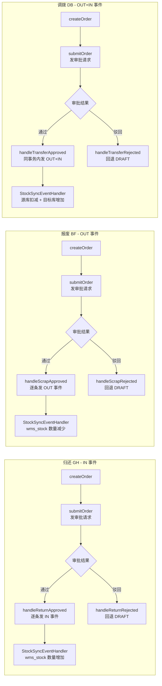
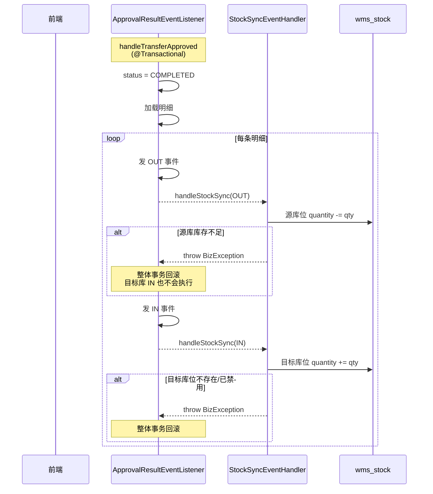

# 归还 / 报废 / 调拨 流程

> **状态**: ✅ 已完成（2026-06-02）
> **负责人**: <TBD>
> **关联模块**: `wms-business` (Return / Scrap / Transfer) + `wms-item` (库存) + `wms-approval` (审批) + `wms-warehouse` (库房库位)
> **优先级**: 🔴 P0 — 核心业务

## 一、概述

归还、报废、调拨是备品备件库房的 **"反向/横向" 三大业务**，与入库/出库构成完整闭环。三者有共同的"草稿 → 审批 → 完成"骨架，差异在库存事件方向与业务目的：

| 业务 | 业务目的 | 库存事件方向 | 是否跨库房 | 编号前缀 |
|------|----------|-------------|-----------|----------|
| 归还（Return） | 领用物品回到库房 | IN（入库） | 否 | `GH` |
| 报废（Scrap） | 物品销毁 | OUT（出库） | 否 | `BF` |
| 调拨（Transfer） | 库房间移动 | OUT + IN（出库+入库） | **是** | `DB` |

**核心约定**（[AGENTS.md §4.2](../AGENTS.md)）：三业务的库存同步事件 **都不在 `createOrder` 或 `submitOrder` 中发布**，而是在审批流通过 `ApprovalResultEventListener` 监听 `ApprovalResultEvent` 后统一发布，调拨还会一次发布两个事件（源库 OUT + 目标库 IN）保证"出库即入库"的原子语义。

文档目标：

- 三个业务的全链路（创建 → 提交 → 审批 → 完成 → 库存事件）
- 状态机与异常分支
- 与审批模块、库存模块的交互边界
- 与 [入库流程.md](入库流程.md) / [出库流程.md](出库流程.md) 的 IN/OUT 对照
- 调拨的跨库房事务边界（**单事务**：源库 OUT 与目标库 IN 在同一 `@Transactional` 内发布，若任一事件失败则整体回滚）

## 二、整体架构

### 2.1 涉及模块

| 模块 | 角色 |
|------|------|
| `wms-business` (Return) | 归还单主表/明细维护、关联出库单、异常登记、提交 |
| `wms-business` (Scrap) | 报废单主表/明细维护、报废原因登记、提交 |
| `wms-business` (Transfer) | 调拨单主表/明细维护、调出/调入库房&库位校验、提交 |
| `wms-warehouse` | 库房/库位存在性、库位归属单据库房校验（`BinWarehouseValidator`） |
| `wms-item` | 物品存在性、库存数量增减（`StockSyncEventHandler`） |
| `wms-approval` | 审批流；审批通过/驳回通过 `ApprovalResultEvent` 回调 |

### 2.2 三业务的差异概览



## 三、归还流程

### 3.1 业务概述

归还是 **领用出库的反向业务**：领用人把已领用的物品交还库房，重新入库。归还单必须关联一张 **出库单**（`outboundOrderId`），归还人/归还原因/归还物品明细从该出库单中追溯。

**归还类型**（`conditionStatus`，见 [OrderConstants.RETURN_CONDITION_*](#)）：

| 取值 | 常量 | 含义 | 是否入库 | 入库数量 |
|------|------|------|----------|---------|
| 1 | `RETURN_CONDITION_NORMAL` | 正常归还 | ✅ | `quantity` |
| 2 | `RETURN_CONDITION_DAMAGED` | 损坏 | ❌ | 0 |
| 3 | `RETURN_CONDITION_LOST` | 丢失 | ❌ | 0 |
| 4 | `RETURN_CONDITION_MISMATCH` | 数量不符 | ✅ | `actualQuantity` |

> 损坏/丢失的明细 `abnormalRemark`（异常说明）**必须**填写；`submitOrder` 时校验，缺失抛 `BizException("异常归还明细必须填写异常说明: 物品ID=...")`。

### 3.2 业务流程图

```mermaid
flowchart TD
    A[创建归还单<br/>POST /return] -->|status=DRAFT| B[草稿]
    B -->|更新<br/>PUT /return/{id}| B
    B -->|提交<br/>POST /return/{id}/submit| C{校验异常说明}
    C -->|异常未填| X1[BizException]
    C -->|通过| D[待审批<br/>PENDING]
    D -->|发布 ApprovalRequestEvent| E[审批模块]
    E -->|审批中| F[APPROVING]
    F -->|通过| G[handleReturnApproved]
    G -->|查关联出库单拿 warehouseId| H[逐条处理明细]
    H -->|conditionStatus=DAMAGED/LOST| I[跳过不入库]
    H -->|conditionStatus=NORMAL/MISMATCH| J[发 IN 事件]
    J --> K[StockSyncEventHandler]
    K -->|wms_stock 数量增加| L[已完成]
    F -->|驳回| M[handleReturnRejected]
    M -->|回退 DRAFT| B
    B -->|删除<br/>DELETE /return/{id}| N[逻辑删除]
```

### 3.3 状态机

| 状态码 | 枚举 (`OrderStatusEnum`) | 描述 | 可执行操作 |
|--------|--------------------------|------|------------|
| 0 | `DRAFT` | 草稿 | 编辑、更新、提交、逻辑删除 |
| 1 | `PENDING` | 待审批 | 等待审批模块处理 |
| 2 | `APPROVING` | 审批中 | 等待多级审批节点流转 |
| 3 | `APPROVED` | 已通过 | 瞬态，由 `handleReturnApproved` 直接置为 `COMPLETED` |
| 4 | `REJECTED` | 已驳回 | 瞬态，监听器收到驳回事件后回退为 `DRAFT` |
| 5 | `COMPLETED` | 已完成 | 库存已入账、单据不可再编辑 |

> 数据库字段为 `order_status`（见 `WmsReturnOrder.status`），枚举为 `OrderStatusEnum`。**禁止在 Service/Controller 中直接写数字字面量**，必须通过 `OrderStatusEnum.DRAFT.getCode()` 等方式引用。

状态流转由两处协同驱动：

- **`ReturnServiceImpl.submitOrder`**：`DRAFT → PENDING`（提交时一次性更新并发布审批请求）
- **`ApprovalResultEventListener.handleReturnApproved`**：`PENDING/APPROVING → COMPLETED` + 发布 IN 事件
- **`ApprovalResultEventListener.handleReturnRejected`**：`PENDING/APPROVING/REJECTED → DRAFT`

**仅 `DRAFT` 状态可执行** `updateOrder` / `deleteOrder`（见 [ReturnServiceImpl §181/§248](../wms-server/wms-business/src/main/java/com/wms/business/service/impl/ReturnServiceImpl.java)），其他状态直接抛 `BizException`。

### 3.4 核心 API

`ReturnController` 全部挂在 `/return` 前缀下。

| # | HTTP | 路径 | 方法名 | 权限标识 | 注解 | 说明 |
|---|------|------|--------|----------|------|------|
| 1 | GET | `/return` | `pageOrders` | `business:return:list` | `@DataScope` | 分页查询归还单 |
| 2 | GET | `/return/{id}` | `getOrderById` | `business:return:list` | `@DataScope` | 详情（含明细） |
| 3 | POST | `/return` | `createOrder` | `business:return:add` | `@OperLog(新增)` | 新建草稿 |
| 4 | PUT | `/return/{id}` | `updateOrder` | `business:return:edit` | `@OperLog(更新)` | 仅草稿可更新 |
| 5 | POST | `/return/{id}/submit` | `submitOrder` | `business:return:submit` | `@OperLog(提交)` | 草稿→待审批 |
| 6 | DELETE | `/return/{id}` | `deleteOrder` | `business:return:delete` | `@OperLog(删除)` | 仅草稿可删除 |

> 所有 Controller 方法均带 `@PreAuthorize(...)`，查询接口带 `@DataScope`，写操作带 `@OperLog`，符合 [AGENTS.md §1.2-1.4](../AGENTS.md)。

#### 3.4.1 请求/响应示例

**3.4.1.1 新增归还单** `POST /return`

请求体：

```json
{
  "outboundOrderId": 1900,
  "receiver": "张三",
  "remark": "车间 A 维修后归还",
  "details": [
    { "itemId": 101, "binId": 5021, "quantity": 2, "conditionStatus": 1 },
    { "itemId": 102, "binId": 5022, "quantity": 1, "conditionStatus": 4, "actualQuantity": 1, "abnormalRemark": "实际只还 1 件" }
  ]
}
```

`conditionStatus` 取值见 [§3.1](#31-业务概述)。响应：返回完整 `ReturnOrderVo`，含 `id`、`orderNo`（`GH + yyyyMMdd + 4位流水`）、明细列表。

**3.4.1.2 提交归还单** `POST /return/{id}/submit` —— 无请求体；返回 `R<Void>`，状态从 `DRAFT(0)` 改为 `PENDING(1)`，并发布 `ApprovalRequestEvent(id, BizTypeEnum.RETURN.getCode())`。

### 3.5 关键 Service 方法

`ReturnServiceImpl` 暴露 6 个 `public` 方法（`pageOrders/getOrderById/createOrder/updateOrder/deleteOrder/submitOrder`）：

| 方法 | 职责 | 关键校验/操作 |
|------|------|---------------|
| `pageOrders` | 分页查询归还单 | 按 `status/orderNo` 过滤；批量查询关联出库单构建 `outboundOrderMap` 填充 `outboundOrderNo` |
| `getOrderById` | 查详情（含明细） | 主单不存在/已删除抛 `BizException`；`ReturnOrderConverter` 转换 + `buildItemMap` 批量填充物品 |
| `createOrder` | 创建草稿 | 校验关联出库单存在/未删除 → `generateOrderNo` → `BinWarehouseValidator` 校验明细库位归属出库单库房 → `Db.saveBatch` 插明细 → `appendDefaultBins` 把有效入库库位追加到物品默认库位 |
| `updateOrder` | 更新草稿 | 仅 `DRAFT` 可更新；旧明细 `LogicDeleteHelper.markDeletedEntities` 后 `saveBatch` 新明细 |
| `submitOrder` | 提交 | 仅 `DRAFT` 可提交；遍历明细校验异常归还（`DAMAGED/LOST/MISMATCH`）必须有 `abnormalRemark`；状态置为 `PENDING`；发布 `ApprovalRequestEvent(id, BizTypeEnum.RETURN.getCode())` |
| `deleteOrder` | 删除 | 仅 `DRAFT` 可删除；`LogicDeleteHelper.markDeleted` 主单 + 明细 |

私有方法：

- `buildDetails(Long orderId, List<ReturnDetailDto> detailDtos)` —— 校验物品存在，设置默认 `conditionStatus = OrderConstants.RETURN_CONDITION_NORMAL`，构建 `WmsReturnDetail` 列表。
- `buildItemMap(List<WmsReturnDetail> details)` —— 批量查 `itemId` 后映射，避免 N+1（[AGENTS.md §5.1](../AGENTS.md)）。
- `generateOrderNo()` —— 调 `SequenceGenerator.next(OrderConstants.RETURN_NO_PREFIX)` 生成 `GH + yyyyMMdd + 4位流水`（Redis INCR 并发安全，[AGENTS.md §5.4](../AGENTS.md)）。
- `appendDefaultBins(List<WmsReturnDetail> details)` —— 过滤出"会形成有效入库"的明细（`NORMAL` 全部、`MISMATCH` 且 `actualQuantity>0`、损坏/丢失不入库），按 `itemId` 分组后调 `itemService.appendDefaultBins`。
- `needsInbound(WmsReturnDetail detail)` —— 判断归还明细是否会形成有效入库，规则见 [§3.1](#31-业务概述) 表格。

### 3.6 库存事件发布时机（关键）

> ⚠️ **核心规则**：[AGENTS.md §4.2](../AGENTS.md) —— 归还单的库存同步事件 **不在 `createOrder` 中发布**，也 **不在 `submitOrder` 中发布**，仅在审批通过时由 `ApprovalResultEventListener.handleReturnApproved` 统一发布。

事件发布链路（[ApprovalResultEventListener.java:235-275](../wms-server/wms-business/src/main/java/com/wms/business/listener/ApprovalResultEventListener.java)）：

1. `ReturnServiceImpl.submitOrder` 收到提交请求，状态置为 `PENDING`，发布 `ApprovalRequestEvent(id, BizTypeEnum.RETURN.getCode())` 进入审批流。
2. 审批模块流转到通过节点后，发布 `ApprovalResultEvent(approved=true)`。
3. `ApprovalResultEventListener.handleApproved` 收到事件，根据 `bizType=RETURN` 分发到 `handleReturnApproved(bizId)`：
   - 加载主单 `WmsReturnOrder`，状态置为 `OrderStatusEnum.COMPLETED`。
   - 加载明细 `WmsReturnDetail`，**逐条** 决策后发布 `StockSyncEvent`：
     - `conditionStatus` 为 `DAMAGED/LOST` → **跳过**（`continue`），不发事件，不入账。
     - `conditionStatus` 为 `MISMATCH` 且 `actualQuantity != null` → 入库数量 = `actualQuantity`；否则用 `quantity`。
     - `conditionStatus` 为 `NORMAL`（或 `null`）→ 入库数量 = `quantity`。
     - 上述任一情况下若入库数量 `> 0` 才发事件 `StockSyncEvent(itemId, warehouseId, binId, qty, BizConstants.STOCK_SYNC_IN)`。
4. `StockSyncEventHandler.handleStockSync` 在事务中根据 `itemId + warehouseId + binId` 查找/插入 `wms_stock`：
   - **命中**：`quantity = quantity + event.quantity`（入库为正数），同时刷新 `lastInboundTime`。
   - **未命中**：新增 `wms_stock` 记录（默认 `lockedQuantity=0`）。

> `warehouseId` 来自 **关联出库单**（`wmsOutboundOrderMapper.selectById(order.getOutboundOrderId())`），不是来自归还单本身；因为归还必须回到原库房，归还单没有独立的 `warehouseId` 字段。

### 3.7 异常处理清单

`ReturnServiceImpl` 与 `ApprovalResultEventListener` 中所有 `throw new BizException(...)` 场景：

| 触发点 | 异常信息 | 业务含义 |
|--------|----------|----------|
| `getOrderById/updateOrder/submitOrder/deleteOrder` | `归还单不存在` | 主单未查询到 |
| `getOrderById/updateOrder/submitOrder/deleteOrder` | `归还单已删除` | 主单 `delFlag=DELETED` |
| `createOrder/updateOrder` | `关联出库单不存在` | 出库单主表查不到 |
| `createOrder/updateOrder` | `关联出库单已删除` | 出库单 `delFlag=DELETED` |
| `updateOrder` | `仅草稿状态的归还单可以更新` | 状态 ≠ `DRAFT` |
| `submitOrder` | `只有草稿状态的归还单可以提交` | 状态 ≠ `DRAFT` |
| `deleteOrder` | `仅草稿状态的归还单可以删除` | 状态 ≠ `DRAFT` |
| `submitOrder` | `异常归还明细必须填写异常说明: 物品ID=...` | 损坏/丢失/数量不符时 `abnormalRemark` 为空 |
| `createOrder/updateOrder` (`buildDetails`) | `物品不存在: {itemId}` | 物品主表查不到 |
| `createOrder/updateOrder` (`buildDetails`) | `物品已删除: {itemId}` | 物品 `delFlag=DELETED` |
| `createOrder/updateOrder` | `归还库位不属于关联出库单库房: binId=..., warehouseId=...` | `BinWarehouseValidator` 校验失败 |
| `handleReturnApproved` | `关联出库单不存在: {id}`（`log.warn` 后 `return`） | 归还单无对应出库单 |
| `StockSyncEventHandler` | `库位不能为空: ...` | `binId == null` |
| `BinWarehouseValidator` | `库位不存在: binId=...` | 库位查不到 |
| `BinWarehouseValidator` | `库位已删除: binId=...` | 库位 `delFlag=DELETED` |
| `BinWarehouseValidator` | `库位已禁用: binId=...` | `binStatus == BIN_STATUS_DISABLED` |

### 3.8 字段说明

#### 3.8.1 DTO

`ReturnOrderDto`（新增/编辑）：

| 字段 | 类型 | 必填 | 校验 | 说明 |
|------|------|------|------|------|
| `outboundOrderId` | `Long` | ✅ | `@NotNull` | 关联出库单 ID |
| `receiver` | `String` | ❌ | - | 归还人 |
| `remark` | `String` | ❌ | - | 备注 |
| `details` | `List<ReturnDetailDto>` | ✅ | `@NotNull` `@Valid` | 归还明细列表 |

`ReturnOrderDto.ReturnDetailDto`：

| 字段 | 类型 | 必填 | 校验 | 说明 |
|------|------|------|------|------|
| `itemId` | `Long` | ✅ | `@NotNull` | 物品 ID |
| `binId` | `Long` | ❌ | - | 归还库位 ID |
| `quantity` | `Integer` | ✅ | `@NotNull` | 数量 |
| `conditionStatus` | `Integer` | ❌ | - | 物品状态（1-正常 2-损坏 3-丢失 4-数量不符，见 [OrderConstants](../wms-server/wms-business/src/main/java/com/wms/business/domain/constant/OrderConstants.java)） |
| `abnormalRemark` | `String` | ❌ | - | 异常说明（损坏/丢失/数量不符时必填） |
| `actualQuantity` | `Integer` | ❌ | - | 实际归还数量（数量不符时填写） |

#### 3.8.2 VO

`ReturnOrderVo`：

| 字段 | 类型 | 说明 |
|------|------|------|
| `id` | `Long` | 主键 |
| `orderNo` | `String` | 归还单号（`GH + yyyyMMdd + 4位流水`） |
| `outboundOrderId` / `outboundOrderNo` | `Long` / `String` | 关联出库单（`outboundOrderMap` 填充） |
| `status` | `Integer` | 单据状态（`OrderStatusEnum`） |
| `receiver` / `remark` | - | 业务字段 |
| `createTime` / `createBy` | `LocalDateTime` / `String` | 创建信息 |
| `details` | `List<ReturnDetailVo>` | 归还明细 |

`ReturnOrderVo.ReturnDetailVo`：

| 字段 | 类型 | 说明 |
|------|------|------|
| `id` | `Long` | 明细主键 |
| `itemId` / `itemName` / `itemCode` | - | 物品（`itemMap` 填充） |
| `binId` | `Long` | 归还库位 ID |
| `quantity` | `Integer` | 数量 |
| `conditionStatus` | `Integer` | 物品状态（1/2/3/4） |
| `abnormalRemark` | `String` | 异常说明 |
| `actualQuantity` | `Integer` | 实际归还数量 |

#### 3.8.3 实体

`WmsReturnOrder`（表 `wms_return_order`，数据库列 `order_status`）：

| 字段 | DB 列 | 说明 |
|------|-------|------|
| `id` | `id` | 主键，雪花 ID（`IdType.ASSIGN_ID`） |
| `orderNo` | `order_no` | 归还单号 |
| `outboundOrderId` | `outbound_order_id` | 关联出库单 ID（决定归还库房） |
| `status` | `order_status` | 单据状态（`@TableField("order_status")`） |
| `receiver` | `receiver` | 归还人 |
| `remark` | `remark` | 备注 |
| 公共字段 | `del_flag/create_time/create_by/update_time/update_by` | 见 [AGENTS.md §7.3](../AGENTS.md) |

`WmsReturnDetail`（表 `wms_return_detail`）：

| 字段 | DB 列 | 说明 |
|------|-------|------|
| `id` | `id` | 主键，雪花 ID |
| `orderId` | `order_id` | 归还单 ID |
| `itemId` | `item_id` | 物品 ID |
| `binId` | `bin_id` | 归还库位 ID |
| `quantity` | `quantity` | 数量 |
| `conditionStatus` | `condition_status` | 物品状态（1/2/3/4） |
| `abnormalRemark` | `abnormal_remark` | 异常说明 |
| `actualQuantity` | `actual_quantity` | 实际归还数量 |
| 公共字段 | `del_flag/...` | 同上 |

### 3.9 关联表 `wms_return_order`

| 列名 | 类型 | 默认 | 注释 |
|------|------|------|------|
| `id` | `BIGINT` | - | 主键（雪花 ID） |
| `order_no` | `VARCHAR(50)` | - | 归还单号 |
| `outbound_order_id` | `BIGINT` | - | 关联出库单 ID |
| `order_status` | `TINYINT` | `0` | 单据状态（0-草稿 1-待审批 2-审批中 3-已通过 4-已驳回 5-已完成） |
| `receiver` | `VARCHAR(64)` | `''` | 归还人 |
| `remark` | `VARCHAR(500)` | `NULL` | 备注 |
| 公共字段 | - | - | `del_flag/create_time/create_by/update_time/update_by` |
| 索引 | - | - | `PRIMARY(id)`、`uk_order_no(order_no, del_flag)`、`idx_outbound_order_id`、`idx_order_status` |

`wms_return_detail` 索引：`PRIMARY(id)`、`idx_order_id`、`idx_item_id`。

---

## 四、报废流程

### 4.1 业务概述

报废是 **"物品销毁"** 业务：从指定库房中扣减一定数量的物品，物品下账。报废单有独立的 `warehouseId` 和 `scrapReason`（报废原因），**不关联其他单据**，是出库的"终态"之一。

> 与"出库 - 报废类型"的区别：出库的 `orderType=3` 在 `WmsOutboundOrder` 上，语义是"盘亏/报废"作为出库理由；而本流程的报废是 **独立单据**，有自己的 `WmsScrapOrder` 主表，流程独立（草稿→审批→完成），与出库无主从关系。

### 4.2 业务流程图

```mermaid
flowchart TD
    A[创建报废单<br/>POST /scrap] -->|校验库房启用| B[草稿 DRAFT]
    B -->|更新<br/>PUT /scrap/{id}| B
    B -->|提交<br/>POST /scrap/{id}/submit| C[待审批 PENDING]
    C -->|发布 ApprovalRequestEvent| D[审批模块]
    D -->|审批中| E[APPROVING]
    E -->|通过| F[handleScrapApproved]
    F -->|逐条发 OUT 事件| G[StockSyncEventHandler]
    G -->|wms_stock 数量减少<br/>若 quantity<0 抛 BizException| H[已完成 COMPLETED]
    E -->|驳回| I[handleScrapRejected]
    I -->|回退 DRAFT| B
    B -->|删除<br/>DELETE /scrap/{id}| J[逻辑删除]
```

### 4.3 状态机

| 状态码 | 枚举 (`OrderStatusEnum`) | 描述 | 可执行操作 |
|--------|--------------------------|------|------------|
| 0 | `DRAFT` | 草稿 | 编辑、更新、提交、逻辑删除 |
| 1 | `PENDING` | 待审核 | 等待审批模块处理 |
| 2 | `APPROVING` | 审批中 | 等待多级审批节点流转 |
| 3 | `APPROVED` | 已通过 | 瞬态，由 `handleScrapApproved` 直接置为 `COMPLETED` |
| 4 | `REJECTED` | 已驳回 | 瞬态，监听器收到驳回事件后回退为 `DRAFT` |
| 5 | `COMPLETED` | 已完成 | 库存已扣减、单据不可再编辑 |

> 与归还共用 `OrderStatusEnum`（5 个值），数据库列同样是 `order_status`。**禁止在 Service/Controller 中直接写数字字面量**。

状态流转由两处协同驱动：

- **`ScrapServiceImpl.submitOrder`**：`DRAFT → PENDING`（发布 `ApprovalRequestEvent(id, BizTypeEnum.SCRAP.getCode())`）
- **`ApprovalResultEventListener.handleScrapApproved`**：`PENDING/APPROVING → COMPLETED` + 发布 OUT 事件
- **`ApprovalResultEventListener.handleScrapRejected`**：`PENDING/APPROVING/REJECTED → DRAFT`

**仅 `DRAFT` 状态可执行** `updateOrder` / `deleteOrder`（见 [ScrapServiceImpl §196/§279](../wms-server/wms-business/src/main/java/com/wms/business/service/impl/ScrapServiceImpl.java)）。

### 4.4 核心 API

`ScrapController` 全部挂在 `/scrap` 前缀下。

| # | HTTP | 路径 | 方法名 | 权限标识 | 注解 | 说明 |
|---|------|------|--------|----------|------|------|
| 1 | GET | `/scrap` | `pageOrders` | `business:scrap:list` | `@DataScope` | 分页查询报废单 |
| 2 | GET | `/scrap/{id}` | `getOrderById` | `business:scrap:list` | `@DataScope` | 详情（含明细） |
| 3 | POST | `/scrap` | `createOrder` | `business:scrap:add` | `@OperLog(新增)` | 新建草稿 |
| 4 | PUT | `/scrap/{id}` | `updateOrder` | `business:scrap:edit` | `@OperLog(更新)` | 仅草稿可更新 |
| 5 | POST | `/scrap/{id}/submit` | `submitOrder` | `business:scrap:submit` | `@OperLog(提交)` | 草稿→待审批 |
| 6 | DELETE | `/scrap/{id}` | `deleteOrder` | `business:scrap:delete` | `@OperLog(删除)` | 仅草稿可删除 |

#### 4.4.1 请求/响应示例

**4.4.1.1 新增报废单** `POST /scrap`

请求体：

```json
{
  "warehouseId": 1,
  "scrapReason": "电子元件老化无法修复",
  "details": [
    { "itemId": 101, "binId": 5021, "quantity": 2 },
    { "itemId": 102, "binId": 5022, "quantity": 1 }
  ]
}
```

响应：返回完整 `ScrapOrderVo`，含 `id`、`orderNo`（`BF + yyyyMMdd + 4位流水`）、明细列表。

**4.4.1.2 提交报废单** `POST /scrap/{id}/submit` —— 无请求体；返回 `R<Void>`，状态从 `DRAFT(0)` 改为 `PENDING(1)`，并发布 `ApprovalRequestEvent(id, BizTypeEnum.SCRAP.getCode())`。

### 4.5 关键 Service 方法

`ScrapServiceImpl` 暴露 6 个 `public` 方法：

| 方法 | 职责 | 关键校验/操作 |
|------|------|---------------|
| `pageOrders` | 分页查询报废单 | 按 `status/orderNo` 过滤；批量查询库房构建 `warehouseMap` 填充 `warehouseName` |
| `getOrderById` | 查详情（含明细） | 主单不存在/已删除抛 `BizException`；`ScrapOrderConverter` 转换 + 批量填物品（`itemMap`） |
| `createOrder` | 创建草稿 | 校验库房存在/未删除/启用 → `generateOrderNo` → `BinWarehouseValidator` 校验明细库位归属单据库房 → `Db.saveBatch` 插明细 |
| `updateOrder` | 更新草稿 | 仅 `DRAFT` 可更新；旧明细 `LogicDeleteHelper.markDeletedEntities` 后 `saveBatch` 新明细 |
| `submitOrder` | 提交 | 仅 `DRAFT` 可提交；状态置为 `PENDING`；发布 `ApprovalRequestEvent(id, BizTypeEnum.SCRAP.getCode())` |
| `deleteOrder` | 删除 | 仅 `DRAFT` 可删除；`LogicDeleteHelper.markDeleted` 主单 + 明细 |

私有方法：

- `generateOrderNo()` —— 调 `SequenceGenerator.next(OrderConstants.SCRAP_NO_PREFIX)` 生成 `BF + yyyyMMdd + 4位流水`（Redis INCR 并发安全）。

> 报废单创建后 **不会** 调 `appendDefaultBins`（与归还、调拨不同），因为报废是销毁物品，不再保留库位关系。

### 4.6 库存事件发布时机（关键）

> ⚠️ **核心规则**：报废单的库存同步事件 **不在 `createOrder` 中发布**，也 **不在 `submitOrder` 中发布**，仅在审批通过时由 `ApprovalResultEventListener.handleScrapApproved` 统一发布 OUT 事件（负数扣减库存）。

事件发布链路（[ApprovalResultEventListener.java:175-194](../wms-server/wms-business/src/main/java/com/wms/business/listener/ApprovalResultEventListener.java)）：

1. `ScrapServiceImpl.submitOrder` 收到提交请求，状态置为 `PENDING`，发布 `ApprovalRequestEvent(id, BizTypeEnum.SCRAP.getCode())`。
2. 审批模块流转到通过节点后，发布 `ApprovalResultEvent(approved=true)`。
3. `ApprovalResultEventListener.handleApproved` 收到事件，根据 `bizType=SCRAP` 分发到 `handleScrapApproved(bizId)`：
   - 加载主单 `WmsScrapOrder`，状态置为 `OrderStatusEnum.COMPLETED`。
   - 加载明细 `WmsScrapDetail`，**逐条** 发布 `StockSyncEvent(itemId, order.warehouseId, binId, -quantity, BizConstants.STOCK_SYNC_OUT)`。
4. `StockSyncEventHandler.handleStockSync` 在事务中扣减 `wms_stock`：
   - **命中**：`quantity = quantity + event.quantity`（出库为负数），同时刷新 `lastOutboundTime`。
   - **未命中**：出库为负数，不应新增，库存不足直接抛 `BizException("库存不足: ...")`。

### 4.7 异常处理清单

| 触发点 | 异常信息 | 业务含义 |
|--------|----------|----------|
| `getOrderById/updateOrder/submitOrder/deleteOrder` | `报废单不存在` / `报废单已删除` | 主单未查询到 / `delFlag=DELETED` |
| `updateOrder` | `仅草稿状态的报废单可以更新` | 状态 ≠ `DRAFT` |
| `submitOrder` | `仅草稿状态的报废单可以提交` | 状态 ≠ `DRAFT` |
| `deleteOrder` | `仅草稿状态的报废单可以删除` | 状态 ≠ `DRAFT` |
| `createOrder/updateOrder` | `库房不存在` | 库房主表查不到 |
| `createOrder/updateOrder` | `库房已删除` | 库房 `delFlag=DELETED` |
| `createOrder/updateOrder` | `库房已禁用` | `warehouse.status != BizConstants.STATUS_ENABLED` |
| `createOrder/updateOrder` | `物品不存在: {itemId}` / `物品已删除: {itemId}` | 物品主表查不到 / `delFlag=DELETED` |
| `createOrder/updateOrder` | `报废明细库位不属于单据库房: binId=..., warehouseId=...` | `BinWarehouseValidator` 校验失败 |
| `StockSyncEventHandler` | `库存不足: itemId=..., warehouseId=..., 当前库存=..., 扣减数量=...` | 扣减后 `quantity < 0` |
| `StockSyncEventHandler` | `库位不能为空: ...` | `binId == null` |
| `BinWarehouseValidator` | `库位不存在: binId=...` / `库位已删除: binId=...` / `库位已禁用: binId=...` | 库位异常 |

### 4.8 字段说明

#### 4.8.1 DTO

`ScrapOrderDto`（新增/编辑）：

| 字段 | 类型 | 必填 | 校验 | 说明 |
|------|------|------|------|------|
| `warehouseId` | `Long` | ✅ | `@NotNull` | 所属库房 ID |
| `scrapReason` | `String` | ✅ | `@NotBlank` | 报废原因 |
| `details` | `List<ScrapDetailDto>` | ✅ | `@NotNull` `@Valid` | 报废明细列表 |

`ScrapOrderDto.ScrapDetailDto`：

| 字段 | 类型 | 必填 | 校验 | 说明 |
|------|------|------|------|------|
| `itemId` | `Long` | ✅ | `@NotNull` | 物品 ID |
| `binId` | `Long` | ✅ | `@NotNull` | 报废库位 ID |
| `quantity` | `Integer` | ✅ | `@NotNull` | 数量 |

#### 4.8.2 VO

`ScrapOrderVo`：

| 字段 | 类型 | 说明 |
|------|------|------|
| `id` | `Long` | 主键 |
| `orderNo` | `String` | 报废单号（`BF + yyyyMMdd + 4位流水`） |
| `warehouseId` / `warehouseName` | `Long` / `String` | 所属库房（`warehouseMap` 填充） |
| `status` | `Integer` | 单据状态（`OrderStatusEnum`） |
| `scrapReason` | `String` | 报废原因 |
| `createTime` / `createBy` | `LocalDateTime` / `String` | 创建信息 |
| `details` | `List<ScrapDetailVo>` | 报废明细 |

`ScrapOrderVo.ScrapDetailVo`：

| 字段 | 类型 | 说明 |
|------|------|------|
| `id` | `Long` | 明细主键 |
| `itemId` / `itemName` / `itemCode` | - | 物品 |
| `binId` | `Long` | 报废库位 ID |
| `quantity` | `Integer` | 数量 |

#### 4.8.3 实体

`WmsScrapOrder`（表 `wms_scrap_order`，数据库列 `order_status`）：

| 字段 | DB 列 | 说明 |
|------|-------|------|
| `id` | `id` | 主键，雪花 ID |
| `orderNo` | `order_no` | 报废单号 |
| `applicantId` | `applicant_id` | 申请人 ID |
| `status` | `order_status` | 单据状态（`@TableField("order_status")`） |
| `scrapReason` | `scrap_reason` | 报废原因 |
| `warehouseId` | `warehouse_id` | 所属库房 ID |
| 公共字段 | `del_flag/...` | 同上 |

`WmsScrapDetail`（表 `wms_scrap_detail`）：

| 字段 | DB 列 | 说明 |
|------|-------|------|
| `id` | `id` | 主键，雪花 ID |
| `orderId` | `order_id` | 报废单 ID |
| `itemId` | `item_id` | 物品 ID |
| `binId` | `bin_id` | 报废库位 ID |
| `quantity` | `quantity` | 数量 |
| 公共字段 | `del_flag/...` | 同上 |

### 4.9 关联表 `wms_scrap_order`

| 列名 | 类型 | 默认 | 注释 |
|------|------|------|------|
| `id` | `BIGINT` | - | 主键（雪花 ID） |
| `order_no` | `VARCHAR(50)` | - | 报废单号 |
| `applicant_id` | `BIGINT` | `NULL` | 申请人 ID |
| `order_status` | `TINYINT` | `0` | 单据状态（0-草稿 1-待审核 2-已审核 3-已完成 4-已驳回） |
| `scrap_reason` | `VARCHAR(500)` | - | 报废原因 |
| `warehouse_id` | `BIGINT` | - | 所属库房 ID |
| 公共字段 | - | - | `del_flag/create_time/create_by/update_time/update_by` |
| 索引 | - | - | `PRIMARY(id)`、`uk_order_no(order_no, del_flag)`、`idx_warehouse_id`、`idx_order_status` |

`wms_scrap_detail` 索引：`PRIMARY(id)`、`idx_order_id`、`idx_item_id`。

---

## 五、调拨流程（最复杂）

### 5.1 业务概述

调拨是 **库房间的物品移动**：把物品从调出库房（`fromWarehouseId`）的某个库位扣减，同时增加到调入库房（`toWarehouseId`）的某个库位。**调出库房与调入库房不能相同**（代码校验）。调拨涉及 **两个库存事件**（源库 OUT + 目标库 IN），是三业务中最复杂的。

> 与出库 - 调拨类型的区别：出库的 `orderType=2` 在 `WmsOutboundOrder` 上，是"出库"语义（物品离开库房到外部）；而本流程的调拨是 **库房之间的内部流转**，有自己的 `WmsTransferOrder` 主表，**出库 + 入库"成对"完成**。

### 5.2 业务流程图

```mermaid
flowchart TD
    A[创建调拨单<br/>POST /transfer] -->|校验from/to库房存在<br/>from ≠ to| B[草稿 DRAFT]
    B -->|更新<br/>PUT /transfer/{id}| B
    B -->|提交<br/>POST /transfer/{id}/submit| C[待审批 PENDING]
    C -->|发布 ApprovalRequestEvent| D[审批模块]
    D -->|审批中| E[APPROVING]
    E -->|通过| F[handleTransferApproved<br/>同事务]
    F -->|逐条发 OUT 事件<br/>源库位扣减| G[StockSyncEventHandler]
    G -->|wms_stock 数量减少| G1
    F -->|逐条发 IN 事件<br/>目标库位增加| H[StockSyncEventHandler]
    H -->|wms_stock 数量增加| H1
    G1 --> I[已完成 COMPLETED]
    H1 --> I
    E -->|驳回| J[handleTransferRejected]
    J -->|回退 DRAFT| B
    B -->|删除<br/>DELETE /transfer/{id}| K[逻辑删除]
```

> ⚠️ **事务边界关键**：源库 OUT 与目标库 IN 在 `handleTransferApproved` 的 **同一 `@Transactional`** 内逐条发布，且 Spring 事件默认同步处理，`StockSyncEventHandler.handleStockSync` 也在事务内执行。**任一事件失败**（如 OUT 扣减后源库库存不足、或 IN 时目标库位不存在）将导致整体回滚，保证"出库即入库"原子性（见 [§5.6](#56-库存事件双重发布关键)）。

### 5.3 状态机

| 状态码 | 枚举 (`OrderStatusEnum`) | 描述 | 可执行操作 |
|--------|--------------------------|------|------------|
| 0 | `DRAFT` | 草稿 | 编辑、更新、提交、逻辑删除 |
| 1 | `PENDING` | 待审核 | 等待审批模块处理 |
| 2 | `APPROVING` | 审批中 | 等待多级审批节点流转 |
| 3 | `APPROVED` | 已通过 | 瞬态，由 `handleTransferApproved` 直接置为 `COMPLETED` |
| 4 | `REJECTED` | 已驳回 | 瞬态，监听器收到驳回事件后回退为 `DRAFT` |
| 5 | `COMPLETED` | 已完成 | 源库已扣减、目标库已增加、单据不可再编辑 |

> 状态机与归还、报废共用 `OrderStatusEnum`，**禁止直接写数字字面量**。

状态流转由两处协同驱动：

- **`TransferServiceImpl.submitOrder`**：`DRAFT → PENDING`（发布 `ApprovalRequestEvent(id, BizTypeEnum.TRANSFER.getCode())`）
- **`ApprovalResultEventListener.handleTransferApproved`**：`PENDING/APPROVING → COMPLETED` + 在同事务内发布 OUT/IN 一对事件
- **`ApprovalResultEventListener.handleTransferRejected`**：`PENDING/APPROVING/REJECTED → DRAFT`

**仅 `DRAFT` 状态可执行** `updateOrder` / `deleteOrder`（见 [TransferServiceImpl §229/§308](../wms-server/wms-business/src/main/java/com/wms/business/service/impl/TransferServiceImpl.java)）。

### 5.4 跨库房数据权限（@DataScope）

[AGENTS.md §1.2](../AGENTS.md) 要求"所有 Controller 的查询方法必须加 `@DataScope` 注解，实现数据隔离"。**调拨是三业务中唯一涉及跨库房的业务**，`TransferController` 中：

- `pageOrders` (`GET /transfer`)：带 `@DataScope`。调拨单数据权限按 `fromWarehouseId` 或 `toWarehouseId` 命中用户授权库房即可见。
- `getOrderById` (`GET /transfer/{id}`)：带 `@DataScope`。单条详情也走数据权限，防止通过 ID 越权读取其他库房的调拨单。
- 写操作（`createOrder/updateOrder/submitOrder/deleteOrder`）：不带 `@DataScope`（按 [AGENTS.md §1.2](../AGENTS.md) 规则，**写操作不强制加 `@DataScope`**，但需 `@PreAuthorize` 拦截），写操作按 `hasAuthority('business:transfer:add/edit/submit/delete')` 授权。

> 跨库房的数据权限策略详见 [权限体系.md](../系统管理/权限体系.md) 的 `DataScopeConstants` 枚举（`ALL/DEPT_AND_SUB/DEPT/SELF/CUSTOM`）。本流程只关注 `@DataScope` 在调拨场景下的应用：**单据内同时引用两个库房（from + to），任一命中用户授权库房即视为可访问**——具体由 `@DataScope` 切面与 mapper SQL 拼接决定，本文档不展开。

### 5.5 核心 API

`TransferController` 全部挂在 `/transfer` 前缀下。

| # | HTTP | 路径 | 方法名 | 权限标识 | 注解 | 说明 |
|---|------|------|--------|----------|------|------|
| 1 | GET | `/transfer` | `pageOrders` | `business:transfer:list` | `@DataScope` | 分页查询调拨单 |
| 2 | GET | `/transfer/{id}` | `getOrderById` | `business:transfer:list` | `@DataScope` | 详情（含明细） |
| 3 | POST | `/transfer` | `createOrder` | `business:transfer:add` | `@OperLog(新增)` | 新建草稿 |
| 4 | PUT | `/transfer/{id}` | `updateOrder` | `business:transfer:edit` | `@OperLog(更新)` | 仅草稿可更新 |
| 5 | POST | `/transfer/{id}/submit` | `submitOrder` | `business:transfer:submit` | `@OperLog(提交)` | 草稿→待审批 |
| 6 | DELETE | `/transfer/{id}` | `deleteOrder` | `business:transfer:delete` | `@OperLog(删除)` | 仅草稿可删除 |

#### 5.5.1 请求/响应示例

**5.5.1.1 新增调拨单** `POST /transfer`

请求体：

```json
{
  "fromWarehouseId": 1,
  "toWarehouseId": 2,
  "remark": "车间 A 备件转储到车间 B 备件库",
  "details": [
    { "itemId": 101, "fromBinId": 5021, "toBinId": 6021, "quantity": 2 },
    { "itemId": 102, "fromBinId": 5022, "toBinId": 6022, "quantity": 1 }
  ]
}
```

> 校验：`fromWarehouseId ≠ toWarehouseId`；`fromBinId` 必须在 `fromWarehouseId` 库房下；`toBinId` 必须在 `toWarehouseId` 库房下（`BinWarehouseValidator` 双向校验）。

响应：返回完整 `TransferOrderVo`，含 `id`、`orderNo`（`DB + yyyyMMdd + 4位流水`，例如 `DB202605180001`）、明细列表。

**5.5.1.2 提交调拨单** `POST /transfer/{id}/submit` —— 无请求体；返回 `R<Void>`，状态从 `DRAFT(0)` 改为 `PENDING(1)`，并发布 `ApprovalRequestEvent(id, BizTypeEnum.TRANSFER.getCode())`。

### 5.6 库存事件双重发布（关键）

> ⚠️ **核心规则**：调拨单的库存同步事件 **不在 `createOrder` 中发布**，也 **不在 `submitOrder` 中发布**，仅在审批通过时由 `ApprovalResultEventListener.handleTransferApproved` 在 **同一事务** 内逐条发布两个事件：源库位 OUT（负数）+ 目标库位 IN（正数）。

事件发布链路（[ApprovalResultEventListener.java:202-226](../wms-server/wms-business/src/main/java/com/wms/business/listener/ApprovalResultEventListener.java)）：

1. `TransferServiceImpl.submitOrder` 收到提交请求，状态置为 `PENDING`，发布 `ApprovalRequestEvent(id, BizTypeEnum.TRANSFER.getCode())`。
2. 审批模块流转到通过节点后，发布 `ApprovalResultEvent(approved=true)`。
3. `ApprovalResultEventListener.handleApproved` 收到事件，根据 `bizType=TRANSFER` 分发到 `handleTransferApproved(bizId)`：
   - 加载主单 `WmsTransferOrder`，状态置为 `OrderStatusEnum.COMPLETED`。
   - 加载明细 `WmsTransferDetail`，**逐条** 在同一循环内发布两个事件：
     - **源库 OUT**：`StockSyncEvent(itemId, order.fromWarehouseId, detail.fromBinId, -quantity, BizConstants.STOCK_SYNC_OUT)`
     - **目标库 IN**：`StockSyncEvent(itemId, order.toWarehouseId, detail.toBinId, +quantity, BizConstants.STOCK_SYNC_IN)`
4. `StockSyncEventHandler.handleStockSync` 处理每个事件：
   - 源库 OUT：源库位库存扣减；若扣减后 `quantity < 0` 抛 `BizException("库存不足: ...")`，**回滚整体事务**。
   - 目标库 IN：目标库位库存增加；`wms_stock` 命中累加，未命中则新增。

#### 5.6.1 事务边界（单事务，非分布式）

`handleTransferApproved` 方法上声明 `@Transactional(rollbackFor = Exception.class)`。Spring 事件默认 **同步处理**，即 `eventPublisher.publishEvent(...)` 调用会立即在当前线程触发 `@EventListener` 注解的方法（即 `StockSyncEventHandler.handleStockSync`），且 `handleStockSync` 自身也声明 `@Transactional`，**默认会沿用外层事务**（`PROPAGATION_REQUIRED`）。

**结论**：

- 源库 OUT 与目标库 IN 在 **同一数据库事务** 中执行，**不是分布式事务**。
- 若任一事件处理失败（如源库库存不足、目标库位不存在/已删除/已禁用），`BizException` 抛出后整个事务回滚，**主单状态回退、源库扣减、目标库增加全部撤销**。
- 跨库房写一致性靠 **单事务 + 单数据库实例** 实现（库存表 `wms_stock` 全库统一在一份数据源下），不需要 Seata/2PC 等分布式事务方案。

#### 5.6.2 发布顺序与失败回滚



> 顺序：**先 OUT 后 IN**（源库扣减在前，目标库增加在后）。如果 OUT 失败，IN 不会执行；如果 OUT 成功但 IN 失败，整体回滚、源库扣减也被撤销。

#### 5.6.3 `appendDefaultBins` 副作用

与归还不同，调拨在 `createOrder`/`updateOrder` 中还会调 `appendDefaultBins`：

- 见 [TransferServiceImpl §179/§289](../wms-server/wms-business/src/main/java/com/wms/business/service/impl/TransferServiceImpl.java)。
- 行为：把明细中 **`toBinId`**（调入库位）按 `itemId` 分组后调 `itemService.appendDefaultBins`，让物品"知道"它在调入库房有可用库位。
- 与审批通过无关：草稿创建/更新时即生效（因为调拨库位已经确定）；归还仅对"有效入库明细"（`NORMAL` 全部 + `MISMATCH` 且 `actualQuantity>0`）追加默认库位（[ReturnServiceImpl §380-387](../wms-server/wms-business/src/main/java/com/wms/business/service/impl/ReturnServiceImpl.java)）。

### 5.7 异常处理清单

| 触发点 | 异常信息 | 业务含义 |
|--------|----------|----------|
| `getOrderById/updateOrder/submitOrder/deleteOrder` | `调拨单不存在` / `调拨单已删除` | 主单未查询到 / `delFlag=DELETED` |
| `updateOrder` | `仅草稿状态的调拨单可以更新` | 状态 ≠ `DRAFT` |
| `submitOrder` | `仅草稿状态的调拨单可以提交` | 状态 ≠ `DRAFT` |
| `deleteOrder` | `仅草稿状态的调拨单可以删除` | 状态 ≠ `DRAFT` |
| `createOrder/updateOrder` | `调出库房不存在` / `调出库房已删除` | from 库房主表查不到 / `delFlag=DELETED` |
| `createOrder/updateOrder` | `调入库房不存在` / `调入库房已删除` | to 库房主表查不到 / `delFlag=DELETED` |
| `createOrder/updateOrder` | `调出库房和调入库房不能相同` | `fromWarehouseId.equals(toWarehouseId)` |
| `createOrder/updateOrder` | `物品不存在: {itemId}` / `物品已删除: {itemId}` | 物品主表查不到 / `delFlag=DELETED` |
| `createOrder/updateOrder` | `调出库位不属于调出库房: binId=..., warehouseId=...` | `BinWarehouseValidator` 校验 fromBinId 失败 |
| `createOrder/updateOrder` | `调入库位不属于调入库房: binId=..., warehouseId=...` | `BinWarehouseValidator` 校验 toBinId 失败 |
| `StockSyncEventHandler`（OUT） | `库存不足: itemId=..., warehouseId=..., 当前库存=..., 扣减数量=...` | 源库扣减后 `quantity < 0`，整体事务回滚 |
| `StockSyncEventHandler`（IN） | `库位不能为空: ...` | 目标库位 `binId == null` |
| `BinWarehouseValidator` | `库位不存在: binId=...` / `库位已删除: binId=...` / `库位已禁用: binId=...` | 库位异常 |

### 5.8 字段说明

#### 5.8.1 DTO

`TransferOrderDto`（新增/编辑）：

| 字段 | 类型 | 必填 | 校验 | 说明 |
|------|------|------|------|------|
| `fromWarehouseId` | `Long` | ✅ | `@NotNull` | 调出库房 ID |
| `toWarehouseId` | `Long` | ✅ | `@NotNull` | 调入库房 ID（必须 ≠ fromWarehouseId） |
| `remark` | `String` | ❌ | - | 备注 |
| `details` | `List<TransferDetailDto>` | ✅ | `@NotNull` `@Valid` | 调拨明细列表 |

`TransferOrderDto.TransferDetailDto`：

| 字段 | 类型 | 必填 | 校验 | 说明 |
|------|------|------|------|------|
| `itemId` | `Long` | ✅ | `@NotNull` | 物品 ID |
| `fromBinId` | `Long` | ✅ | `@NotNull` | 调出库位 ID（必须属于 fromWarehouseId） |
| `toBinId` | `Long` | ✅ | `@NotNull` | 调入库位 ID（必须属于 toWarehouseId） |
| `quantity` | `Integer` | ✅ | `@NotNull` | 数量 |

#### 5.8.2 VO

`TransferOrderVo`：

| 字段 | 类型 | 说明 |
|------|------|------|
| `id` | `Long` | 主键 |
| `orderNo` | `String` | 调拨单号（`DB + yyyyMMdd + 4位流水`，示例 `DB202605180001`） |
| `fromWarehouseId` / `fromWarehouseName` | `Long` / `String` | 调出库房（`warehouseMap` 填充） |
| `toWarehouseId` / `toWarehouseName` | `Long` / `String` | 调入库房（`warehouseMap` 填充） |
| `status` | `Integer` | 单据状态（`OrderStatusEnum`） |
| `remark` | `String` | 备注 |
| `createTime` / `createBy` | `LocalDateTime` / `String` | 创建信息 |
| `details` | `List<TransferDetailVo>` | 调拨明细 |

`TransferOrderVo.TransferDetailVo`：

| 字段 | 类型 | 说明 |
|------|------|------|
| `id` | `Long` | 明细主键 |
| `itemId` / `itemName` / `itemCode` | - | 物品 |
| `fromBinId` | `Long` | 调出库位 ID |
| `toBinId` | `Long` | 调入库位 ID |
| `quantity` | `Integer` | 数量 |

#### 5.8.3 实体

`WmsTransferOrder`（表 `wms_transfer_order`，数据库列 `order_status`）：

| 字段 | DB 列 | 说明 |
|------|-------|------|
| `id` | `id` | 主键，雪花 ID |
| `orderNo` | `order_no` | 调拨单号 |
| `applicantId` | `applicant_id` | 申请人 ID |
| `fromWarehouseId` | `from_warehouse_id` | 调出库房 ID |
| `toWarehouseId` | `to_warehouse_id` | 调入库房 ID |
| `status` | `order_status` | 单据状态（`@TableField("order_status")`） |
| `remark` | `remark` | 备注 |
| 公共字段 | `del_flag/...` | 同上 |

`WmsTransferDetail`（表 `wms_transfer_detail`）：

| 字段 | DB 列 | 说明 |
|------|-------|------|
| `id` | `id` | 主键，雪花 ID |
| `orderId` | `order_id` | 调拨单 ID |
| `itemId` | `item_id` | 物品 ID |
| `fromBinId` | `from_bin_id` | 调出库位 ID |
| `toBinId` | `to_bin_id` | 调入库位 ID |
| `quantity` | `quantity` | 数量 |
| 公共字段 | `del_flag/...` | 同上 |

### 5.9 关联表 `wms_transfer_order`

| 列名 | 类型 | 默认 | 注释 |
|------|------|------|------|
| `id` | `BIGINT` | - | 主键（雪花 ID） |
| `order_no` | `VARCHAR(50)` | - | 调拨单号 |
| `applicant_id` | `BIGINT` | `NULL` | 申请人 ID |
| `from_warehouse_id` | `BIGINT` | - | 调出库房 ID |
| `to_warehouse_id` | `BIGINT` | - | 调入库房 ID |
| `order_status` | `TINYINT` | `0` | 单据状态（0-草稿 1-待审核 2-已审核 3-已完成 4-已驳回） |
| `remark` | `VARCHAR(500)` | `NULL` | 备注 |
| 公共字段 | - | - | `del_flag/create_time/create_by/update_time/update_by` |
| 索引 | - | - | `PRIMARY(id)`、`uk_order_no(order_no, del_flag)`、`idx_from_warehouse_id`、`idx_to_warehouse_id`、`idx_order_status` |

`wms_transfer_detail` 索引：`PRIMARY(id)`、`idx_order_id`、`idx_item_id`、`idx_from_bin_id`、`idx_to_bin_id`。

---

## 六、三业务对比表

### 6.1 业务维度对比

| 维度 | 归还（Return） | 报废（Scrap） | 调拨（Transfer） |
|------|----------------|----------------|------------------|
| 编号前缀 | `GH` | `BF` | `DB` |
| 单号生成 | `SequenceGenerator.next(OrderConstants.RETURN_NO_PREFIX)` | `SequenceGenerator.next(OrderConstants.SCRAP_NO_PREFIX)` | `SequenceGenerator.next(OrderConstants.TRANSFER_NO_PREFIX)` |
| 业务类型码（`BizTypeEnum`） | `RETURN(5)` | `SCRAP(3)` | `TRANSFER(4)` |
| 事件方向 | `IN`（入库） | `OUT`（出库，负数） | `OUT + IN`（源库出库 + 目标库入库） |
| 库存事件发布位置 | `ApprovalResultEventListener.handleReturnApproved` | `ApprovalResultEventListener.handleScrapApproved` | `ApprovalResultEventListener.handleTransferApproved`（同事务内发两条） |
| 触发审批 | 是（`ApprovalRequestEvent`） | 是 | 是 |
| 跨库房 | 否（库房来自关联出库单） | 否（直接指定 warehouseId） | **是**（from + to 两个库房） |
| 业务目的 | 领用物品回到库房 | 物品销毁 | 库房间移动 |
| 关联单据 | 出库单（`outboundOrderId` 必填） | 无 | 无 |
| 物品状态字段 | `conditionStatus`（1/2/3/4） | 无 | 无 |
| `appendDefaultBins` 副作用 | 有（仅"有效入库"明细） | 无 | 有（所有明细的 `toBinId`） |
| 事务边界 | 单事务（事件在审批监听器事务内） | 单事务 | **单事务**（源库 OUT + 目标库 IN 原子） |
| `@DataScope` 应用 | `pageOrders` + `getOrderById` | `pageOrders` + `getOrderById` | `pageOrders` + `getOrderById`（跨库房） |
| 主表 | `wms_return_order` | `wms_scrap_order` | `wms_transfer_order` |
| 明细表 | `wms_return_detail` | `wms_scrap_detail` | `wms_transfer_detail` |
| 状态机 | 共用 `OrderStatusEnum`（6 个值） | 共用 `OrderStatusEnum` | 共用 `OrderStatusEnum` |
| 草稿可编辑/删除 | ✅ | ✅ | ✅ |
| 驳回后回退 | DRAFT | DRAFT | DRAFT |

### 6.2 事件发布位置详细对照

| 业务 | createOrder 是否发事件 | submitOrder 是否发事件 | 审批通过是否发事件 | 事件类型 |
|------|------------------------|------------------------|---------------------|----------|
| 归还 | ❌（注释明确禁止） | ❌（仅发 `ApprovalRequestEvent`） | ✅（`handleReturnApproved`） | `STOCK_SYNC_IN` |
| 报废 | ❌（注释明确禁止） | ❌（仅发 `ApprovalRequestEvent`） | ✅（`handleScrapApproved`） | `STOCK_SYNC_OUT`（负数） |
| 调拨 | ❌ | ❌（仅发 `ApprovalRequestEvent`） | ✅（`handleTransferApproved`，**同事务 2 条事件**） | `STOCK_SYNC_OUT`（源库） + `STOCK_SYNC_IN`（目标库） |

> 三个业务 **一致遵守** [AGENTS.md §4.2](../AGENTS.md)：草稿阶段不发布库存事件，事件统一在审批通过时由监听器发布。

### 6.3 库存同步事件字段对照

| 字段 | 归还示例 | 报废示例 | 调拨示例（OUT） | 调拨示例（IN） |
|------|----------|----------|------------------|------------------|
| `itemId` | `detail.itemId` | `detail.itemId` | `detail.itemId` | `detail.itemId` |
| `warehouseId` | 关联出库单 `warehouseId` | 单据 `warehouseId` | 单据 `fromWarehouseId` | 单据 `toWarehouseId` |
| `binId` | `detail.binId` | `detail.binId` | `detail.fromBinId` | `detail.toBinId` |
| `quantity` | `quantity` 或 `actualQuantity` | `-quantity`（负数） | `-quantity`（负数） | `+quantity`（正数） |
| `type` | `BizConstants.STOCK_SYNC_IN`（`"IN"`） | `BizConstants.STOCK_SYNC_OUT`（`"OUT"`） | `BizConstants.STOCK_SYNC_OUT`（`"OUT"`） | `BizConstants.STOCK_SYNC_IN`（`"IN"`） |

> `type` 字符串值见 [BizConstants](../wms-server/wms-common/src/main/java/com/wms/common/constant/BizConstants.java)：`STOCK_SYNC_IN = "IN"`、`STOCK_SYNC_OUT = "OUT"`。**禁止在代码中直接写 `"IN"` / `"OUT"` 字面量**（[AGENTS.md §4.3](../AGENTS.md)）。

---

## 七、关联规则引用

| 规则条目 | 内容 | 本流程中的体现 |
|----------|------|----------------|
| [AGENTS.md §1.2](../AGENTS.md) | 查询接口必加 `@DataScope` | 三个 Controller 的 `pageOrders`/`getOrderById` 均已落实；调拨额外处理跨库房 |
| [AGENTS.md §1.3](../AGENTS.md) | 所有 Controller 方法必加 `@PreAuthorize(...)` | 已落实（按 `business:return/scrap/transfer:*` 授权） |
| [AGENTS.md §1.4](../AGENTS.md) | 写操作必加 `@OperLog` | `createOrder/updateOrder/submitOrder/deleteOrder` 均已落实 |
| [AGENTS.md §3.2](../AGENTS.md) | 逻辑删除必须用 `LogicDeleteHelper` / 显式 `set("del_flag", DelFlagConstants.DELETED)` | `deleteOrder` 全部用 `LogicDeleteHelper.markDeleted`（主单 + 明细） |
| [AGENTS.md §3.3](../AGENTS.md) | 禁止手动 `eq(::getDelFlag, 0)` | Service / Mapper 全程未写此条件（依赖 MyBatis-Plus 自动拼接） |
| [AGENTS.md §3.4](../AGENTS.md) | 主键使用雪花 ID（`IdType.ASSIGN_ID`） | 三个 Entity 均已落实，SQL 无 `AUTO_INCREMENT` |
| [AGENTS.md §4.1](../AGENTS.md) | 库存不足必须抛 `BizException` | 由 `StockSyncEventHandler` 在事务内统一执行（出库/调拨源库侧） |
| [AGENTS.md §4.2](../AGENTS.md) | 库存同步事件在 `submitOrder` **或**审批通过后发布，**禁止在 `createOrder` 中直接发布** | **关键**：三业务的事件均仅在 `ApprovalResultEventListener` 收到 `approved=true` 后发布；`createOrder` / `submitOrder` 注释明确"不直接发布库存同步事件，需走审批流程" |
| [AGENTS.md §4.3](../AGENTS.md) | 状态/类型值必须引用枚举/常量 | `OrderStatusEnum.DRAFT/PENDING/COMPLETED`；`BizTypeEnum.RETURN/SCRAP/TRANSFER`；`BizConstants.STOCK_SYNC_IN/OUT`；`OrderConstants.RETURN_NO_PREFIX/SCRAP_NO_PREFIX/TRANSFER_NO_PREFIX/RETURN_CONDITION_*`；`DelFlagConstants.DELETED`；`BizConstants.STATUS_ENABLED` |
| [AGENTS.md §4.4](../AGENTS.md) | 异常信息必须区分场景 | 三 Service 的"不存在/已删除/已禁用/不属于该库房/库存不足"等均单独抛精准信息 |
| [AGENTS.md §5.1](../AGENTS.md) | 列表查询禁止 N+1 | `pageOrders` 批量查 `outboundOrderMap/warehouseMap`；`getOrderById` 批量查 `itemMap` |
| [AGENTS.md §5.3](../AGENTS.md) | 批量插入用 `saveBatch` | `createOrder`/`updateOrder` 全部用 `Db.saveBatch` 插明细 |
| [AGENTS.md §5.4](../AGENTS.md) | 编号生成并发安全 | `SequenceGenerator.next(prefix)`（Redis INCR） |
| [AGENTS.md §7.3](../AGENTS.md) | 表必须包含公共字段 | 三个主表 + 三个明细表均含 `del_flag/create_time/create_by/update_time/update_by` |

---

## 八、关联文档链接

- [入库流程.md](入库流程.md) —— IN 方向对照（最简正向）
- [出库流程.md](出库流程.md) —— OUT 方向对照（含 `orderType=3 报废` 的出库侧解读）
- [库房管理.md](库房管理.md) —— 库房/区域/库位/库位占用规则；`BinWarehouseValidator` 的归属解析
- [审批流程.md](审批流程.md) —— 审批节点、抄送、加签等；三业务通过 `ApprovalRequestEvent` 进入审批，通过 `ApprovalResultEvent` 回调
- [物品库存.md](物品库存.md) —— `wms_stock` 库存模型（与 `StockSyncEventHandler` 直接交互）
- [PDA移动端.md](PDA移动端.md) —— PDA 端整体架构（三业务无 PDA 专属接口，依赖通用扫码）
- [监控预警.md](监控预警.md) —— 库存预警、超期未归还
- [AGENTS.md](../AGENTS.md) —— 全局开发规则（必须先读；§4.2 是三业务事件时机的唯一来源）
