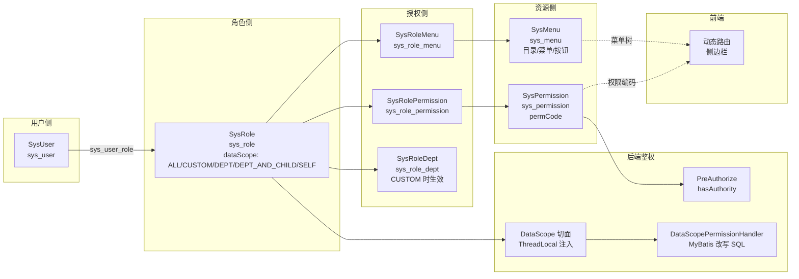
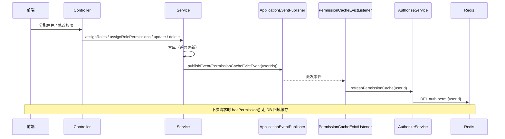

# 权限体系（数据权限 / 菜单权限 / 按钮权限）

> **状态**: ✅ 已完成（2026-06-02）
> **负责人**: <TBD>
> **关联模块**: wms-system（用户/角色/菜单/权限）+ wms-common（数据权限注解与上下文）+ wms-auth（权限缓存与失效监听）
> **优先级**: 🔴 P0 — 核心系统

## 1. 概述

WMS 平台采用经典 RBAC（Role-Based Access Control）模型，并在此基础上扩展出**三层权限**：

| 层级 | 作用 | 实现机制 | 关键注解 |
|------|------|----------|----------|
| 菜单权限 | 控制前端路由可达性 / 侧边栏显隐 | 角色 → 菜单多对多（`sys_role_menu`）+ 用户菜单树 | （前端基于返回菜单树动态生成路由） |
| 按钮权限 | 控制接口级操作（增/删/改/导出等） | 角色 → 权限多对多（`sys_role_permission`），权限编码 = Spring Security authority | `@PreAuthorize("hasAuthority('模块:实体:操作')")` |
| 数据权限 | 行级过滤：同接口不同人看到的数据范围不同 | 角色携带 `dataScope`，`@DataScope` 切面解析 → `DataScopeContext` ThreadLocal → MyBatis-Plus `MultiDataPermissionHandler` 改写 SQL | `@DataScope` |

### 1.1 三层关系

- **用户 ↔ 角色**：多对多（`sys_user_role`）。
- **角色 ↔ 菜单**：多对多（`sys_role_menu`），菜单作为前端路由数据源。
- **角色 ↔ 权限**：多对多（`sys_role_permission`），权限编码是接口鉴权单元。
- **角色 ↔ 部门**：多对多（`sys_role_dept`），**仅**当角色的 `dataScope = CUSTOM` 时生效，用于限定自定义部门范围。
- **角色携带 `dataScope`**：5 个枚举值（`DataScopeConstants`），决定数据权限的最终 SQL 拼接。

### 1.2 关键术语

- **权限编码（`permCode`）**：形如 `wms:item:export`、`system:user:list` 的字符串，是后端 `@PreAuthorize` 与前端 `v-permission` 指令共用的"钥匙"。
- **数据范围（`dataScope`）**：角色维度上的行级过滤策略，取值见 `DataScopeConstants`。
- **超管放行**：任意角色持有 `SCOPE_ALL` 时直接放行，不再叠加其它范围。
- **权限缓存**：用户权限编码集合在 Redis 缓存，变更通过 `PermissionCacheEvictEvent` 事件失效。

### 1.3 相关规则文件

- `AGENTS.md §1.2` —— `@DataScope` 必加，不可绕过
- `AGENTS.md §1.3` —— 所有接口必须 `@PreAuthorize`，最小粒度 `isAuthenticated()`
- `AGENTS.md §1.4` —— 写操作必须 `@OperLog`
- `AGENTS.md §4.3.2` —— 权限/数据范围相关常量类

---

## 2. 三层权限模型架构图



---

## 3. 菜单权限

### 3.1 菜单表设计

菜单采用**单表自引用树形结构**（`sys_menu`），通过 `parentId` 字段维护父子关系（顶级 `parentId = 0`，对应 `BizConstants.TOP_PARENT_ID`）。按钮（`menuType = 3`）是叶子节点，不出现在用户的动态路由里，但保留 `permCode` 字段与 `sys_permission` 形成软关联。

| 字段 | 含义 | 备注 |
|------|------|------|
| `id` | 雪花ID | `IdType.ASSIGN_ID` |
| `menuName` | 菜单显示名 | 前端侧边栏 |
| `menuCode` | 菜单编码 | 全局唯一，Service 层校验 |
| `parentId` | 上级菜单ID | 顶级为 `BizConstants.TOP_PARENT_ID`（0） |
| `menuType` | 类型：1 目录 / 2 菜单 / 3 按钮 | `SysMenuConstants.MENU_TYPE_*` |
| `path` | 路由路径 | 前端 router |
| `component` | 前端组件路径 | — |
| `redirect` | 重定向路径 | 目录节点可填 |
| `icon` | 菜单图标 | — |
| `isExternal` | 是否外链 | 0-否 1-是 |
| `isCache` | 是否缓存 | 0-否 1-是（前端 keep-alive） |
| `visible` | 是否可见 | 0-隐藏 1-显示（隐藏菜单不进侧边栏但保留权限） |
| `status` | 启用/禁用 | `SysMenuConstants.STATUS_ENABLED/DISABLED` |
| `sortOrder` | 排序号 | 升序 |
| `permCode` | 关联权限编码 | 按钮节点通常对应 `sys_permission` 中某条 permCode |

> 公共字段 `del_flag / create_time / create_by / update_time / update_by` 走 `BaseEntity`；删除统一调用 `LogicDeleteHelper.markDeleted()` 显式写 `del_flag`，**禁止** `setDelFlag(DELETED) + updateById`（AGENTS.md §3.2）。

### 3.2 SysMenuServiceImpl 关键方法

`SysMenuServiceImpl` 负责菜单 CRUD 与**用户菜单树**的构建。

- `listAll() → buildMenuTree()`：拉全表，按 `sortOrder` 升序，构建整棵菜单树。
- `getById(id)`：未找到或已删除时抛 `BizException("菜单不存在")`。
- `create(dto)`：`checkMenuCodeUnique()` 校验编码唯一；若 `status/visible` 未传则默认 `STATUS_ENABLED` + `VISIBLE_YES`；`sysMenuMapper.insert()`。
- `update(id, dto)`：校验编码唯一（`excludeId` 排除自身），`copyDtoToEntity` 后 `updateById`。
- `delete(id)`：**先**判断是否有子菜单（`selectCount(parentId=id)`），有则拒绝删除；**否则**调用 `LogicDeleteHelper.markDeleted(mapper, SysMenu.class, id)` 显式写 `del_flag = DELETED`。
- `getMenuIdsByRoleId(roleId)`：通过 `sys_role_menu` 拿角色关联菜单ID列表。
- `getUserMenuTree()`：**用户菜单树**构建（核心）。
  1. `sys_user_role` 取用户角色；
  2. `sys_role_menu` 取所有菜单ID；
  3. 过滤 `menuType ∈ {DIR, MENU}`、`status = ENABLED`、`visible = VISIBLE_YES`，按 `sortOrder` 升序；
  4. 递归**补全父级**：若子菜单被授权但父目录未授权，将父目录一并拉入；
  5. `buildTree()` 按 `parentId` 分组构造树形结构。

```java
// SysMenuServiceImpl#getUserMenuTree 关键片段
List<SysMenu> menus = sysMenuMapper.selectList(
        new LambdaQueryWrapper<SysMenu>()
                .in(SysMenu::getId, menuIds)
                .in(SysMenu::getMenuType, SysMenuConstants.MENU_TYPE_DIR, SysMenuConstants.MENU_TYPE_MENU)
                .eq(SysMenu::getStatus, SysMenuConstants.STATUS_ENABLED)
                .eq(SysMenu::getVisible, SysMenuConstants.VISIBLE_YES)
                .orderByAsc(SysMenu::getSortOrder)
);
```

### 3.3 SysMenuConstants 关键常量

```java
public final class SysMenuConstants {
    private SysMenuConstants() {}
    public static final int STATUS_ENABLED  = 1;  // 启用
    public static final int STATUS_DISABLED = 0;  // 禁用
    public static final int VISIBLE_YES     = 1;  // 侧边栏可见
    public static final int VISIBLE_NO      = 0;  // 隐藏（保留权限）
    public static final int MENU_TYPE_DIR   = 1;  // 目录（Layout 节点）
    public static final int MENU_TYPE_MENU  = 2;  // 菜单（具体页面）
    public static final int MENU_TYPE_BUTTON= 3;  // 按钮/操作（不进路由）
}
```

> 编写 Service 时必须引用以上常量，禁止 `menu.getMenuType() == 3` 这样的魔法数字（AGENTS.md §4.3.3）。

### 3.4 前端动态路由生成

后端 `/system/menus/userMenuTree` 返回 `List<MenuTreeVo>`（与 `SysMenu` 字段一一对应，外加 `children` 树形子节点）。前端在登录后的 `getUserInfo` 阶段调用该接口，结合 `auth:perm:{userId}` 列表与 `v-permission` 指令：

- `v-permission="'wms:item:export'"` 控制按钮显隐；
- 路由 `meta.permCode` 配合全局 `router.beforeEach` 做兜底拦截；
- 隐藏菜单（`visible = VISIBLE_NO`）不进入侧边栏，但仍可在 URL 直接访问（按钮权限生效）。

### 3.5 菜单状态：启用 / 禁用 / 可见 / 不可见

| 状态组合 | 列表返回 | 侧边栏 | URL 可达 |
|----------|----------|--------|----------|
| `status = ENABLED` + `visible = VISIBLE_YES` | ✅ | ✅ | ✅ |
| `status = ENABLED` + `visible = VISIBLE_NO` | ✅ | ❌ | ✅（按钮权限兜底） |
| `status = DISABLED` | ❌ | ❌ | ❌ |
| 逻辑删除 | ❌ | ❌ | ❌ |

> 由于 `getUserMenuTree` 同时校验了 `status=ENABLED` 与 `visible=VISIBLE_YES`，禁用或隐藏的菜单**不会**进入前端路由表。

---

## 4. 按钮权限

### 4.1 权限标识命名规范

采用三段式 `模块:实体:操作`：

| 示例 | 含义 |
|------|------|
| `system:user:list` | 系统-用户-查询 |
| `system:user:add` | 系统-用户-新增 |
| `system:user:edit` | 系统-用户-编辑 |
| `system:user:delete` | 系统-用户-删除 |
| `system:user:resetPwd` | 系统-用户-重置密码 |
| `system:role:list` | 系统-角色-查询 |
| `system:role:edit` | 系统-角色-编辑（分配菜单/权限） |
| `system:menu:list` | 系统-菜单-查询 |
| `system:menu:add` | 系统-菜单-新增 |
| `system:menu:edit` | 系统-菜单-编辑 |
| `system:menu:delete` | 系统-菜单-删除 |
| `system:perm:list` | 系统-权限-查询 |
| `system:perm:add` | 系统-权限-新增 |
| `system:perm:edit` | 系统-权限-编辑 |
| `system:perm:delete` | 系统-权限-删除 |
| `wms:item:export` | 物品-导出 |
| `approval:pending:approve` | 审批-待办-审批（见 `PermissionConstants.APPROVAL_PENDING_APPROVE`） |

### 4.2 SysPermission 表设计

| 字段 | 含义 |
|------|------|
| `id` | 雪花ID |
| `permName` | 权限名称（展示用） |
| `permCode` | 权限编码（**接口鉴权与前端指令的关键字**） |
| `permType` | 类型：1 菜单 / 2 按钮 / 3 接口 |
| `parentId` | 上级权限ID（支持树形） |
| `menuId` | 关联菜单ID（可空：与 `sys_menu` 软关联） |
| `status` | 0-禁用 1-启用（`BizConstants.STATUS_*`） |

### 4.3 后端 `@PreAuthorize` 示例

```java
@PreAuthorize("hasAuthority('system:user:add')")
@OperLog(module = "system", type = "INSERT", desc = "新增用户")
@PostMapping
public R<SysUserVo> create(@Valid @RequestBody SysUserDto dto) { ... }
```

最小粒度校验（仅要求登录）：

```java
@PreAuthorize("isAuthenticated()")
```

> 复合校验：
>
> ```java
> @PreAuthorize("hasAnyAuthority('system:user:list','approval:config:add','approval:config:edit')")
> ```

### 4.4 角色-权限多对多（`sys_role_permission`）

`SysRoleServiceImpl#assignRolePermissions(id, permIds)` 完成分配：

1. 取该角色现有 `sys_role_permission` 行（`selectAllByRoleId` 包含已软删的）；
2. `activePermissionMap`：当前生效的 `permId → row`；
3. `deletedPermissionMap`：历史软删的 `permId → row`；
4. 对**不再在目标集合内**的 `activePermissionMap` 走 `updateDelFlagById(... DELETED ...)`；
5. 对**新增**的 `permId`：
   - 若在 `deletedPermissionMap` 命中 → `updateDelFlagById(... NORMAL ...)` 复活旧行；
   - 否则 `sysRolePermissionMapper.insert()`；
6. 全部包在 `@Transactional(rollbackFor = Exception.class)`；
7. **关键**：在事务提交后由 `publishPermissionCacheEvictEvent(affectedUserIds)` 发布 `PermissionCacheEvictEvent`，见 §8。

### 4.5 前端 `v-permission` 指令

前端通过 `auth:perm:{userId}` 列表（接口 `/auth/permissions/current`）维护本地权限池，组件上 `v-permission="'wms:item:export'"` 控制渲染；后端**不依赖**前端隐藏，**必须**在每个写接口上加 `@PreAuthorize`（AGENTS.md §1.3）。

---

## 5. 数据权限（核心）

### 5.1 5 个范围

| 范围 | `DataScopeConstants` 常量 | 实际数值 | 含义 | SQL 拼接示例 |
|------|--------------------------|----------|------|--------------|
| 全部 | `SCOPE_ALL` | `1` | 无附加条件 | `null`（不拼 SQL 片段） |
| 自定义 | `SCOPE_CUSTOM` | `2` | 仅看 `sys_role_dept` 中勾选的部门 | `t.dept_id IN (1,2,3)`（部门ID列表） |
| 本部门 | `SCOPE_DEPT` | `3` | 仅当前用户所在部门 | `t.dept_id = {userDeptId}` |
| 本部门及下级 | `SCOPE_DEPT_AND_CHILD` | `4` | 本部门 + 递归所有子部门 | `t.dept_id IN (3,7,8,9)`（BFS 展开） |
| 仅本人 | `SCOPE_SELF` | `5` | 仅 `create_by / operator_id / user_id` 等于自己 | `t.operator_id = {userId}` |

> 多个范围**取并集**：若用户有角色 A=`DEPT`、角色 B=`SELF`，最终拼出 `(... dept 列表) OR (... 仅本人)`，见 `DataScopeSqlBuilder#buildSqlSegment` 的 `OR` 合并逻辑。
>
> 任何一个角色持有 `SCOPE_ALL` → 直接 `DataScopeCondition.all()`，不再叠加其它范围。

### 5.2 `@DataScope` 切面实现

#### 5.2.1 注解

```java
@Target(ElementType.METHOD)
@Retention(RetentionPolicy.RUNTIME)
@Documented
public @interface DataScope {
    String deptAlias() default "d";
    String userAlias() default "u";
}
```

> 注：`deptAlias` / `userAlias` 预留给需要自定义别名的场景（如 `LEFT JOIN sys_department d`）。当前 `DataScopeSqlBuilder` 实际使用 MyBatis-Plus 解析出的表别名，因此默认值 `d` / `u` 并未真正参与拼接。

#### 5.2.2 切面：`DataScopeAspect`

`com.wms.system.aspect.DataScopeAspect`：

```java
@Around("@annotation(com.wms.common.annotation.DataScope)")
public Object around(ProceedingJoinPoint joinPoint) throws Throwable {
    DataScopeCondition condition = dataScopeService.getCurrentDataScope();
    DataScopeContext.set(condition);
    try {
        return joinPoint.proceed();
    } finally {
        DataScopeContext.clear();
    }
}
```

流程：解析当前用户的数据范围 → 写入 ThreadLocal → 执行原方法 → `finally` 清空（防止 Tomcat 线程复用导致权限串扰）。

#### 5.2.3 服务：`DataScopeServiceImpl`

`getCurrentDataScope()` 逻辑：

1. 通过 `SecurityUtil.getCurrentUserId()` 取当前用户；
2. `sysUserMapper.selectById(userId)` 拿 `deptId`；
3. `getEnabledRoles(userId)`：联 `sys_user_role` + `sys_role`，仅保留 `status = BizConstants.STATUS_ENABLED` 的角色；
4. **超管短路**：任一角色 `dataScope = SCOPE_ALL` → `DataScopeCondition.all()`；
5. 否则按角色分组：
   - `SCOPE_DEPT` → 加入 `deptIds.add(currentDeptId)`；
   - `SCOPE_DEPT_AND_CHILD` → BFS 展开 `getDeptAndChildren(currentDeptId)`（内存中按 `parentId` 构邻接表后 BFS，结果用 `HashSet` 去重）；
   - `SCOPE_SELF` → `selfScope = true`；
   - `SCOPE_CUSTOM` → 把 `roleId` 收集进 `customRoleIds`；
6. `getCustomDeptIds(customRoleIds)`：批量查 `sys_role_dept`，把部门ID并入 `deptIds`；
7. 返回 `DataScopeCondition.restricted(deptIds, userId, selfScope)`；
8. **特别兜底**：若用户没有任何角色，返回 `restricted(emptySet, userId, true)`，再叠加 `hasRestriction()`，最终 `buildSqlSegment` 退化为 `1 = 0`（拒绝一切数据）。

> ⚠️ `getDeptAndChildren` 当前在内存中**全量加载** `sys_department` 构造 BFS，部门数极大时需改为 `WITH RECURSIVE` 的 SQL 递归；该实现遵守"避免 N+1"原则（一次查询），但仍属于"全表→内存"做法，应在超大部门规模时优化。

#### 5.2.4 上下文：`DataScopeContext`

```java
public final class DataScopeContext {
    private static final ThreadLocal<DataScopeCondition> HOLDER = new ThreadLocal<>();
    public static void set(DataScopeCondition c) { HOLDER.set(c); }
    public static DataScopeCondition get() { return HOLDER.get(); }
    public static void clear() { HOLDER.remove(); }
}
```

#### 5.2.5 条件：`DataScopeCondition`

```java
@Getter
public class DataScopeCondition {
    private final boolean allData;          // true = SCOPE_ALL
    private final Set<Long> deptIds;        // 部门ID列表（DEPT/DEPT_AND_CHILD/CUSTOM）
    private final Long userId;              // 当前用户ID（SELF 时使用）
    private final boolean selfScope;        // 是否允许本人数据

    public static DataScopeCondition all() { return new DataScopeCondition(true, Set.of(), null, false); }
    public static DataScopeCondition restricted(Collection<Long> deptIds, Long userId, boolean selfScope) { ... }
    public boolean hasRestriction() {
        return !allData && (!deptIds.isEmpty() || (selfScope && userId != null));
    }
}
```

#### 5.2.6 SQL 拼装：`DataScopeSqlBuilder`

`buildSqlSegment(tableName, tableAlias, condition)` 行为：

| 输入 | 返回 |
|------|------|
| `condition == null` 或 `isAllData()` | `null`（不拼 SQL） |
| 表名不在 `TABLE_RULES` | `null`（放行：未登记的表不受限） |
| `!hasRestriction()`（无任何限制） | `"1 = 0"`（拒绝一切） |
| 有 `deptIds` 且规则中有 `deptColumns` | `<alias>.dept_col IN (id1,id2,...)` |
| 有 `selfScope` 且规则中有 `userColumns` | `<alias>.user_col = {userId}` |
| 多段 | 用 `OR` 包裹：`(<seg1> OR <seg2>)` |

**表-列规则表**（`DataScopeSqlBuilder#TABLE_RULES`）：

| 表名 | `deptColumns`（部门维度） | `userColumns`（人员维度） |
|------|--------------------------|--------------------------|
| `sys_user` | `dept_id` | `id` |
| `wms_outbound_order` | `dept_id` | `applicant_id` |
| `wms_scrap_order` | — | `applicant_id` |
| `wms_transfer_order` | — | `applicant_id` |
| `wms_inbound_order` | — | `operator_id` |
| `wms_electronic_label` | `current_dept_id` | `current_user_id` |
| `sys_oper_log` | — | `user_id` |
| `sys_login_log` | — | `user_id` |
| `approval_record` | — | `approver_id` |

> **未登记的表不拼接任何条件**（如 `wms_item` / `wms_warehouse` 等），由业务方自行评估是否需要新增规则。**新增业务表的数据权限**：在 `TABLE_RULES` 中追加 `Map.entry("表名", new TableRule(deptCols, userCols))` 即可生效。

#### 5.2.7 MyBatis 拦截：`DataScopePermissionHandler`

实现 MyBatis-Plus 的 `MultiDataPermissionHandler`：

```java
public Expression getSqlSegment(Table table, Expression where, String mappedStatementId) {
    DataScopeCondition condition = DataScopeContext.get();
    if (condition == null) return null;
    String alias = table.getAlias() == null ? table.getName() : table.getAlias().getName();
    String sqlSegment = sqlBuilder.buildSqlSegment(table.getName(), alias, condition);
    if (sqlSegment == null) return null;
    return CCJSqlParserUtil.parseCondExpression(sqlSegment);
}
```

JSqlParser 将 SQL 字符串解析为 `Expression`，由 MyBatis-Plus 与原 `WHERE` 合并（`AND`）。**Mapper 中无需手动加 `del_flag = 0`**，全局 `@TableLogic` 已自动拼接（AGENTS.md §3.3）。

### 5.3 自定义数据权限

`DataScopeConstants.SCOPE_CUSTOM` 时生效。`SysRoleServiceImpl#saveRoleDeptScope` 负责：

- 角色 `dataScope != CUSTOM` → 调 `clearRoleDeptScope(roleId)` 清空所有 `sys_role_dept` 关联；
- 角色 `dataScope == CUSTOM` 且 `deptIds` 为空 → 抛 `BizException("自定义数据范围必须选择部门")`；
- 否则按"差异更新"模式：旧关联中不在目标集合的 → 软删；新集合中不存在于 active 的 → 复活或新增。

跨部门调拨场景：发起人（`applicant_id`）走 `SCOPE_SELF`（仅本人）；审批人（业务主管）走 `SCOPE_DEPT` 或 `SCOPE_DEPT_AND_CHILD`（按业务部门树自动包含下级子部门）。

### 5.4 数据权限实战：5 个范围的实际 SQL 拼接

假设用户 `zhangsan` 拥有角色 `A（SCOPE_DEPT）`、`B（SCOPE_SELF）`，且 `currentDeptId = 10`，userId = 1001。则 `deptIds = {10}`、`selfScope = true`、`userId = 1001`。`DataScopeCondition.hasRestriction() = true`。

| 表 | 拼接结果（`alias=t`） |
|----|----------------------|
| `wms_inbound_order` | `t.operator_id = 1001`（`deptColumns` 为空，仅 SELF 段） |
| `wms_outbound_order` | `(t.dept_id IN (10) OR t.applicant_id = 1001)` |
| `wms_scrap_order` | `t.applicant_id = 1001` |
| `sys_user` | `(t.dept_id IN (10) OR t.id = 1001)` |
| `wms_electronic_label` | `(t.current_dept_id IN (10) OR t.current_user_id = 1001)` |
| `sys_oper_log` | `t.user_id = 1001` |
| `approval_record` | `t.approver_id = 1001` |
| 未在 `TABLE_RULES`（如 `wms_item`） | 不拼接任何条件 |
| 无角色用户 | `1 = 0`（拒绝所有数据） |
| 拥有 `SCOPE_ALL` 角色 | `null`（不拼接） |

---

## 6. 角色管理

### 6.1 SysRoleServiceImpl 关键方法

- `listAll() / listEnabled()`：前者全量、后者只取 `status = ENABLED`。
- `getById(id)`：未找到 → `BizException("角色不存在")`；已删除 → `BizException("角色已删除")`。
- `getRoleCodesByUserId(userId) / getRoleIdsByUserId(userId)`：供权限判断与登录使用。
- `create(dto)`：`checkRoleCodeUnique()` 校验编码唯一；状态默认 `BizConstants.STATUS_ENABLED`；调 `saveRoleDeptScope` 处理自定义部门范围。
- `update(id, dto)`：存在性 + 唯一性校验（排除自身），同样 `saveRoleDeptScope`。
- `delete(id)`：
  1. `LogicDeleteHelper.markDeleted(mapper, SysRole.class, id)` 软删角色；
  2. 收集受影响的 `userId` 集合；
  3. 软删 `sys_user_role` 中所有 `roleId = id` 行；
  4. 软删 `sys_role_menu` 中所有 `roleId = id` 行；
  5. 软删 `sys_role_permission` 中所有 `roleId = id` 行；
  6. `publishPermissionCacheEvictEvent(affectedUserIds)` 触发权限缓存失效。
- `getRoleMenus(id) / assignRoleMenus(id, menuIds)`：角色-菜单差异更新（同 §4.4 流程）。
- `getRolePermissions(id) / assignRolePermissions(id, permIds)`：角色-权限差异更新 + 缓存失效。
- `saveRoleDeptScope(roleId, dto)`：见 §5.3。
- `toVo(role)`：额外调用 `getRoleDeptIds()` 注入 `deptIds`；`toVoList(roles)` 走 `buildRoleDeptIdMap(roleIds)` 一次性批量查询，**避免 N+1**（AGENTS.md §5.1）。

### 6.2 角色-用户多对多（`sys_user_role`）

`SysUserServiceImpl#assignRoles(id, roleIds)` 行为：

1. 拉用户现有 `sys_user_role`（含已软删的）；
2. 收集 `targetRoleIds = normalizeRoleIds(roleIds)`、`currentRoleIds = 旧 active 集合`；
3. 对**不再在目标集合内**的旧关联构造 `updateRole(id, delFlag=DELETED)`，调 `LogicDeleteHelper.markDeletedEntities`；
4. 对**新加入**的 `roleId` 走 `sysUserRoleMapper.insert()`；
5. **关键**：`applicationEventPublisher.publishEvent(new PermissionCacheEvictEvent(Set.of(id)))` 通知 `PermissionCacheEvictListener` 清空该用户 Redis 权限缓存。

### 6.3 角色-菜单多对多（`sys_role_menu`）

`SysRoleServiceImpl#assignRoleMenus(id, menuIds)`：

- 流程同 `assignRolePermissions`，但**不发布**权限失效事件（菜单变更不影响 `permCode` 集合）。
- 写操作中"被移除的 → 软删"、"新集合中 active 缺失的 → 复活或 insert"，避免"删后重插同一 menuId"触发唯一索引冲突。
- 通过 `sysRoleMenuMapper.updateDelFlagById(id, flag, updateBy)` 直接更新指定行的 `del_flag`，更新人取自 `SecurityUtil.getCurrentUsername()`。

### 6.4 角色-部门（`sys_role_dept`，用于数据权限）

- 仅 `dataScope = SCOPE_CUSTOM` 角色持有该关联；
- 同上，差异更新模式（`saveRoleDeptScope`）；
- `clearRoleDeptScope(roleId)` 用于切换为非 CUSTOM 范围时清理。

### 6.5 角色-权限（`sys_role_permission`）

- 见 §4.4；
- 每次更新会按 `findUserIdsByRoleId(roleId)` 找到受影响用户，发布缓存失效事件。

---

## 7. 用户与认证

### 7.1 SysUserServiceImpl 关键方法

- `getByUsername(username)`：登录用，按用户名精确查询，返回含密码哈希的实体。
- `updatePassword(userId, newHash)`：BCrypt 写入密码。
- `page(pageParam, username, realName, status)`：分页 + 模糊 + 状态过滤；调 `fillUserRoles(records)` 批量回填 `roleIds / roleNames`，**避免 N+1**（一次 `selectList(userIds)`、一次 `selectBatchIds(roleIds)`）。
- `getVoByUsernameExact(username)`：登录态下用，额外计算 `hasApprovalPermission(userId)`。
- `getById(id)`：存在性 + 未删除校验。
- `create(dto)`：
  - `checkUsernameUnique()`；
  - 密码 BCrypt 编码（密码从 `SysConfigManager.getValue("wms.security.default-password", defaultPassword)` 读，**优先数据库配置**，回退到 `wms.default-password` 环境变量默认值，避免硬编码 AGENTS.md §1.1）；
  - 默认 `status = BizConstants.STATUS_ENABLED`；
  - `saveUserRoles` 关联角色。
- `update(id, dto)`：**不修改密码**（`existing.setPassword(null)` 避免空覆盖），密码修改走独立接口。
- `delete(id)`：存在性校验 → `LogicDeleteHelper.markDeleted`。
- `resetPwd(id)`：写入 BCrypt 加密的默认密码，密码来源同 `create`。
- `changeStatus(id)`：状态 0 ↔ 1 切换。
- `getUserRoles(id) / assignRoles(id, roleIds)`：见 §6.2。
- `hasApprovalPermission(userId)`：检查用户是否持有 `PermissionConstants.APPROVAL_PENDING_APPROVE`（"approval:pending:approve"）权限编码，用于前端判断"是否显示审批按钮"。

### 7.2 与 [认证鉴权](认证鉴权.md) 的关系

- **认证（你是谁）**：`wms-auth` 模块负责登录、JWT 签发/刷新/撤销、限流、验证码；详见 [认证鉴权.md](认证鉴权.md)。
- **授权（你能做什么）**：本文件覆盖菜单/按钮/数据权限。
- **会话装配**：登录成功后从 `sys_user` 加载 `deptId`，从 `sys_user_role → sys_role` 加载角色 + `dataScope`，从 `sys_role_permission → sys_permission` 加载 `permCode` 列表，全部缓存到 JWT 或 Redis（详见 §8）。
- **过滤器链顺序**（对齐 `认证鉴权.md`）：`JwtAuthenticationFilter` → `JwtAuthorizationFilter` → `@PreAuthorize` → 业务方法 → `@DataScope` 切面 → Mapper。

---

## 8. 权限缓存策略

### 8.1 缓存位置与 Key

`wms-auth` 模块 `AuthRedisKey`：

```java
public class AuthRedisKey {
    public static final String PERM_PREFIX = "auth:perm:";
    ...
}
```

- **Key**：`auth:perm:{userId}`（`userId` 为雪花 ID）。
- **类型**：Redis List（`StringRedisTemplate.opsForList()`），元素是 `permCode` 字符串。
- **TTL**：`AuthConstants.PERM_CACHE_EXPIRE_MINUTES` 分钟。

### 8.2 缓存读写：`AuthorizeServiceImpl`

```java
// 读：先查 Redis，miss 后查 DB 并回写
List<String> cached = stringRedisTemplate.opsForList().range(permKey, 0, -1);
if (cached != null && !cached.isEmpty()) return cached;
List<String> permissions = sysPermissionService.getPermCodesByUserId(userId);
if (!permissions.isEmpty()) {
    stringRedisTemplate.opsForList().rightPushAll(permKey, permissions);
    stringRedisTemplate.expire(permKey, AuthConstants.PERM_CACHE_EXPIRE_MINUTES, TimeUnit.MINUTES);
}
return permissions;
```

- **降级容错**：Redis 不可用时 `log.warn` 后继续走 DB 查询；DB 异常时返回 `Collections.emptyList()` 并 `log.error`。
- **空结果处理**：DB 查得空集合**不写缓存**，避免缓存击穿；下次 miss 重新走 DB。
- **鉴权入口**：
  - `hasPermission(userId, permCode)` → `getUserPermissions(userId).contains(permCode)`；
  - `hasCurrentUserPermission(permCode)` → 先 `SecurityUtil.getCurrentUserId()` 再 `hasPermission`；
  - `getUserPermissions(userId)` → 上述 Redis 优先逻辑。

### 8.3 失效触发

通过 `PermissionCacheEvictEvent`（`com.wms.common.event` 的 `record` 事件）发布：

| 触发动作 | 发布位置 | 携带的 `userIds` |
|----------|----------|------------------|
| 角色删除 | `SysRoleServiceImpl#delete` | 受影响用户ID集合 |
| 角色权限分配 | `SysRoleServiceImpl#assignRolePermissions` | `findUserIdsByRoleId(id)` 集合 |
| 权限更新 | `SysPermissionServiceImpl#update` | `findAffectedUserIdsByPermissionIds(permIds)` 集合 |
| 权限删除 | `SysPermissionServiceImpl#delete` | 同上 |
| 用户角色分配 | `SysUserServiceImpl#assignRoles` | `Set.of(id)` |

> **关键设计**：使用 Spring `ApplicationEventPublisher` 同步发布（在事务内调用），由 `PermissionCacheEvictListener` 异步处理（`@EventListener`），不阻塞写事务提交。

### 8.4 失效监听：`PermissionCacheEvictListener`

`com.wms.auth.listener.PermissionCacheEvictListener`：

```java
@EventListener
public void onPermissionCacheEvict(PermissionCacheEvictEvent event) {
    if (event == null || event.userIds() == null || event.userIds().isEmpty()) return;
    event.userIds().forEach(authorizeService::refreshPermissionCache);
}
```

`AuthorizeServiceImpl#refreshPermissionCache(userId)` 简单 `stringRedisTemplate.delete(AuthRedisKey.PERM_PREFIX + userId)`，异常时 `log.warn` 但不抛。

### 8.5 失效时序图



### 8.6 密码重置与缓存

`SysUserServiceImpl#resetPwd(id)` 仅重置密码，**不**主动清理权限缓存（密码变更不影响 `permCode` 集合）。如需"踢下线"，应额外调用 token 失效接口（详见 `认证鉴权.md`）。

---

## 9. 核心注解

### 9.1 `@DataScope`

- **位置**：`com.wms.common.annotation.DataScope`
- **作用**：方法级声明；触发 `DataScopeAspect` 在调用前后管理 `DataScopeContext`。
- **强制规则**（AGENTS.md §1.2）：所有 Controller 的**查询方法**（`page/list/getById/search/by-username` 等）必须标注，**不可绕过**。
- **当前豁免**：写操作（`create/update/delete/resetPwd/changeStatus/assignRoles`）通常不标，但若写操作内含子查询（联表、嵌套 select）建议同样加上。

### 9.2 `@PreAuthorize`（继承 Spring Security）

- **最小粒度**：`@PreAuthorize("isAuthenticated()")`（仅要求已登录）。
- **典型用法**：`@PreAuthorize("hasAuthority('system:user:add')")` / `hasAnyAuthority(...)`。
- **强制规则**（AGENTS.md §1.3）：所有 Controller 方法必须添加，最小粒度 `isAuthenticated()`。
- **审批委派等动态场景**：使用 `@PreAuthorize("@pms.hasPermission(authentication, 'approval:pending:approve')")` 调用 Bean 内的方法判断。

### 9.3 `@OperLog`

- **位置**：`com.wms.common.annotation.OperLog`
- **强制规则**（AGENTS.md §1.4）：所有写操作（POST/PUT/DELETE）必须标注。
- **典型用法**：

  ```java
  @OperLog(module = "system", type = "INSERT", desc = "新增用户")
  @PreAuthorize("hasAuthority('system:user:add')")
  @PostMapping
  public R<SysUserVo> create(@Valid @RequestBody SysUserDto dto) { ... }
  ```

- **异步落库**：`@OperLog` 由切面拦截后通过线程池或 MQ 异步持久化到 `sys_oper_log`，不影响接口 RT（详见 `认证鉴权.md`）。

### 9.4 注解组合

```java
@PreAuthorize("hasAuthority('system:user:list')")
@DataScope
@GetMapping
public R<PageResult<SysUserVo>> page(...) { ... }
```

```java
@PreAuthorize("hasAuthority('system:user:add')")
@OperLog(module = "system", type = "INSERT", desc = "新增用户")
@PostMapping
public R<SysUserVo> create(@Valid @RequestBody SysUserDto dto) { ... }
```

> 三者**正交**：`@PreAuthorize` 管"能不能调"，`@DataScope` 管"调时看哪些数据"，`@OperLog` 管"记下做了什么事"。

---

## 10. 异常处理清单

| 触发点 | 异常 | 信息 | 说明 |
|--------|------|------|------|
| `SysMenuServiceImpl#getById` | `BizException` | "菜单不存在" | 未找到或已删除 |
| `SysMenuServiceImpl#delete` | `BizException` | "存在子菜单，无法删除" | 校验通过后才允许软删 |
| `SysMenuServiceImpl#checkMenuCodeUnique` | `BizException` | "菜单编码已存在: {menuCode}" | 全局唯一 |
| `SysRoleServiceImpl#getById/update/delete` | `BizException` | "角色不存在" / "角色已删除" | 区分不同状态 |
| `SysRoleServiceImpl#checkRoleCodeUnique` | `BizException` | "角色编码已存在: {roleCode}" | — |
| `SysRoleServiceImpl#saveRoleDeptScope` | `BizException` | "自定义数据范围必须选择部门" | `dataScope = CUSTOM` 时 `deptIds` 为空 |
| `SysUserServiceImpl#getById/update/delete` | `BizException` | "用户不存在" / "用户已删除" | 区分 |
| `SysUserServiceImpl#checkUsernameUnique` | `BizException` | "用户名已存在: {username}" | — |
| `SysPermissionServiceImpl#getById/update/delete` | `BizException` | "权限不存在" | — |
| `SysPermissionServiceImpl#checkPermCodeUnique` | `BizException` | "权限编码已存在: {permCode}" | — |
| `DataScopePermissionHandler` | `IllegalStateException` | "构建数据权限SQL表达式失败: {sqlSegment}" | JSqlParser 解析失败（一般是 TABLE_RULES 配置错） |
| 通用：Spring Security | `AccessDeniedException` | "不允许访问" | `@PreAuthorize` 失败 |
| 通用：未登录 | `AuthenticationException` | "请先登录" | `JwtAuthenticationFilter` 拒绝 |

> 异常码统一由 `BizException` 承载；具体错误码见各模块 `ErrorCode` 枚举（不在本文档展开）。

---

## 11. 关键数据库表

| 表名 | 中文说明 | 关键字段 | 备注 |
|------|----------|----------|------|
| `sys_user` | 用户表 | `id, username, password(BCrypt), real_name, dept_id, phone, email, avatar, status` | 主键雪花 |
| `sys_role` | 角色表 | `id, role_name, role_code, role_desc, data_scope, status` | `data_scope` 取 `DataScopeConstants` 枚举 |
| `sys_menu` | 菜单表 | `id, menu_name, menu_code, parent_id, menu_type, path, component, icon, visible, status, sort_order, perm_code` | 树形自引用 |
| `sys_permission` | 权限表 | `id, perm_name, perm_code, perm_type, parent_id, menu_id, status` | 实际鉴权单元 |
| `sys_user_role` | 用户-角色 | `id, user_id, role_id` | 逻辑删除 |
| `sys_role_menu` | 角色-菜单 | `id, role_id, menu_id` | 逻辑删除 |
| `sys_role_permission` | 角色-权限 | `id, role_id, perm_id` | 逻辑删除 |
| `sys_role_dept` | 角色-部门（自定义范围） | `id, role_id, dept_id` | 仅 `SCOPE_CUSTOM` 有效 |
| `sys_department` | 部门表 | `id, dept_name, dept_code, parent_id, sort_order, leader, phone, status` | 树形自引用 |
| `sys_oper_log` | 操作日志 | `user_id, ...` | `@OperLog` 落库 |
| `sys_login_log` | 登录日志 | `user_id, ...` | 登录时记录 |
| `approval_record` | 审批记录 | `approver_id, ...` | 审批模块 |

> 公共字段 `del_flag / create_time / create_by / update_time / update_by` 全部按 `BaseEntity` + AGENTS.md §7.3 规范维护。

---

## 12. 关联规则引用

- [AGENTS.md §1.1](../AGENTS.md) — 密钥/密码必须环境变量；BCrypt 加密；默认密码走配置
- [AGENTS.md §1.2](../AGENTS.md) — `@DataScope` 必加，**不可绕过**
- [AGENTS.md §1.3](../AGENTS.md) — `@PreAuthorize` 必加，最小粒度 `isAuthenticated()`
- [AGENTS.md §1.4](../AGENTS.md) — 写操作 `@OperLog` 必加
- [AGENTS.md §2.1-2.3](../AGENTS.md) — Controller 不含业务逻辑、返回 VO、Converter 类独立
- [AGENTS.md §3.1-3.4](../AGENTS.md) — 禁止物理删除、显式逻辑删除、不写 `del_flag=0`、雪花ID
- [AGENTS.md §4.3](../AGENTS.md) — 常量类与魔法数字禁令
- [AGENTS.md §5.1-5.2](../AGENTS.md) — 禁止 N+1 与全表内存过滤
- [AGENTS.md §7.1-7.4](../AGENTS.md) — SQL 日志、参数校验、完整公共字段、非 AUTO_INCREMENT
- [AGENTS.md §9](../AGENTS.md) — PR 自查清单（含 SEC-01~04）

---

## 13. 关联文档链接

- [认证鉴权.md](认证鉴权.md) — 登录、JWT、过滤器链、`@OperLog` 切面
- [入库流程.md](../业务开发/入库流程.md) — `@DataScope` + `@PreAuthorize` + `@OperLog` 三注解组合示例
- [工程结构.md](../.harness/rules/%E5%B7%A5%E7%A8%8B%E7%BB%93%E6%9E%84.md) — `wms-system` 子包结构
- [check-rules.sh](../../scripts/check-rules.sh) — SEC-01~04 自动检查

---

## 附录 A：关键路径速查

| 用途 | 路径 |
|------|------|
| `@DataScope` 注解 | `wms-server/wms-common/src/main/java/com/wms/common/annotation/DataScope.java` |
| `DataScopeContext` | `wms-server/wms-common/src/main/java/com/wms/common/context/DataScopeContext.java` |
| `DataScopeCondition` | `wms-server/wms-common/src/main/java/com/wms/common/datascope/DataScopeCondition.java` |
| `DataScopeSqlBuilder` | `wms-server/wms-common/src/main/java/com/wms/common/datascope/DataScopeSqlBuilder.java` |
| `DataScopePermissionHandler` | `wms-server/wms-common/src/main/java/com/wms/common/config/DataScopePermissionHandler.java` |
| `DataScopeAspect` | `wms-server/wms-system/src/main/java/com/wms/system/aspect/DataScopeAspect.java` |
| `DataScopeServiceImpl` | `wms-server/wms-system/src/main/java/com/wms/system/service/impl/DataScopeServiceImpl.java` |
| `SysUserServiceImpl` | `wms-server/wms-system/src/main/java/com/wms/system/service/impl/SysUserServiceImpl.java` |
| `SysRoleServiceImpl` | `wms-server/wms-system/src/main/java/com/wms/system/service/impl/SysRoleServiceImpl.java` |
| `SysMenuServiceImpl` | `wms-server/wms-system/src/main/java/com/wms/system/service/impl/SysMenuServiceImpl.java` |
| `SysPermissionServiceImpl` | `wms-server/wms-system/src/main/java/com/wms/system/service/impl/SysPermissionServiceImpl.java` |
| `AuthorizeServiceImpl` | `wms-server/wms-auth/src/main/java/com/wms/auth/service/impl/AuthorizeServiceImpl.java` |
| `PermissionCacheEvictListener` | `wms-server/wms-auth/src/main/java/com/wms/auth/listener/PermissionCacheEvictListener.java` |
| `PermissionCacheEvictEvent` | `wms-server/wms-common/src/main/java/com/wms/common/event/PermissionCacheEvictEvent.java` |
| `DataScopeConstants` | `wms-server/wms-common/src/main/java/com/wms/common/constant/DataScopeConstants.java` |
| `PermissionConstants` | `wms-server/wms-common/src/main/java/com/wms/common/constant/PermissionConstants.java` |
| `SysMenuConstants` | `wms-server/wms-system/src/main/java/com/wms/system/domain/constant/SysMenuConstants.java` |
| `AuthRedisKey` | `wms-server/wms-auth/src/main/java/com/wms/auth/constant/AuthRedisKey.java` |
| `AuthConstants`（缓存 TTL） | `wms-server/wms-auth/src/main/java/com/wms/auth/domain/constant/AuthConstants.java` |

## 附录 B：常见误区

1. **以为加 `@PreAuthorize` 就够**：没有 `@DataScope`，不同部门用户能查到全部数据 → 违反行级隔离。
2. **`setDelFlag(DELETED) + updateById` 删关联表**：MyBatis-Plus `@TableLogic` 会跳过 `del_flag` 字段更新，导致关联"假删"；必须走 `LogicDeleteHelper.markDeleted` 或 `updateDelFlagById`。
3. **写 Mapper 时手动加 `del_flag = 0`**：与全局 `@TableLogic` 重复拼接，影响索引；不写即可。
4. **给按钮菜单（`MENU_TYPE_BUTTON`）配 `path`/`component`**：按钮不进路由，这些字段无意义；正确做法是放 `sys_permission.permCode`，后端用 `@PreAuthorize` 鉴权。
5. **修改 `sys_role_menu` / `sys_role_permission` 后忘记发布缓存失效事件**：用户登录态保持旧 `permCode` 集合越权操作；必须按 §8.3 表格触发事件。
6. **跨服务调用不传 userId**：若 `B` 服务单独调用 DB，需在 `B` 服务 Controller 上也加 `@DataScope`，否则无 ThreadLocal。
