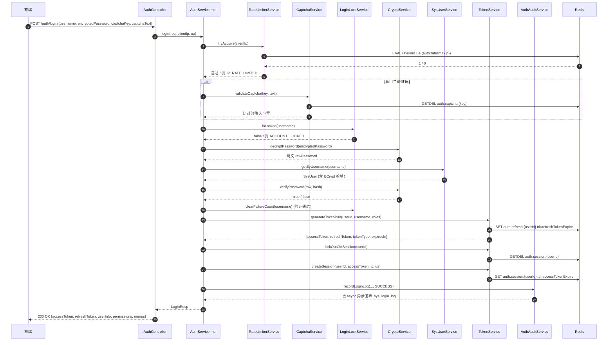
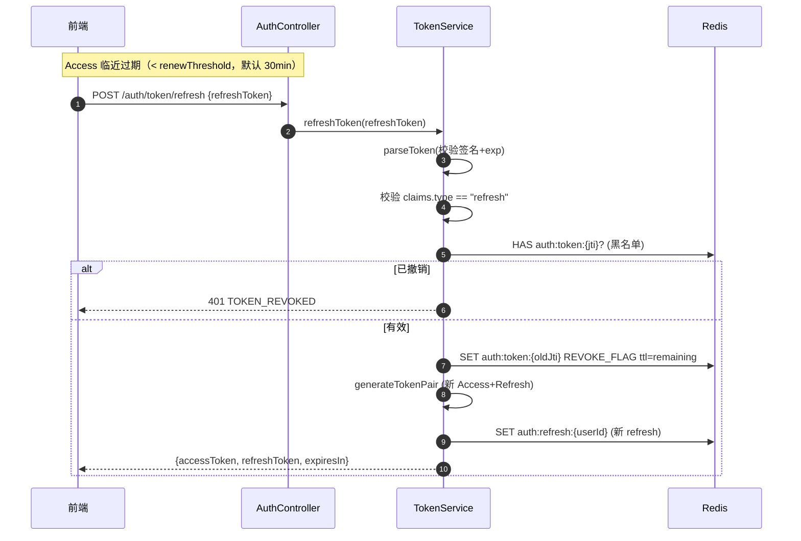
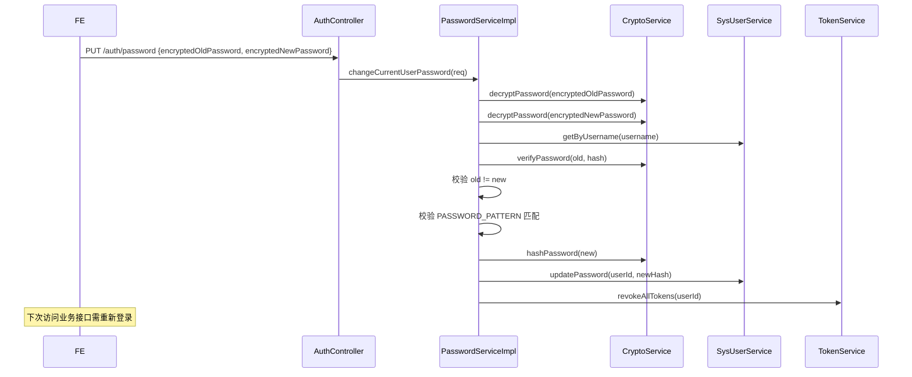
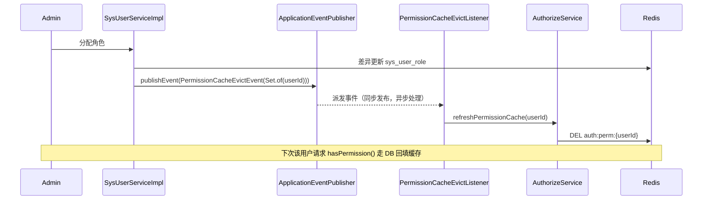

# 认证鉴权（JWT / 限流 / 验证码 / 操作日志）

> **状态**: ✅ 已完成（2026-06-02）
> **负责人**: <TBD>
> **关联模块**: wms-auth + wms-system（`OperLogAspect`、`SysOperLogService`）+ wms-common（`OperLog` 注解、`BizException`）+ wms-app（`application.yml` 注入）
> **优先级**: 🔴 P0 — 核心系统

## 1. 概述

WMS 平台认证体系基于 **Spring Security 6 + JWT（JJWT 0.11+） + Redis** 构建，对外提供完整的 **"登录 → 鉴权 → 操作审计 → 强制下线"** 闭环。核心子模块如下：

| 子模块 | 关键类 | 职责 |
|--------|--------|------|
| 过滤器链 | `SecurityConfig` / `JwtAuthenticationFilter` / `JwtAuthenticationEntryPoint` / `JwtAccessDeniedHandler` | 全局无状态鉴权、401/403 统一响应 |
| 登录服务 | `AuthServiceImpl` / `TokenServiceImpl` | 登录流程编排、Access/Refresh Token 签发与撤销 |
| 登录保护 | `RateLimiterService` / `CaptchaService` / `LoginLockService` | IP 限流、图形验证码、失败计数与账号锁定 |
| 密码 | `PasswordService` / `CryptoService` | BCrypt 加密、强度校验、`RSA` 前后端密码加密 |
| 异步事件 | `PermissionCacheEvictListener` / `AuthConfigRefreshListener` | 权限缓存失效、`wms.auth.*` 配置热更新 |
| 操作审计 | `OperLogAspect`（位于 `wms-system`） | 拦截 `@OperLog`，异步落库 `sys_oper_log` |
| 登录审计 | `AuthAuditServiceImpl` | `@Async` 落库 `sys_login_log` |

### 1.1 与三层权限的关系

| 维度 | 关键类 | 文档 |
|------|--------|------|
| 认证（你是谁） | 本文件覆盖：`JwtAuthenticationFilter` + `SecurityContextHolder` | — |
| 授权（你能做什么） | `@PreAuthorize` + `AuthorizeService` | [权限体系.md](权限体系.md) §4 |
| 数据（看哪些行） | `@DataScope` + `DataScopeAspect` | [权限体系.md](权限体系.md) §5 |
| 操作留痕（干了啥） | `@OperLog` + `OperLogAspect` | 本文件 §7 |

### 1.2 关键术语

- **Access Token**：短期令牌，默认 2 小时（`auth.access-token-expire`），访问业务接口时携带。
- **Refresh Token**：长期令牌，默认 7 天（`auth.refresh-token-expire`），通过 `/auth/token/refresh` 换发新 Access。
- **JTI**（JWT ID）：JWT 载荷 `jti` 字段，`UUID.randomUUID().toString().replace("-", "")`，作为单 Token 撤销标识。
- **REVOKE_FLAG**：`TokenConstants.REVOKE_FLAG`，写入 `auth:token:{jti}` 作为黑名单。
- **踢下线（kickOut）**：同账号再登录时通过 `kickOutOldSession` 撤销旧会话，保证"同账号单端在线"。

### 1.3 相关规则文件

- `AGENTS.md §1.1` — JWT 密钥、Redis 密码必须环境变量注入
- `AGENTS.md §1.3` — 所有 Controller `@PreAuthorize`
- `AGENTS.md §1.4` — 写操作 `@OperLog`
- `AGENTS.md §4.3.2` — 公共常量类（`AuthConstants`、`TokenConstants`）

---

## 2. 登录流程

### 2.1 时序图



### 2.2 关键节点说明

| 步骤 | 关键点 | 失败处理 |
|------|--------|----------|
| 1. 限流 | `tryAcquire(ip)`，Lua 原子计数；`AuthConstants.RATE_LIMIT_WINDOW_SECONDS` 秒内最多 `ipRateLimitThreshold` 次 | 抛 `IP_RATE_LIMITED`（HTTP 429） |
| 2. 验证码 | `authProperties.isCaptchaEnabled()` 为 `true` 且前端传了 `captchaKey/Text` 才校验 | `CAPTCHA_INVALID` / `CAPTCHA_MISMATCH` |
| 3. 锁定 | `isLocked(username)` 命中 Redis 锁定键 | 抛 `ACCOUNT_LOCKED`（HTTP 423） |
| 4. 密码解密 | `cryptoService.decryptPassword(encryptedPassword)`（前端用 RSA 公钥加密，后端私钥解密） | `DECRYPT_ERROR` |
| 5. 用户名校验 | `sysUserService.getByUsername` 找不到时 `recordFailure` | `CREDENTIAL_INVALID`，记录失败次数 |
| 6. 状态校验 | `user.getStatus() == BizConstants.STATUS_DISABLED` → 拒绝 | `ACCOUNT_DISABLED`（不计入失败次数） |
| 7. 密码校验 | `cryptoService.verifyPassword(raw, user.getPassword())`（BCrypt 匹配） | `CREDENTIAL_INVALID`，`recordFailure` |
| 8. 颁发令牌 | `generateTokenPair` 返回 Access/Refresh 双令牌 | — |
| 9. 踢旧会话 | `kickOutOldSession(userId)` 拿旧 session 后 `DEL`，记 INFO 日志 | Redis 异常仅 `log.warn`，不阻塞登录 |
| 10. 新会话 | `createSession` 写入 `auth:session:{userId}`，TTL = accessTokenExpire | — |
| 11. 异步登录日志 | `authAuditService.recordLoginLog` 标 `@Async` | 落库失败不影响登录 |

> ⚠️ 失败时**不返回**具体的"用户不存在 / 密码错误"，统一 `CREDENTIAL_INVALID`，避免账号枚举攻击；同时 `recordFailure` 仍然会增加失败计数（账号锁定不被绕过）。

---

## 3. JWT 机制

### 3.1 签名密钥

```java
// TokenServiceImpl#getSigningKey
byte[] keyBytes = authProperties.getJwtSecret().getBytes(StandardCharsets.UTF_8);
return Keys.hmacShaKeyFor(Arrays.copyOf(keyBytes, TokenConstants.HMAC_KEY_LENGTH));
```

- 算法：**HMAC-SHA256**（JJWT 0.11+ 默认对称算法）。
- 密钥长度：`TokenConstants.HMAC_KEY_LENGTH`（**32 字节**，HS256 最低要求）。
- 密钥来源：`wms.auth.jwt-secret` → `${JWT_SECRET:dev_jwt_secret}`（AGENTS.md §1.1，生产**禁止**使用默认值）。

### 3.2 Access Token Claims

| 字段 | 来源 | 含义 |
|------|------|------|
| `sub` | `String.valueOf(userId)` | 当前用户雪花ID |
| `jti` | `UUID.randomUUID().toString().replace("-", "")` | 单 Token 撤销 ID |
| `iat` | `Date.from(now)` | 签发时间 |
| `exp` | `Date.from(now.plusSeconds(accessTokenExpire))` | 过期时间（默认 +2h） |
| `username` | `String` | 用户名（冗余，便于审计） |
| `roles` | `List<String>` | 角色编码（`roleCode` 列表） |

> 注：Access Token 中**不包含** `permCode` 列表。每次请求的权限集合由 `JwtAuthenticationFilter` 重新从 Redis 拉取（`authorizeService.getUserPermissions(userId)`），保证**权限变更即时生效**。

### 3.3 Refresh Token Claims

| 字段 | 来源 | 含义 |
|------|------|------|
| `sub` | `String.valueOf(userId)` | 用户ID |
| `jti` | 新 UUID | Refresh 撤销 ID |
| `type` | `"refresh"` | 强制要求；`refreshToken` 流程会校验 |
| `username` | `String` | 用户名 |
| `roles` | `List<String>` | 角色编码（用于续签新 Access） |
| `iat` / `exp` | 同上 | 默认 7 天（`refresh-token-expire=604800`） |

### 3.4 双 Token 续期



### 3.5 续期阈值与滑动续命

`JwtAuthenticationFilter` 在每次请求时检查：

```java
// JwtAuthenticationFilter#doFilterInternal 末尾
tokenService.renewTokenIfNeeded(token);
```

`renewTokenIfNeeded` 实现（精简）：

```java
long remainingSeconds = claims.getExpiration().getTime() / 1000 - System.currentTimeMillis() / 1000;
return remainingSeconds > 0 && remainingSeconds < authProperties.getTokenRenewThreshold();
```

> **关键澄清**：当前实现 `renewTokenIfNeeded` 只返回 `boolean`（用于其它地方决定是否续命），过滤器链**未自动重发**新 Access；如需"滑动续命"，需在过滤器命中 `true` 时主动生成新 Token 并通过响应头/体回传。这是已记录的"潜在优化点"。

### 3.6 黑名单（REVOKE_FLAG）

详见 §10。

---

## 4. Spring Security 过滤器链

### 4.1 SecurityConfig 配置

`SecurityConfig#securityFilterChain` 的关键决策：

| 配置项 | 取值 | 含义 |
|--------|------|------|
| `csrf` | `disable` | 无状态 API，禁用 CSRF |
| `sessionManagement` | `STATELESS` | 不创建/使用 HttpSession |
| `exceptionHandling.authenticationEntryPoint` | `JwtAuthenticationEntryPoint` | 未登录 → 401 JSON |
| `exceptionHandling.accessDeniedHandler` | `JwtAccessDeniedHandler` | 无权限 → 403 JSON |
| `addFilterBefore` | `JwtAuthenticationFilter` 添加在 `UsernamePasswordAuthenticationFilter` 之前 | 自定义 JWT 解析在用户名密码过滤器前生效 |
| `@EnableMethodSecurity` | 启用 | 允许 `@PreAuthorize` 注解生效 |

### 4.2 过滤器链顺序

```mermaid
flowchart LR
    REQ[HTTP Request] --> CORS[Disable CSRF<br/>STATELESS Session]
    CORS --> JWTF[JwtAuthenticationFilter<br/>解析 Bearer Token]
    JWTF --> EH[ExceptionHandlingFilter<br/>EntryPoint / AccessDeniedHandler]
    EH --> AUTH[AuthorizationFilter<br/>基于 SecurityContext]
    AUTH --> DISP[DispatcherServlet → Controller]
    DISP --> PA[@PreAuthorize<br/>hasAuthority / isAuthenticated]
    PA --> BIZ[业务方法 → @DataScope → Mapper]
```

### 4.3 permitAll 白名单

`SecurityConfig` 中明确放行的路径：

| 路径 | 用途 |
|------|------|
| `/auth/login` | 登录入口 |
| `/auth/captcha/**` | 验证码 |
| `/auth/crypto/**` | RSA 公钥/前端密码加解密 |
| `/auth/token/refresh` | 续签 |
| `/auth/profile/avatar/content/**` | 头像静态内容（DataScope 兜底） |
| `/storage/avatars/**` | 本地存储头像 |
| `/storage/items/**` | 本地存储物品图片 |
| `/doc.html`、`/swagger-ui/**`、`/v3/api-docs/**`、`/webjars/**`、`/knife4j/**` | 文档与调试 |

> 其它**所有**请求走 `.anyRequest().authenticated()`，由 `JwtAuthenticationFilter` 在 `SecurityContextHolder` 写入 `Authentication`，否则被 `JwtAuthenticationEntryPoint` 拦回 401。

### 4.4 JwtAuthenticationFilter 解析流程

```java
// JwtAuthenticationFilter#doFilterInternal 关键步骤
String token = extractToken(request);                              // 1. 抽取 Bearer xxx
if (token != null) {
    if (tokenService.validateToken(token)) {                       // 2. 验签+黑名单
        Claims claims = tokenService.parseToken(token);
        Long userId = Long.valueOf(claims.getSubject());           // 3. 取 sub
        String username = claims.get("username", String.class);
        List<String> roles = defaultList(sysRoleService.getRoleCodesByUserId(userId));
        List<String> permissions = defaultList(authorizeService.getUserPermissions(userId));
        // 4. 角色加 ROLE_ 前缀，权限直接作为 authority
        List<SimpleGrantedAuthority> authorities = buildAuthorities(roles, permissions)
                .stream().map(SimpleGrantedAuthority::new).collect(Collectors.toList());
        UsernamePasswordAuthenticationToken authentication =
                new UsernamePasswordAuthenticationToken(userId, null, authorities);
        authentication.setDetails(username);
        SecurityContextHolder.getContext().setAuthentication(authentication);
        tokenService.renewTokenIfNeeded(token);
    } catch (Exception e) {
        SecurityContextHolder.clearContext();                       // 异常清空上下文
    }
}
filterChain.doFilter(request, response);
```

- `buildAuthorities`：roles → `"ROLE_" + role`，permissions → 原样；使用 `LinkedHashSet` 去重保持顺序。
- 任何异常**不抛出**给后续过滤器（避免 500），只 `log.debug` + `clearContext()`，由后续 `JwtAuthenticationEntryPoint` 兜底 401。

### 4.5 401 / 403 统一响应

| 场景 | 触发点 | 状态码 | 响应体 |
|------|--------|--------|--------|
| 未携带 Token / Token 无效 | `JwtAuthenticationEntryPoint.commence` | `401 SC_UNAUTHORIZED` | `R.fail(401, "未登录，请先登录")` |
| 已登录但 `@PreAuthorize` 拒绝 | `JwtAccessDeniedHandler.handle` | `403 SC_FORBIDDEN` | `R.fail(403, "无权限访问")` |

两者均 `Content-Type: application/json;charset=UTF-8`，由 `ObjectMapper.writeValueAsString` 序列化。

---

## 5. 限流策略

### 5.1 RateLimiterService 实现

```java
// RateLimiterServiceImpl#tryAcquire
private static final String LUA_SCRIPT =
        "local key = KEYS[1] " +
        "local limit = tonumber(ARGV[1]) " +
        "local window = tonumber(ARGV[2]) " +
        "local current = tonumber(redis.call('get', key) or '0') " +
        "if current >= limit then return 0 end " +
        "redis.call('incr', key) " +
        "if current == 0 then redis.call('expire', key, window) end " +
        "return 1";
```

| 算法 | **固定窗口（Fixed Window）计数器** |
|------|-----------------------------------|
| Key | `AuthRedisKey.RATE_LIMIT_PREFIX + ip` → `auth:ratelimit:{ip}` |
| 窗口 | `AuthConstants.RATE_LIMIT_WINDOW_SECONDS`（**60 秒**） |
| 阈值 | `authProperties.getIpRateLimitThreshold()`（默认 **10 次/分钟**，可热更新） |
| 执行 | Lua 脚本保证 `GET → 判断 → INCR → EXPIRE` 原子性 |
| 降级 | 无显式降级；Redis 异常时 `execute` 抛 `BizException`（上层 `try/catch`） |

> ⚠️ 命名注释称"滑动窗口"（`RateLimiterServiceImpl` 类注释），实际是**固定窗口**（`INCR + EXPIRE`）。在窗口边界处可能出现 2 倍突发流量，但对登录接口的防爆破场景足够。如需严格滑动，改用 `ZADD + ZREMRANGEBYSCORE`。

### 5.2 调用点

`AuthServiceImpl#login` 入口第一行：

```java
rateLimiterService.tryAcquire(clientIp);
```

任何超过阈值的请求**直接抛** `IP_RATE_LIMITED`（HTTP 429），不再进行验证码/账号等后续校验。

### 5.3 配置热更新

`AuthConfigRefreshListener` 监听 `wms.auth.*` 变更事件。`ip-rate-limit-threshold` 当前未在 `refreshProperty` 中映射（不在 §13 表格列举的 key 中），如需热更新需扩展 `AuthConfigRefreshListener.refreshProperty`。

---

## 6. 验证码

### 6.1 CaptchaService 实现

```java
// CaptchaServiceImpl#generateCaptcha
LineCaptcha captcha = CaptchaUtil.createLineCaptcha(
        AuthConstants.CAPTCHA_WIDTH,    // 120
        AuthConstants.CAPTCHA_HEIGHT,   // 40
        AuthConstants.CAPTCHA_CHAR_COUNT, // 4
        AuthConstants.CAPTCHA_LINE_COUNT); // 6
String captchaKey = UUID.randomUUID().toString().replace("-", "");
String captchaText = captcha.getCode();

stringRedisTemplate.opsForValue().set(
        AuthRedisKey.CAPTCHA_PREFIX + captchaKey,   // auth:captcha:{key}
        captchaText.toLowerCase(),                  // 存小写
        authProperties.getCaptchaExpire(),          // 默认 300 秒
        TimeUnit.SECONDS);
```

返回 `CaptchaResp { captchaKey, captchaImage(Base64) }`。

### 6.2 校验

```java
// CaptchaServiceImpl#validateCaptcha
String storedText = stringRedisTemplate.opsForValue().getAndDelete(redisKey);  // 一次性
if (storedText == null) throw new BizException(CAPTCHA_INVALID);
if (!storedText.equals(captchaText.toLowerCase())) throw new BizException(CAPTCHA_MISMATCH);
```

- **GETDEL** 原子操作：校验成功即删除，防止同一验证码重复使用。
- 大小写不敏感：存 / 比对都 `toLowerCase()`。

### 6.3 启用开关

`authProperties.isCaptchaEnabled()` 默认 `true`。`AuthServiceImpl#login` 仅在该开关**为 true** 且前端**传了** `captchaKey/Text` 时才校验，方便联调期临时绕过。

### 6.4 短信验证码

当前实现**仅图形验证码**。如接入短信验证码，建议：

1. 新增 `SmsCaptchaService`（与 `CaptchaService` 同级接口）。
2. 复用 `AuthRedisKey.CAPTCHA_PREFIX`（如 `auth:captcha:sms:{phone}`）。
3. 通过 `authProperties.getSmsExpire()` 与 `authProperties.getSmsRateLimit()` 控制有效期与下发频率。

---

## 7. 操作日志

### 7.1 @OperLog 注解

```java
@Target(ElementType.METHOD)
@Retention(RetentionPolicy.RUNTIME)
@Documented)
public @interface OperLog {
    String module() default "";
    String type() default "";
    String desc() default "";
}
```

| 字段 | 含义 | 示例 |
|------|------|------|
| `module` | 模块标识 | `"auth"`、`"system"`、`"business"` |
| `type` | 操作类型 | `"新增"`、`"修改"`、`"删除"`、`"上传"` |
| `desc` | 业务描述 | `"修改密码"`、`"新增入库单"` |

### 7.2 OperLogAspect 切点与流程

```java
// OperLogAspect
@Pointcut("@annotation(com.wms.common.annotation.OperLog)")
public void operLogPointcut() { }

@Around("operLogPointcut()")
public Object around(ProceedingJoinPoint joinPoint) throws Throwable { ... }
```

```mermaid
sequenceDiagram
    participant API as Controller Method
    participant AOP as OperLogAspect
    participant SU as SecurityUtil
    participant IP as IpUtil
    participant Svc as SysOperLogService
    participant DB

    API->>AOP: @Around 拦截
    AOP->>AOP: 读取 @OperLog 注解
    AOP->>SU: getCurrentUserId / getCurrentUsername
    AOP->>AOP: 从 RequestContextHolder 取 request
    AOP->>IP: getIpAddr(request) (X-Forwarded-For 优先)
    AOP->>AOP: 反射拿参数名 + 序列化 + 脱敏

    AOP->>API: joinPoint.proceed()
    alt 成功
        API-->>AOP: 返回业务结果
        AOP->>AOP: status = OPER_STATUS_SUCCESS
    catch Throwable e
        AOP->>AOP: status = OPER_STATUS_FAIL, errorMsg 截断 500 字符
        AOP->>API: rethrow
    end

    AOP->>AOP: costTime = now - startTime
    AOP->>Svc: asyncSave(operLog)
    Svc-->>DB: 异步线程池 insert
    AOP-->>API: 返回原结果
```

### 7.3 字段映射

| `SysOperLog` 字段 | 来源 |
|------------------|------|
| `module` | `@OperLog.module()` |
| `type` | `@OperLog.type()` |
| `desc` | `@OperLog.desc()` |
| `operatorId` | `SecurityUtil.getCurrentUserId()` |
| `operatorName` | `SecurityUtil.getCurrentUsername()` |
| `requestUrl` | `request.getRequestURI()` |
| `requestMethod` | `request.getMethod()` |
| `operIp` | `IpUtil.getIpAddr(request)` |
| `requestParams` | 参数名→值 Map 序列化后脱敏（见下） |
| `responseResult` | `ObjectMapper.writeValueAsString` 后截断到 `MAX_PARAM_LENGTH` |
| `status` | `OPER_STATUS_SUCCESS` / `OPER_STATUS_FAIL` |
| `errorMsg` | 异常信息，截断到 `MAX_ERROR_MSG_LENGTH` |
| `costTime` | 环绕耗时（ms） |
| `operTime` | `LocalDateTime.now()` |

### 7.4 异步持久化

- 切面 `finally` 块调用 `sysOperLogService.asyncSave(operLog)`，**不阻塞**业务方法返回。
- `SysOperLogServiceImpl#asyncSave` 用业务自定义线程池或 `@Async` 包装（具体实现见 `wms-system`）：
  - `sysOperLogMapper.insert(operLog)` 落库 `sys_oper_log`；
  - 失败仅 `log.warn`，不向上抛（不影响业务）。
- `AuthAuditServiceImpl#recordOperLog` 同样 `@Async`，供 `AuthServiceImpl#logout` 在非切面场景下补登登出日志。

### 7.5 敏感字段脱敏

`SysLogConstants.SENSITIVE_FIELDS`：

```java
public static final Set<String> SENSITIVE_FIELDS = Set.of(
        "password", "token", "secret", "key", "authorization", "accessToken", "refreshToken"
);
```

正则替换为 `"******"`：

```java
json.replaceAll("(\"" + field + "\"\\s*:\\s*)\"[^\"]*\"", "$1\"" + DESENSITIZE_MASK + "\"");
```

参数总长截断到 `MAX_PARAM_LENGTH`（10240 字节）。

> **注意**：`@OperLog` 拦截到 `/auth/password` 写操作时，`requestParams` 中的 `encryptedOldPassword / encryptedNewPassword` 字段名不在敏感字段集合中——加密密文不会泄露明文密码，但建议新增 `"encryptedOldPassword"` / `"encryptedNewPassword"` 到 `SENSITIVE_FIELDS` 进一步降低审计日志敏感度（已记录为待优化项）。

### 7.6 强制规则（AGENTS.md §1.4）

- 所有 POST/PUT/DELETE 接口**必须**标注 `@OperLog`。
- 典型组合：

  ```java
  @PreAuthorize("isAuthenticated()")
  @OperLog(module = "auth", type = "修改", desc = "修改密码")
  @PutMapping("/password")
  public R<Void> changePassword(@Valid @RequestBody PasswordReq req) { ... }
  ```

---

## 8. 登录失败锁定

### 8.1 LoginLockService 实现

```java
// LoginLockServiceImpl#recordFailure
String failKey = AuthRedisKey.LOCK_FAIL_PREFIX + username;       // auth:lock:fail:{username}
Long count = stringRedisTemplate.opsForValue().increment(failKey);
if (count == 1) {
    stringRedisTemplate.expire(failKey, authProperties.getLockDuration(), SECONDS);
}
if (count >= authProperties.getLoginFailThreshold()) {           // 默认 5
    String lockKey = AuthRedisKey.LOCK_STATE_PREFIX + username;  // auth:lock:state:{username}
    stringRedisTemplate.opsForValue().set(lockKey, AuthConstants.LOCK_FLAG,
            authProperties.getLockDuration(), SECONDS);          // 默认 1800s
}
```

| 参数 | 默认值 | 含义 |
|------|--------|------|
| `loginFailThreshold` | `5` | 连续失败次数达到即锁定 |
| `lockDuration` | `1800` 秒（30 分钟） | 失败计数窗口 + 锁定时长（共用 TTL） |
| `LOCK_FLAG` | `"1"` | 锁定标记值（`AuthConstants.LOCK_FLAG`） |

### 8.2 关键时序

| 事件 | 调用 | 行为 |
|------|------|------|
| 用户名不存在 | `recordFailure` | `INCR auth:lock:fail:{u}`，首次设 TTL |
| 密码错误 | `recordFailure` | 同上 |
| 连续失败 ≥ 阈值 | `recordFailure` 内部 | `SET auth:lock:state:{u} = "1"` 锁定 |
| 账号禁用（`STATUS_DISABLED`） | **不** `recordFailure` | 视为业务提示，避免被外部"刷锁定" |
| 登录成功 | `clearFailureCount` | `DEL` 两个 Key |
| 锁定期间登录 | `isLocked` | 抛 `ACCOUNT_LOCKED`，提示剩余 `getRemainingLockTime` 分钟 |

### 8.3 设计取舍

- **失败计数 TTL = 锁定时长**：意味着窗口期与锁定期一致；锁定过期后失败计数也清零（避免永久累积）。
- **不区分用户名存在与否**：用户名不存在时**也**会 `recordFailure`，外部探测者无法通过"先刷用户名 → 再正常用户"绕开锁定（虽然代价是会污染不存在的用户名 key，可接受）。
- **可热更新**：`wms.security.login-fail-threshold`、`wms.security.lock-duration-seconds` 走 `AuthConfigRefreshListener`，无需重启。

---

## 9. 密码策略

### 9.1 加密

`CryptoServiceImpl#hashPassword` 使用 **BCrypt**（Spring Security `BCryptPasswordEncoder`），盐值内嵌，相同明文每次哈希值不同。

```java
// PasswordServiceImpl#changePassword
String newHash = cryptoService.hashPassword(newPassword);
sysUserService.updatePassword(userId, newHash);
tokenService.revokeAllTokens(userId);   // 改密成功后强制全部 Token 失效
```

### 9.2 强度校验

```java
// PasswordServiceImpl
private static final Pattern PASSWORD_PATTERN =
        Pattern.compile("^(?=.*[a-z])(?=.*[A-Z])(?=.*\\d).{8,20}$");
```

| 规则 | 值（取自正则字面量说明） | 错误码 |
|------|------------------------|--------|
| 最小长度 | `8` | `PASSWORD_STRENGTH_FAIL` |
| 最大长度 | `20` | `PASSWORD_STRENGTH_FAIL` |
| 包含小写字母 | `(?=.*[a-z])` | 同上 |
| 包含大写字母 | `(?=.*[A-Z])` | 同上 |
| 包含数字 | `(?=.*\d)` | 同上 |

> 注：当前实现**不支持**特殊字符强制要求与不可用字符集（如连续相同字符、键盘连续序列），属"基础版"。生产强化建议：禁止与用户名相同、强制每 90 天更换、连续 5 次历史密码去重。

### 9.3 修改密码流程



### 9.4 默认密码

`SysUserServiceImpl#create / #resetPwd` 通过 `SysConfigManager.getValue("wms.security.default-password", defaultPassword)` 读默认密码，**优先数据库配置**，回退到 `@Value("${wms.default-password:Wms@2024}")` 环境变量。严禁硬编码（AGENTS.md §1.1）。

---

## 10. Token 黑名单与强制下线

### 10.1 AuthRedisKey 总览

| 常量 | Key 前缀 | 用途 | TTL |
|------|----------|------|-----|
| `TOKEN_PREFIX` | `auth:token:` | 黑名单（jti → `REVOKE_FLAG`） | Token 剩余有效期 |
| `SESSION_PREFIX` | `auth:session:` | 当前会话（`userId → sessionInfo`） | accessTokenExpire |
| `REFRESH_PREFIX` | `auth:refresh:` | 持久化的 Refresh Token | refreshTokenExpire |
| `PERM_PREFIX` | `auth:perm:` | 用户权限编码集合 | `AuthConstants.PERM_CACHE_EXPIRE_MINUTES`（5 分钟） |
| `CAPTCHA_PREFIX` | `auth:captcha:` | 图形验证码文本 | captchaExpire（300s） |
| `LOCK_FAIL_PREFIX` | `auth:lock:fail:` | 登录失败计数 | lockDuration |
| `LOCK_STATE_PREFIX` | `auth:lock:state:` | 账号锁定标记 | lockDuration |
| `RATE_LIMIT_PREFIX` | `auth:ratelimit:` | IP 限流计数器 | 60s |
| `RSA_PRIVATE_KEY` / `RSA_PUBLIC_KEY` / `RSA_KEY_ID` | `auth:rsa:*` | 前后端密码 RSA 密钥 | rsaKeyExpire（86400s） |

### 10.2 撤销流程

```java
// TokenServiceImpl#revokeToken
public void revokeToken(String accessToken) {
    Claims claims = parseToken(accessToken);
    String jti = claims.getId();
    long remainingSeconds = claims.getExpiration().getTime() / 1000 - System.currentTimeMillis() / 1000;
    if (remainingSeconds > 0) {
        stringRedisTemplate.opsForValue().set(
                AuthRedisKey.TOKEN_PREFIX + jti,    // auth:token:{jti}
                TokenConstants.REVOKE_FLAG,         // "1"
                remainingSeconds, TimeUnit.SECONDS);
    }
}
```

- **TTL = Token 剩余有效期**：黑名单不会永久保留，过期 Token 自然失效。
- 验证时 `isTokenRevoked(jti)` 通过 `hasKey` 判断；Redis 不可用时**降级为仅签名校验**（`log.warn`），属"可用性 > 严格性"取舍，生产应监控此降级。

### 10.3 强制下线（踢人）

`AuthServiceImpl#login` 成功后：

```java
tokenService.kickOutOldSession(user.getId());     // GETDEL auth:session:{userId}
tokenService.createSession(user.getId(), accessToken, clientIp, userAgent);
```

| 行为 | 实现 |
|------|------|
| 旧会话踢出 | `stringRedisTemplate.opsForValue().getAndDelete(sessionKey)` 拿到旧 session 后丢弃 |
| 新会话登记 | `SET auth:session:{userId} = "userId|token前缀|ip|ua截断|timestamp"` TTL = accessTokenExpire |

> **当前机制**：仅在登录时检查并踢旧会话。**对已签发的 Access Token 不会自动失效**——需 `revokeAllTokens(userId)`（改密、登出、管理员"踢人"接口调用）才会把 Refresh Token 关联的 jti 写黑名单。

### 10.4 完整登出 / 全部撤销

```java
// TokenServiceImpl#revokeAllTokens
String refreshToken = stringRedisTemplate.opsForValue().get(AuthRedisKey.REFRESH_PREFIX + userId);
if (refreshToken != null) {
    Claims refreshClaims = parseToken(refreshToken);
    long remaining = refreshClaims.getExpiration().getTime() / 1000 - System.currentTimeMillis() / 1000;
    if (remaining > 0) {
        stringRedisTemplate.opsForValue().set(
                AuthRedisKey.TOKEN_PREFIX + refreshClaims.getId(),
                TokenConstants.REVOKE_FLAG, remaining, TimeUnit.SECONDS);
    }
    stringRedisTemplate.delete(AuthRedisKey.REFRESH_PREFIX + userId);
}
String sessionKey = AuthRedisKey.SESSION_PREFIX + userId;
String sessionData = stringRedisTemplate.opsForValue().get(sessionKey);
if (sessionData != null) stringRedisTemplate.delete(sessionKey);
```

`AuthServiceImpl#logout` 同时调 `revokeToken(accessToken)` + `revokeAllTokens(userId)`，并 `authAuditService.recordOperLog` 落库登出操作日志。

---

## 11. 权限缓存失效

### 11.1 缓存结构

- **Key**：`AuthRedisKey.PERM_PREFIX + userId` → `auth:perm:{userId}`
- **类型**：Redis List，元素是 `permCode` 字符串
- **TTL**：`AuthConstants.PERM_CACHE_EXPIRE_MINUTES`（5 分钟）

详见 [权限体系.md](权限体系.md) §8。

### 11.2 触发场景汇总

`PermissionCacheEvictEvent` 由 `ApplicationEventPublisher` 在事务内**同步发布**，由 `PermissionCacheEvictListener` **异步**处理（`@EventListener`）。

| 触发动作 | 发布位置 | 携带 `userIds` |
|----------|----------|----------------|
| 删除角色 | `SysRoleServiceImpl#delete` | 受影响用户 |
| 角色分配权限 | `SysRoleServiceImpl#assignRolePermissions` | `findUserIdsByRoleId(id)` |
| 权限更新 | `SysPermissionServiceImpl#update` | `findAffectedUserIdsByPermissionIds(permIds)` |
| 权限删除 | `SysPermissionServiceImpl#delete` | 同上 |
| 用户分配角色 | `SysUserServiceImpl#assignRoles` | `Set.of(id)` |

### 11.3 监听器实现

```java
// PermissionCacheEvictListener
@EventListener
public void onPermissionCacheEvict(PermissionCacheEvictEvent event) {
    if (event == null || event.userIds() == null || event.userIds().isEmpty()) return;
    event.userIds().forEach(authorizeService::refreshPermissionCache);
}
```

`refreshPermissionCache(userId)` 内部：

```java
stringRedisTemplate.delete(AuthRedisKey.PERM_PREFIX + userId);
```

异常时 `log.warn` 不抛，确保监听器不影响主事务。

### 11.4 时序图



> **关键设计**：`PermissionCacheEvictEvent` 同步发布，事务提交后由 `RefreshPermissionCacheListener` 异步处理，避免阻塞写事务的 RT。同时不依赖"缓存 TTL 自然过期"——5 分钟内即可反映最新权限。

---

## 12. 异常处理清单

| 触发点 | 异常 / 错误码 | 信息 | 备注 |
|--------|---------------|------|------|
| `RateLimiterServiceImpl#tryAcquire` | `IP_RATE_LIMITED`（429） | "请求过于频繁，请稍后再试" | Lua 返回 0 |
| `CaptchaServiceImpl#validateCaptcha`（不存在） | `CAPTCHA_INVALID`（400） | "验证码无效或已过期" | `getAndDelete` 返回 null |
| `CaptchaServiceImpl#validateCaptcha`（不一致） | `CAPTCHA_MISMATCH`（400） | "验证码错误" | 大小写不敏感 |
| `LoginLockServiceImpl#isLocked` | `ACCOUNT_LOCKED`（423） | "账号已被锁定，请稍后再试，剩余X分钟" | 含 `getRemainingLockTime` |
| `AuthServiceImpl#login`（用户不存在） | `CREDENTIAL_INVALID`（401） | "用户名或密码错误" | 统一文案防枚举 |
| `AuthServiceImpl#login`（账号禁用） | `ACCOUNT_DISABLED`（403） | "账号已被禁用" | 不计入失败次数 |
| `AuthServiceImpl#login`（密码错误） | `CREDENTIAL_INVALID`（401） | "用户名或密码错误" | 触发 `recordFailure` |
| `TokenServiceImpl#parseToken`（过期） | `TOKEN_EXPIRED`（401） | "Token已过期" | `ExpiredJwtException` |
| `TokenServiceImpl#parseToken`（签名错） | `TOKEN_INVALID`（401） | "Token无效" | 其它 `JwtException` |
| `TokenServiceImpl#refreshToken`（非 refresh） | `BizException(TOKEN_INVALID, "非刷新Token")` | "非刷新Token" | 校验 `type` claim |
| `TokenServiceImpl#refreshToken`（已撤销） | `TOKEN_REVOKED`（401） | "Token已被撤销" | `isTokenRevoked(refreshJti)` |
| `TokenServiceImpl#isTokenRevoked`（过滤链） | 静默 `validateToken → false` | — | `JwtAuthenticationFilter` 走 `EntryPoint` |
| `PasswordServiceImpl#changePassword`（旧密码错） | `CREDENTIAL_INVALID`（401） | "用户名或密码错误" | 复用错误码 |
| `PasswordServiceImpl#changePassword`（新旧相同） | `PASSWORD_SAME`（400） | "新密码不能与原密码相同" | — |
| `PasswordServiceImpl#validatePasswordStrength` 失败 | `PASSWORD_STRENGTH_FAIL`（400） | "密码强度不足，需8-20位含大小写字母和数字" | — |
| `CryptoService`（密码 RSA 解密失败） | `DECRYPT_ERROR`（400） | "密码解密失败" | — |
| `CryptoService`（RSA 密钥获取失败） | `RSA_KEY_ERROR`（400） | "RSA密钥获取失败" | — |
| 通用：`SecurityContextHolder` 无 `Authentication` 访问 `@PreAuthorize` 接口 | `AccessDeniedException` → `JwtAccessDeniedHandler` | "无权限访问"（403） | 实际是 `isAuthenticated` 失败的兜底 |
| `AuthServiceImpl#getCurrentProfile / updateProfile / uploadAvatar`（无 userId） | `TOKEN_INVALID`（401） | "Token无效" | — |
| `AuthServiceImpl#validateAvatarFile`（空文件） | `BizException` | "头像文件不能为空" | — |
| `AuthServiceImpl#validateAvatarFile`（类型不支持） | `BizException` | "头像仅支持 PNG、JPG、JPEG、WEBP 图片" | — |
| `AuthServiceImpl#validateAvatarFile`（超限） | `BizException` | "头像大小不能超过X字节" | 取自 `authProperties.getAvatarMaxSizeBytes()` |
| `AuthServiceImpl#uploadCurrentUserAvatar`（IO 异常） | `BizException` | "头像上传失败" | — |
| `AuthConfigRefreshListener#onConfigChange`（刷新失败） | `log.error` | "认证属性刷新失败, key={}" | 异常**不抛**，避免影响其它监听器 |

> `AuthErrorCode` 枚举汇总见 §13 关键配置。

---

## 13. 关键配置

### 13.1 AuthConstants

`com.wms.auth.domain.constant.AuthConstants`（**模块常量**，单 `wms-auth` 使用）：

| 常量 | 值 | 含义 |
|------|----|------|
| `CAPTCHA_WIDTH` | `120` | 验证码图片宽度（px） |
| `CAPTCHA_HEIGHT` | `40` | 验证码图片高度（px） |
| `CAPTCHA_CHAR_COUNT` | `4` | 验证码字符数 |
| `CAPTCHA_LINE_COUNT` | `6` | 干扰线数 |
| `RATE_LIMIT_WINDOW_SECONDS` | `60` | IP 限流窗口（秒） |
| `PERM_CACHE_EXPIRE_MINUTES` | `5` | 权限缓存 TTL（分钟） |
| `OPER_RESULT_SUCCESS` | `1` | 操作结果：成功 |
| `OPER_LOG_MODULE_AUTH` | `"auth"` | 认证模块操作日志 module |
| `OPER_LOG_DESC_LOGOUT` | `"用户登出"` | 登出日志 desc |
| `USER_AGENT_MAX_LENGTH` | `200` | UA 截取最大长度 |
| `LOCK_FLAG` | `"1"` | 账号锁定标记值 |

### 13.2 TokenConstants

`com.wms.auth.domain.constant.TokenConstants`：

| 常量 | 值 | 含义 |
|------|----|------|
| `TOKEN_TYPE_BEARER` | `"Bearer"` | Token 类型（响应 `tokenType` 字段） |
| `HMAC_KEY_LENGTH` | `32` | HMAC-SHA256 密钥长度（字节） |
| `REVOKE_FLAG` | `"1"` | Token 黑名单标记值 |
| `TOKEN_PREFIX_LENGTH` | `8` | Session 中保存的 Token 前缀长度 |
| `SESSION_UA_MAX_LENGTH` | `50` | Session 中 UA 截取长度 |
| `TOKEN_TYPE_REFRESH` | `"refresh"` | Refresh Token 类型 claim |

### 13.3 AuthProperties（`wms.auth.*`）

| 配置项 | 默认值 | 说明 |
|--------|--------|------|
| `wms.auth.jwt-secret` | `${JWT_SECRET:dev_jwt_secret}` | **必须**环境变量注入（AGENTS.md §1.1） |
| `wms.auth.access-token-expire` | `7200` 秒（2h） | 可热更新 |
| `wms.auth.refresh-token-expire` | `604800` 秒（7d） | 可热更新 |
| `wms.auth.token-renew-threshold` | `1800` 秒（30min） | 可热更新 |
| `wms.auth.login-fail-threshold` | `5` | 可热更新（监听前缀 `wms.security.login-fail-threshold`） |
| `wms.auth.lock-duration` | `1800` 秒（30min） | 可热更新（监听 `wms.security.lock-duration-seconds`） |
| `wms.auth.ip-rate-limit-threshold` | `10` | **当前未接入热更新** |
| `wms.auth.captcha-expire` | `300` 秒（5min） | 可热更新（`wms.security.captcha-expire-seconds`） |
| `wms.auth.rsa-key-expire` | `86400` 秒（24h） | RSA 密钥 TTL |
| `wms.auth.captcha-enabled` | `true` | 可热更新（`wms.security.captcha-enabled`） |
| `wms.auth.avatar-max-size-bytes` | `2 * 1024 * 1024L`（2MB） | 可热更新（`wms.storage.avatar-max-size-mb`） |

### 13.4 application.yml 关键节

`wms-server/wms-app/src/main/resources/application.yml`（公共）+ `application-dev.yml`（开发）+ `application-prod.yml`（生产）：

```yaml
# application.yml 公共节
wms:
  storage:
    type: ${STORAGE_TYPE:local}
    local-base-dir: ${STORAGE_LOCAL_DIR:storage}
    local-url-prefix: /api/storage

# application-dev.yml
wms:
  auth:
    jwt-secret: ${JWT_SECRET:dev_jwt_secret}
    access-token-expire: 7200
    refresh-token-expire: 604800
    token-renew-threshold: 1800
    login-fail-threshold: 5
    lock-duration: 1800
    ip-rate-limit-threshold: 10
    captcha-expire: 300
    rsa-key-expire: 86400
    captcha-enabled: true
  default-password: ${WMS_DEFAULT_PASSWORD:dev_default_password}

# application-prod.yml 强调
# - jwt-secret 通过 ${JWT_SECRET} 强制注入，**无默认值**
# - sql 日志走 NoLoggingImpl
mybatis-plus:
  configuration:
    log-impl: org.apache.ibatis.logging.nologging.NoLoggingImpl
```

> ⚠️ 生产环境 `application-prod.yml` **没有**写 `wms.auth.jwt-secret`，完全依赖 `${JWT_SECRET}` 环境变量；如缺失会启动失败，符合 AGENTS.md §1.1 红线。

### 13.5 AuthErrorCode 枚举

| 枚举 | code | msg |
|------|------|-----|
| `CREDENTIAL_INVALID` | `401` | "用户名或密码错误" |
| `ACCOUNT_DISABLED` | `403` | "账号已被禁用" |
| `ACCOUNT_LOCKED` | `423` | "账号已被锁定，请稍后再试" |
| `CAPTCHA_INVALID` | `400` | "验证码无效或已过期" |
| `CAPTCHA_MISMATCH` | `400` | "验证码错误" |
| `TOKEN_INVALID` | `401` | "Token无效" |
| `TOKEN_EXPIRED` | `401` | "Token已过期" |
| `TOKEN_REVOKED` | `401` | "Token已被撤销" |
| `DECRYPT_ERROR` | `400` | "密码解密失败" |
| `RSA_KEY_ERROR` | `400` | "RSA密钥获取失败" |
| `IP_RATE_LIMITED` | `429` | "请求过于频繁，请稍后再试" |
| `PASSWORD_STRENGTH_FAIL` | `400` | "密码强度不足，需8-20位含大小写字母和数字" |
| `PASSWORD_SAME` | `400` | "新密码不能与原密码相同" |
| `PERMISSION_DENIED` | `403` | "无操作权限" |

---

## 14. 关联规则引用

- [AGENTS.md §1.1](../AGENTS.md) — JWT 密钥、Redis 密码必须环境变量；BCrypt 加密
- [AGENTS.md §1.3](../AGENTS.md) — 所有 Controller `@PreAuthorize`，最小粒度 `isAuthenticated()`
- [AGENTS.md §1.4](../AGENTS.md) — 写操作 `@OperLog` 必加
- [AGENTS.md §4.3](../AGENTS.md) — 常量类与魔法数字禁令
- [AGENTS.md §5.1](../AGENTS.md) — 禁止 N+1（`JwtAuthenticationFilter` 每次请求都查权限，可考虑本地缓存）
- [AGENTS.md §7.1](../AGENTS.md) — 生产 SQL 日志走 `NoLoggingImpl`
- [AGENTS.md §9](../AGENTS.md) — PR 自查清单（含 SEC-01~04）

---

## 15. 关联文档链接

- [权限体系.md](权限体系.md) — `@DataScope` / `@PreAuthorize` / 角色-权限缓存
- [入库流程.md](../业务开发/入库流程.md) — `@PreAuthorize` + `@DataScope` + `@OperLog` 三注解组合示例
- [工程结构.md](../.harness/rules/%E5%B7%A5%E7%A8%8B%E7%BB%93%E6%9E%84.md) — `wms-auth` 子包结构
- [check-rules.sh](../../scripts/check-rules.sh) — SEC-01~04 自动检查

---

## 附录 A：关键路径速查

| 用途 | 路径 |
|------|------|
| 过滤器链配置 | `wms-server/wms-auth/src/main/java/com/wms/auth/security/SecurityConfig.java` |
| JWT 解析过滤器 | `wms-server/wms-auth/src/main/java/com/wms/auth/security/JwtAuthenticationFilter.java` |
| 401 EntryPoint | `wms-server/wms-auth/src/main/java/com/wms/auth/security/JwtAuthenticationEntryPoint.java` |
| 403 AccessDeniedHandler | `wms-server/wms-auth/src/main/java/com/wms/auth/security/JwtAccessDeniedHandler.java` |
| 登录服务 | `wms-server/wms-auth/src/main/java/com/wms/auth/service/impl/AuthServiceImpl.java` |
| Token 签发 / 撤销 | `wms-server/wms-auth/src/main/java/com/wms/auth/service/impl/TokenServiceImpl.java` |
| 限流 | `wms-server/wms-auth/src/main/java/com/wms/auth/service/impl/RateLimiterServiceImpl.java` |
| 验证码 | `wms-server/wms-auth/src/main/java/com/wms/auth/service/impl/CaptchaServiceImpl.java` |
| 登录锁定 | `wms-server/wms-auth/src/main/java/com/wms/auth/service/impl/LoginLockServiceImpl.java` |
| 密码 | `wms-server/wms-auth/src/main/java/com/wms/auth/service/impl/PasswordServiceImpl.java` |
| 操作日志切面 | `wms-server/wms-system/src/main/java/com/wms/system/aspect/OperLogAspect.java` |
| 权限缓存失效监听 | `wms-server/wms-auth/src/main/java/com/wms/auth/listener/PermissionCacheEvictListener.java` |
| 配置热更新监听 | `wms-server/wms-auth/src/main/java/com/wms/auth/listener/AuthConfigRefreshListener.java` |
| 登录 / 登出 Controller | `wms-server/wms-auth/src/main/java/com/wms/auth/controller/AuthController.java` |
| 验证码 Controller | `wms-server/wms-auth/src/main/java/com/wms/auth/controller/CaptchaController.java` |
| Redis Key 常量 | `wms-server/wms-auth/src/main/java/com/wms/auth/constant/AuthRedisKey.java` |
| AuthProperties | `wms-server/wms-auth/src/main/java/com/wms/auth/config/AuthProperties.java` |
| AuthConstants | `wms-server/wms-auth/src/main/java/com/wms/auth/domain/constant/AuthConstants.java` |
| TokenConstants | `wms-server/wms-auth/src/main/java/com/wms/auth/domain/constant/TokenConstants.java` |
| AuthErrorCode | `wms-server/wms-auth/src/main/java/com/wms/auth/enums/AuthErrorCode.java` |
| @OperLog 注解 | `wms-server/wms-common/src/main/java/com/wms/common/annotation/OperLog.java` |
| SysLogConstants | `wms-server/wms-system/src/main/java/com/wms/system/domain/constant/SysLogConstants.java` |
| application.yml | `wms-server/wms-app/src/main/resources/application.yml` |
| application-dev.yml | `wms-server/wms-app/src/main/resources/application-dev.yml` |
| application-prod.yml | `wms-server/wms-app/src/main/resources/application-prod.yml` |

## 附录 B：常见误区

1. **以为"加 `@PreAuthorize` 就够"**：认证是过滤器链完成的，**过滤器未注入 `Authentication` 时** `@PreAuthorize` 不会生效——需保证 `JwtAuthenticationFilter` 路径覆盖正确，且 `permitAll` 白名单不放行业务接口。
2. **登录失败计数不区分"用户不存在"与"密码错误"**：统一返回 `CREDENTIAL_INVALID` 防止账号枚举；但**账号禁用**（`STATUS_DISABLED`）不计入失败次数，避免被外部"刷锁定"。
3. **Refresh Token 不校验 `type` 字段**：`refreshToken()` 流程**必须**校验 `claims.get("type") == "refresh"`，否则攻击者用 Access Token 即可换新 Token，破坏双 Token 设计。
4. **黑名单 TTL 等于 Token 剩余有效期**：避免永久保留无用的黑名单 Key；Redis 不可用时**降级为仅签名校验**（`isTokenRevoked` 内 `log.warn`），生产应监控此降级触发次数。
5. **`@OperLog` 拦截的密码类字段未脱敏**：当前 `SENSITIVE_FIELDS` 未包含 `encryptedOldPassword / encryptedNewPassword`，虽密文非明文但仍建议补齐；`@OperLog` 的 `responseResult` 在登录成功时会包含完整 `LoginResp`（含 Token），需评估是否截断。
6. **强制下线仅踢 session 不会撤销 Access Token**：需 `revokeAllTokens(userId)` 才能把 Refresh Token 关联的 jti 写黑名单；建议提供管理员"踢人"接口直接调 `revokeAllTokens`。
7. **限流注释与实现不一致**：`RateLimiterServiceImpl` 类注释写"滑动窗口"，实际是 `INCR + EXPIRE` 的**固定窗口**。如需严格滑动窗口改用 Redis `ZADD + ZREMRANGEBYSCORE`。
8. **`renewTokenIfNeeded` 当前只返回 boolean**：`JwtAuthenticationFilter` 拿到 `true` 后**未自动重发**新 Token。如需"滑动续命"，需在过滤器命中 `true` 时主动生成新 Token 并通过响应头/体回传。
9. **改密后必须 `revokeAllTokens`**：否则旧 Refresh Token 在 7 天内仍能换新 Access，破坏"改密=全部下线"语义。
10. **`CaptchaService` `getAndDelete` 是原子的**：校验成功即删除；前端若失败重试会**永远报 `CAPTCHA_INVALID`**，需提示用户重新 `/auth/captcha/image`。
